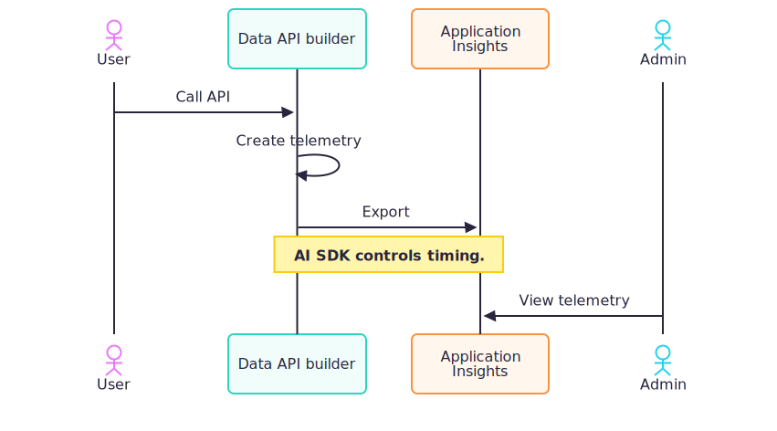
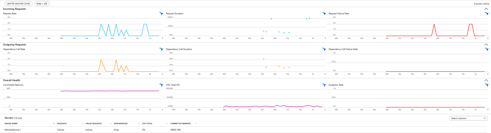
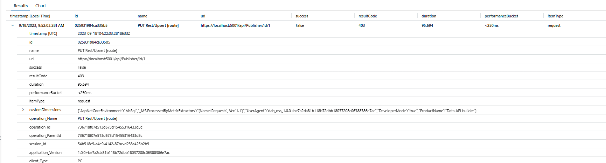
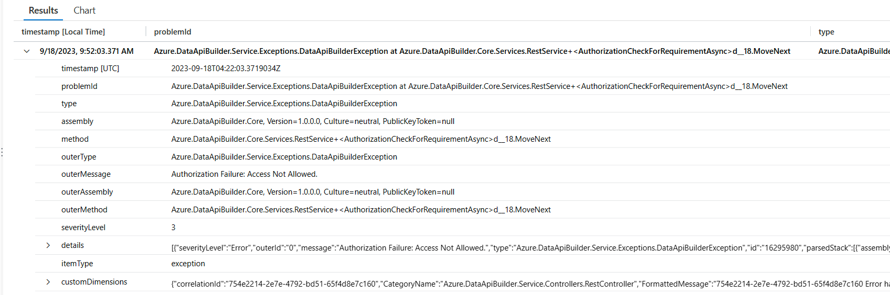

# Use Azure Application Insights in Data API builder

Azure Application Insights is a monitoring service that captures telemetry such as request details, performance counters, logs, and exceptions. Integrating it with Data API builder (DAB) helps you diagnose issues and monitor runtime behavior in production.



> **Warning**
> Application Insights isn't supported when DAB is hosted using Azure App Service web apps. Use Application Insights with DAB when you self-host it (for example, in containers, Azure Container Apps, or AKS). If you must use App Service, consider an alternative monitoring approach or a different hosting platform.

## Prerequisites

- Existing DAB configuration file.
- Application Insights connection string.
- Data API builder CLI. [Install the CLI](../../how-to/install-cli.md)

## Run tool

Use `dab add-telemetry` to add Application Insights settings to your config.

1. Add Application Insights settings to your configuration file.

    #### [Bash](#tab/bash)

    ```bash
    dab add-telemetry \
      --app-insights-enabled true \
      --app-insights-conn-string "@env('app-insights-connection-string')"
    ```

    #### [Command Prompt](#tab/cmd)

    ```cmd
    dab add-telemetry ^
      --app-insights-enabled true ^
      --app-insights-conn-string "@env('app-insights-connection-string')"
    ```

1. Start DAB.

    ```dotnetcli
    dab start
    ```

## Test in your telemetry backend

1. Open your Application Insights resource in the Azure portal.

1. Confirm that requests, traces, and exceptions are arriving.

## Configuration

Add an `application-insights` section under `runtime.telemetry` in your config file.

```json
{
  "runtime": {
    "telemetry": {
      "application-insights": {
        "enabled": true,
        "connection-string": "@env('app-insights-connection-string')"
      }
    }
  }
}
```

This assumes `app-insights-connection-string` is set as an environment variable. You can use an `.env` file to define it.

## Command-line

Configure Application Insights via `dab add-telemetry`.

- `--app-insights-enabled`
- `--app-insights-conn-string`

### Example

#### [Bash](#tab/bash)

```bash
dab add-telemetry \
  --app-insights-enabled true \
  --app-insights-conn-string "@env('app-insights-connection-string')"
```

#### [Command Prompt](#tab/cmd)

```cmd
dab add-telemetry ^
  --app-insights-enabled true ^
  --app-insights-conn-string "@env('app-insights-connection-string')"
```

---

### Resulting config

```json
{
  "runtime": {
    "telemetry": {
      "application-insights": {
        "enabled": true,
        "connection-string": "@env('app-insights-connection-string')"
      }
    }
  }
}
```

> [!NOTE]
> Application Insights settings are configured with `dab add-telemetry`, not `dab configure`.

## What gets captured

| Type                 | Description                     |
| -------------------- | ------------------------------- |
| Request telemetry    | URL, status code, response time |
| Trace telemetry      | Console logs from DAB           |
| Exception telemetry  | Errors and stack traces         |
| Performance counters | CPU, memory, network metrics    |

## View in Azure

1. Go to your Application Insights resource in the Azure portal: [https://portal.azure.com](https://portal.azure.com)
2. Review logs using this query:

```kusto
traces
| order by timestamp
```

LogLevel mapping:

| LogLevel    | Severity    | Value |
| ----------- | ----------- | ----- |
| Trace       | Verbose     | 0     |
| Debug       | Verbose     | 0     |
| Information | Information | 1     |
| Warning     | Warning     | 2     |
| Error       | Error       | 3     |
| Critical    | Critical    | 4     |

3. Check **Live Metrics**



4. Run this query for requests:

```kusto
requests
| order by timestamp
```



5. Run this query for exceptions:

```kusto
exceptions
| order by timestamp
```



## Export and visualization

Telemetry is exported via the Application Insights SDK. Ensure your backend is running and reachable.

> [!NOTE]
> The SDK controls export timing. It exports telemetry on a periodic interval configured by the SDK. If you don't set an interval, the SDK uses its default.

> [!NOTE]
> Ephemeral containers that shut down quickly can exit before exports complete. Allow a graceful shutdown window and avoid aggressive termination so pending telemetry can flush.

