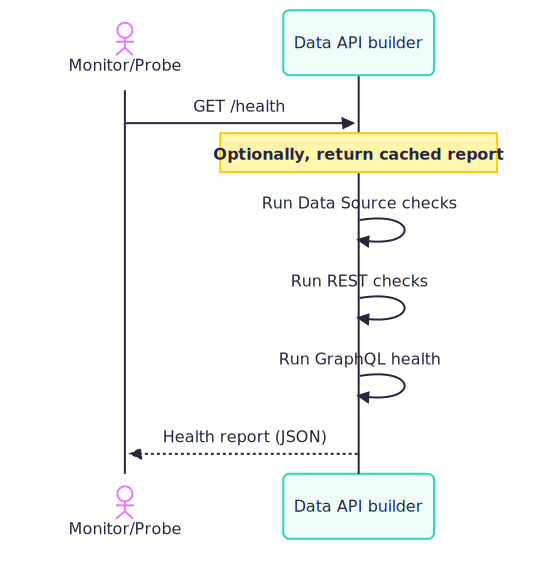

# Use Health Checks and the Health Endpoint

Data API builder provides a `/health` endpoint to monitor the responsiveness and health of your API's data sources and entities. This endpoint runs checks against configured data sources and entities, validating that they respond within thresholds you set.



## Prerequisites

You need an existing DAB configuration file.

## Run tool

Use `dab configure` for runtime health settings. For data source and entity health settings, update the configuration file.

1. Configure runtime health settings.

    #### [Bash](#tab/bash)

    ```bash
    dab configure \
      --runtime.health.enabled true \
      --runtime.health.roles "admin,monitoring" \
      --runtime.health.cache-ttl-seconds 10 \
      --runtime.health.max-query-parallelism 4
    ```

    #### [Command Prompt](#tab/cmd)

    ```cmd
    dab configure ^
      --runtime.health.enabled true ^
      --runtime.health.roles "admin,monitoring" ^
      --runtime.health.cache-ttl-seconds 10 ^
      --runtime.health.max-query-parallelism 4
    ```

1. Start DAB.

    ```dotnetcli
    dab start
    ```

## Test the health endpoint

1. Call the `/health` endpoint.

    #### [Bash](#tab/bash)

    ```bash
    curl http://localhost:5000/health
    ```

    #### [Command Prompt](#tab/cmd)

    ```cmd
    curl http://localhost:5000/health
    ```

1. Confirm the response status is `Healthy`.

## How health checks work

For each data source, a simple database-specific query verifies connectivity and measures response time. For each entity with REST or GraphQL enabled, a query returns the first N rows to confirm responsiveness. Stored procedures are excluded because they require parameters and may not be deterministic. The `/health` endpoint aggregates these results into a comprehensive report indicating overall health.

## Configuration

Use the following example to configure runtime, data source, and entity health settings.

```json
{
  "runtime": {
    "health": {
      "enabled": true,
      "roles": ["admin", "monitoring"],
      "cache-ttl-seconds": 10,
      "max-query-parallelism": 4
    }
  },
  "data-source": {
    "health": {
      "enabled": true,
      "name": "primary-sql-db",
      "threshold-ms": 1500
    }
  },
  "entities": {
    "Book": {
      "health": {
        "enabled": true,
        "first": 50,
        "threshold-ms": 500
      }
    }
  }
}
```

## Command-line

Configure runtime health settings via `dab configure`.

- `--runtime.health.enabled`
- `--runtime.health.roles`
- `--runtime.health.cache-ttl-seconds`
- `--runtime.health.max-query-parallelism`

### Example

#### [Bash](#tab/bash)

```bash
dab configure \
  --runtime.health.enabled true \
  --runtime.health.roles "admin,monitoring" \
  --runtime.health.cache-ttl-seconds 10 \
  --runtime.health.max-query-parallelism 4
```

#### [Command Prompt](#tab/cmd)

```cmd
dab configure ^
  --runtime.health.enabled true ^
  --runtime.health.roles "admin,monitoring" ^
  --runtime.health.cache-ttl-seconds 10 ^
  --runtime.health.max-query-parallelism 4
```

---

### Resulting config

```json
{
  "runtime": {
    "health": {
      "enabled": true,
      "roles": ["admin", "monitoring"],
      "cache-ttl-seconds": 10,
      "max-query-parallelism": 4
    }
  }
}
```

## Runtime health configuration

Health checks are controlled in the `runtime.health` section:

```json
{
  "runtime": {
    "health": {
      "enabled": true,
      "roles": ["admin", "monitoring"],
      "cache-ttl-seconds": 10,
      "max-query-parallelism": 4
    }
  }
}
```

### Properties

**`enabled`** (boolean, default: `true`) enables or disables the comprehensive health endpoint globally.

**`roles`** (string[], default: `null`) controls access to the `/health` endpoint.

**`cache-ttl-seconds`** (integer, default: `5`) sets the cached health report TTL.

**`max-query-parallelism`** (integer, default: `4`) sets the maximum concurrent health check queries (range: `1`-`8`).

### Role-based access behavior

In development mode (`host.mode: development`), the health endpoint is accessible to all users when `roles` isn't configured. When `roles` is configured, only specified roles can access the endpoint. In production mode (`host.mode: production`), `roles` must be explicitly defined. Omitting `roles` returns 403 Forbidden for all requests. To allow public access, set `"roles": ["anonymous"]`.

> [!IMPORTANT]
> Roles configured here control access to the health endpoint, not permissions for individual entity operations. If a role lacks permission to query an entity, the health check for that entity will reflect a failure, which is expected behavior.

### Basic health endpoint at the root path

A simplified health endpoint at `/` is always publicly accessible without authentication. It returns basic service information (version, status) without running any health checks.

## Data source health configuration

Each data source can be configured for health checks in `data-source.health`:

```json
{
  "data-source": {
    "health": {
      "enabled": true,
      "name": "primary-sql-db",
      "threshold-ms": 1500
    }
  }
}
```

### Properties

**`enabled`** (boolean, default: `true`) enables health checks for this data source.

**`name`** (string, default: database-type value) is the unique identifier shown in the health report.

**`threshold-ms`** (integer, default: `1000`) is the maximum allowed query execution time in milliseconds.

The `name` property is optional. It helps distinguish multiple data sources that share the same database type (for example, two SQL databases) in the health report.

## Entity health configuration

Entity checks can be enabled per entity in `entities.{entity-name}.health`:

```json
{
  "entities": {
    "Book": {
      "health": {
        "enabled": true,
        "first": 50,
        "threshold-ms": 500
      }
    }
  }
}
```

### Properties

**`enabled`** (boolean, default: `true`) enables health checks for the entity.

**`first`** (integer, default: `100`) sets the number of rows returned by the health query (range: `1`-`500`).

**`threshold-ms`** (integer, default: `1000`) sets the maximum allowed query execution time in milliseconds.

> [!NOTE]
> The value of `first` must be less than or equal to the runtime configuration for `max-page-size`. A smaller `first` value improves performance. When monitoring many entities, higher `first` values can slow down reports.

Entity health checks run for both REST and GraphQL if enabled. Each appears as a separate entry in the report with tags (`rest` or `graphql`).

## Performance and caching considerations

`cache-ttl-seconds` prevents rapid requests from overwhelming the system and caches the complete health report for the configured TTL. Set it to `0` to disable caching. The default is `5` seconds. `max-query-parallelism` controls how many health check queries run concurrently. Higher values speed up checks but increase database load. The range is `1`-`8`, and the default is `4`. Use lower values if you have many entities or tight resource limits.

## Sample health check response

```json
{
  "status": "Healthy",
  "version": "1.2.3",
  "app-name": "dab_oss_1.2.3",
  "timestamp": "2025-01-15T10:30:00Z",
  "configuration": {
    "rest": true,
    "graphql": true,
    "mcp": true,
    "caching": false,
    "telemetry": true,
    "mode": "Production"
  },
  "checks": [
    {
      "status": "Healthy",
      "name": "primary-sql-db",
      "tags": ["data-source"],
      "data": {
        "response-ms": 12,
        "threshold-ms": 1500
      }
    },
    {
      "status": "Healthy",
      "name": "Book",
      "tags": ["rest", "endpoint"],
      "data": {
        "response-ms": 45,
        "threshold-ms": 500
      }
    },
    {
      "status": "Healthy",
      "name": "Book",
      "tags": ["graphql", "endpoint"],
      "data": {
        "response-ms": 38,
        "threshold-ms": 500
      }
    }
  ]
}
```

## Additional considerations

Health checks respect entity and endpoint authorization. If a role lacks permission to access an entity, the health check reports it. Stored procedures are excluded because they require parameters and may have side effects. Entities with `rest.enabled: false` or `graphql.enabled: false` are excluded from those checks. When `data-source.health.enabled: false`, data source checks are skipped.
