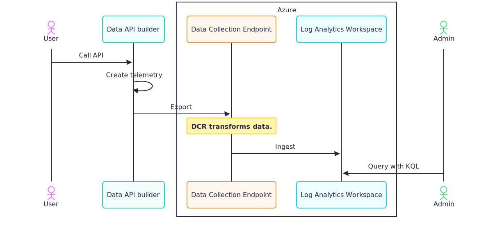

# Use Azure Log Analytics in Data API builder

Azure Log Analytics is a centralized logging platform that aggregates logs from apps, Azure resources, VMs, containers, and more. Integrating it with Data API builder (DAB) helps enterprises meet compliance, governance, and observability requirements. Unlike Application Insights (which focuses on APM), Log Analytics provides broader log aggregation with Kusto Query Language (KQL) support.



## Prerequisites

- Existing DAB configuration file.
- Azure subscription with permissions to create Log Analytics resources.
- Azure Log Analytics workspace with:
  - A custom table (ending in `_CL`)
  - A Data Collection Rule (DCR)
  - A Data Collection Endpoint (DCE)
- Managed Identity enabled on your DAB host (Azure App Service, Container Apps, VM, etc.).
- Data API builder CLI. [Install the CLI](../../command-line/install.md)

## Set up Azure Log Analytics resources

Before configuring DAB, create the required Azure resources.

### Create a Log Analytics workspace

#### [Azure portal](#tab/portal)

1. Navigate to **Azure Portal** > **Log Analytics workspaces**.
1. Select **+ Create**.
1. Choose your subscription, resource group, and region.
1. Provide a workspace name.
1. Select **Review + create** > **Create**.

#### [Azure CLI](#tab/azurecli)

```azurecli
az monitor log-analytics workspace create \
  --resource-group my-rg \
  --workspace-name my-workspace \
  --location eastus
```

---

### Create a custom table

Custom tables for Logs Ingestion API must end with `_CL`.

1. In your Log Analytics workspace, navigate to **Tables**.
1. Select **+ Create** > **New custom log (DCR-based)**.
1. Enter table name (for example, `DabLogs_CL`).
1. Define the schema with these columns:
   - `Time` (datetime)
   - `LogLevel` (string)
   - `Message` (string)
   - `Component` (string)
   - `Identifier` (string)
1. Select **Create**.

### Create a Data Collection Endpoint (DCE)

#### [Azure portal](#tab/portal)

1. Navigate to **Monitor** > **Data Collection Endpoints**.
1. Select **+ Create**.
1. Choose your subscription, resource group, and region.
1. Provide a name (for example, `my-dce`).
1. Select **Review + create** > **Create**.
1. Copy the **Logs Ingestion** endpoint URL (for example, `https://my-dce.eastus-1.ingest.monitor.azure.com`).

#### [Azure CLI](#tab/azurecli)

```azurecli
az monitor data-collection endpoint create \
  --name my-dce \
  --resource-group my-rg \
  --location eastus \
  --public-network-access Enabled
```

Get the endpoint:

```azurecli
az monitor data-collection endpoint show \
  --name my-dce \
  --resource-group my-rg \
  --query logsIngestion.endpoint -o tsv
```

---

### Create a Data Collection Rule (DCR)

1. Navigate to **Monitor** > **Data Collection Rules**.
1. Select **+ Create**.
1. Choose subscription, resource group, region.
1. Provide a name (for example, `my-dcr`).
1. In **Data sources**, select **Custom Text Logs**.
1. Configure:
   - **Data Collection Endpoint**: Select your DCE.
   - **Destination**: Your Log Analytics workspace.
   - **Table**: Your custom table (`DabLogs_CL`).
1. Select **Review + create** > **Create**.
1. Copy the **Immutable ID** (starts with `dcr-`).

## Configure authentication

DAB uses **Azure Managed Identity** to authenticate to Log Analytics. No credentials are stored in your configuration.

### Enable Managed Identity

#### [App Service](#tab/appservice)

```azurecli
az webapp identity assign \
  --name my-app \
  --resource-group my-rg
```

#### [Container Apps](#tab/containerapp)

```azurecli
az containerapp identity assign \
  --name my-app \
  --resource-group my-rg \
  --system-assigned
```

---

### Assign permissions

Grant the **Monitoring Metrics Publisher** role to your Managed Identity on the DCR.

```azurecli
# Get Managed Identity principal ID
PRINCIPAL_ID=$(az webapp identity show \
  --name my-app \
  --resource-group my-rg \
  --query principalId -o tsv)

# Get DCR resource ID
DCR_ID=$(az monitor data-collection rule show \
  --name my-dcr \
  --resource-group my-rg \
  --query id -o tsv)

# Assign role
az role assignment create \
  --assignee $PRINCIPAL_ID \
  --role "Monitoring Metrics Publisher" \
  --scope $DCR_ID
```

> [!IMPORTANT]
> Without this role assignment, DAB can't send logs to Log Analytics even with correct configuration.

## Configure Log Analytics

Add an `azure-log-analytics` section under `runtime.telemetry` in your config file.

```json
{
  "runtime": {
    "telemetry": {
      "azure-log-analytics": {
        "enabled": true,
        "dab-identifier": "my-dab-instance",
        "flush-interval-seconds": 10,
        "auth": {
          "custom-table-name": "DabLogs_CL",
          "dcr-immutable-id": "dcr-xxxxxxxxxxxxxxxxxxxxxxxxxxxxxxxx",
          "dce-endpoint": "https://my-dce.eastus-1.ingest.monitor.azure.com"
        }
      }
    }
  }
}
```

### Configuration properties

| Property | Description | Default | Constraints |
| --- | --- | --- | --- |
| `enabled` | Enable or disable Log Analytics integration. | `false` | Boolean |
| `dab-identifier` | Unique string to identify log entries from this DAB instance. | `DabLogs` | Any string |
| `flush-interval-seconds` | How often (in seconds) logs are flushed to Log Analytics. | `5` | Must be > 0 |
| `auth.custom-table-name` | Custom table name in your Log Analytics workspace. | *(required)* | Must end with `_CL` |
| `auth.dcr-immutable-id` | Immutable ID of your Data Collection Rule. | *(required)* | Starts with `dcr-` |
| `auth.dce-endpoint` | Data Collection Endpoint URL. | *(required)* | HTTPS URL |

## Command-line

Configure Log Analytics via `dab configure`.

### Enable Log Analytics

#### [Bash](#tab/bash-cli)

```bash
dab configure \
  --runtime.telemetry.azure-log-analytics.enabled true
```

#### [Command Prompt](#tab/cmd-cli)

```cmd
dab configure ^
  --runtime.telemetry.azure-log-analytics.enabled true
```

---

### Set DAB identifier

#### [Bash](#tab/bash-cli)

```bash
dab configure \
  --runtime.telemetry.azure-log-analytics.dab-identifier my-dab-instance
```

#### [Command Prompt](#tab/cmd-cli)

```cmd
dab configure ^
  --runtime.telemetry.azure-log-analytics.dab-identifier my-dab-instance
```

---

### Set flush interval

#### [Bash](#tab/bash-cli)

```bash
dab configure \
  --runtime.telemetry.azure-log-analytics.flush-interval-seconds 10
```

#### [Command Prompt](#tab/cmd-cli)

```cmd
dab configure ^
  --runtime.telemetry.azure-log-analytics.flush-interval-seconds 10
```

---

### Set custom table name

#### [Bash](#tab/bash-cli)

```bash
dab configure \
  --runtime.telemetry.azure-log-analytics.auth.custom-table-name DabLogs_CL
```

#### [Command Prompt](#tab/cmd-cli)

```cmd
dab configure ^
  --runtime.telemetry.azure-log-analytics.auth.custom-table-name DabLogs_CL
```

---

### Set DCR immutable ID

#### [Bash](#tab/bash-cli)

```bash
dab configure \
  --runtime.telemetry.azure-log-analytics.auth.dcr-immutable-id dcr-xxxxxxxxxxxxxxxxxxxxxxxxxxxxxxxx
```

#### [Command Prompt](#tab/cmd-cli)

```cmd
dab configure ^
  --runtime.telemetry.azure-log-analytics.auth.dcr-immutable-id dcr-xxxxxxxxxxxxxxxxxxxxxxxxxxxxxxxx
```

---

### Set DCE endpoint

#### [Bash](#tab/bash-cli)

```bash
dab configure \
  --runtime.telemetry.azure-log-analytics.auth.dce-endpoint https://my-dce.eastus-1.ingest.monitor.azure.com
```

#### [Command Prompt](#tab/cmd-cli)

```cmd
dab configure ^
  --runtime.telemetry.azure-log-analytics.auth.dce-endpoint https://my-dce.eastus-1.ingest.monitor.azure.com
```

---

## Run DAB

Start DAB with your configuration file:

```dotnetcli
dab start
```

Check DAB startup logs for:

```text
Azure Log Analytics is enabled.
```

## How it works

When Log Analytics is enabled, DAB:

1. Authenticates to Azure using the host's Managed Identity.
1. Batches log entries based on `flush-interval-seconds`.
1. Sends logs to the Data Collection Endpoint (DCE).
1. DCE routes logs through the Data Collection Rule (DCR) for transformation.
1. DCR ingests logs into your custom Log Analytics table.

### Data flow

```text
DAB Application
    ↓
ILogger (ASP.NET Core)
    ↓
Log Analytics Logger Provider
    ↓
Managed Identity Authentication
    ↓
Data Collection Endpoint (DCE)
    ↓
Data Collection Rule (DCR)
    ↓
Log Analytics Workspace (Custom Table)
```

## What gets captured

| Telemetry type | Source | Examples |
| -------------- | ------ | -------- |
| Traces | `ILogger` calls in DAB | Startup logs, query execution logs, warnings |
| Errors | Exception handling | Runtime errors, configuration errors, database errors |
| Component info | DAB internals | Which module generated the log |
| Instance ID | Configuration | `dab-identifier` value for filtering |

## Log structure

Each log entry sent to Log Analytics contains these fields:

| Field | Type | Description | Example |
| --- | --- | --- | --- |
| `Time` | datetime | Timestamp (ISO 8601) | `2026-01-27T14:30:00Z` |
| `LogLevel` | string | Log severity | `Information`, `Warning`, `Error` |
| `Message` | string | Log message | `Request completed successfully` |
| `Component` | string | DAB component that generated the log | `Azure.DataApiBuilder.Service.Startup` |
| `Identifier` | string | Value from `dab-identifier` config | `my-dab-instance` |

> [!NOTE]
> Custom table columns in Log Analytics append suffixes: `_s` for strings, `_d` for doubles, `_t` for datetimes, etc.

## Query logs in Log Analytics

1. Open your Log Analytics workspace in the Azure portal.

1. Navigate to **Logs** and run a KQL query:

    ```kusto
    DabLogs_CL
    | where Identifier_s == "my-dab-instance"
    | where LogLevel_s in ("Warning", "Error")
    | where TimeGenerated > ago(1h)
    | project TimeGenerated, LogLevel_s, Message_s, Component_s
    | order by TimeGenerated desc
    ```

### Example queries

Count logs by level:

```kusto
DabLogs_CL
| where TimeGenerated > ago(24h)
| summarize Count=count() by LogLevel_s
```

Find errors in specific component:

```kusto
DabLogs_CL
| where Component_s contains "SqlQueryExecutor"
| where LogLevel_s == "Error"
| project TimeGenerated, Message_s
```

## Performance and cost considerations

### Batching behavior

DAB batches logs and sends them every `flush-interval-seconds`:

- **5 seconds (default)**: Good balance for most scenarios.
- **1-2 seconds**: Near real-time logging (higher API calls, higher cost).
- **10-60 seconds**: Reduced API calls but delayed logs.

### Cost optimization

Log Analytics pricing is based on:

1. **Data ingestion**: Per GB ingested.
1. **Data retention**: Per GB per month after free tier.

**Reduce costs:**

- Increase `flush-interval-seconds` to batch more logs.
- Use log level filters to exclude verbose logs. For more information, see [Customize log verbosity](log-levels.md).
- Set appropriate data retention in your Log Analytics workspace.

### Example: Filter to reduce volume

```json
{
  "runtime": {
    "telemetry": {
      "log-level": {
        "Default": "Warning",
        "Microsoft": "Error"
      },
      "azure-log-analytics": {
        "enabled": true,
        "flush-interval-seconds": 30,
        "auth": {
          "custom-table-name": "DabLogs_CL",
          "dcr-immutable-id": "dcr-xxxxxxxxxxxxxxxxxxxxxxxxxxxxxxxx",
          "dce-endpoint": "https://my-dce.eastus-1.ingest.monitor.azure.com"
        }
      }
    }
  }
}
```

This sends only **Warning** and **Error** logs, significantly reducing volume.

### Data retention

Log Analytics data retention is configurable per workspace:

| Tier | Default retention | Maximum retention |
| ---- | ----------------- | ----------------- |
| Free tier | 7 days | 7 days |
| Pay-as-you-go | 30 days | 730 days (2 years) |

Configure retention: Log Analytics workspace → **Usage and estimated costs** → **Data Retention**.

> [!TIP]
> For compliance requirements, consider archiving older logs to Azure Storage for long-term retention.

## Troubleshooting

### Logs not appearing in Log Analytics

**Symptom**: DAB starts successfully but no logs appear in your Log Analytics workspace.

**Possible causes:**

- **Incomplete configuration**: Check DAB startup logs for errors like `Logs won't be sent to Azure Log Analytics because the Custom Table Name is not available in the config file.` Verify all required auth properties: `custom-table-name`, `dcr-immutable-id`, `dce-endpoint`.

- **Managed Identity not assigned**: Verify Managed Identity is enabled with `az webapp identity show --name my-app --resource-group my-rg`. Check role assignment with `az role assignment list --assignee <principal-id> --scope <dcr-id>`.

- **Incorrect DCE endpoint or DCR ID**: Verify DCE endpoint format is `https://<dce-name>.<region>-1.ingest.monitor.azure.com`. Verify DCR immutable ID starts with `dcr-`.

- **Custom table doesn't exist**: Custom tables must end with `_CL`. Table schema must match the log structure.

### Error: Flush interval must be positive

**Cause**: `flush-interval-seconds` is set to `0` or negative value.

**Solution**: Set `flush-interval-seconds` to a positive integer (minimum `1`).

### DAB logs show "Azure Log Analytics is disabled"

**Cause**: `enabled` is `false` or missing from configuration.

**Solution**: Set `enabled: true` in your configuration.

## Log Analytics vs. Application Insights

| Capability | Application Insights | Log Analytics |
| --- | --- | --- |
| Focus | Application performance monitoring (APM) | Centralized log aggregation |
| Query language | KQL | KQL |
| Scope | Single application | Apps, VMs, containers, Azure resources |
| Use case | Performance, exceptions, traces | Compliance, governance, cross-resource correlation |
| Authentication | Connection string | Managed Identity (via DCR/DCE) |

Use Application Insights when you need APM features like request tracking, dependency mapping, and performance profiling. Use Log Analytics when you need centralized logging across multiple resources with enterprise compliance requirements.

## Related content

- [Use Application Insights](application-insights.md)
- [Use OpenTelemetry](open-telemetry.md)
- [Customize log verbosity](log-levels.md)
- [Data collection rules overview](/azure/azure-monitor/essentials/data-collection-rule-overview)
- [Managed identities for Azure resources](/entra/identity/managed-identities-azure-resources/overview)
