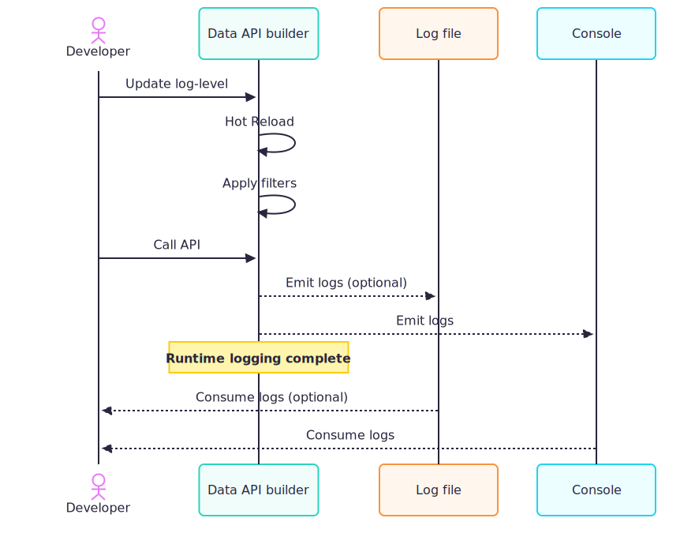

# Configure log levels in Data API builder

Data API builder (DAB) supports filtered log levels to control verbosity. You can set a global level and override specific namespaces or classes for focused diagnostics.



Logging settings are configured in the [`runtime.telemetry.log-level` section](../../configuration/runtime.md#telemetry-runtime) of your configuration. You can specify log levels globally or target specific namespaces or classes for fine-grained control.

## Prerequisites

- Existing DAB configuration file.

## Run tool

Use `dab configure` to set log levels in the configuration file.

### Configure log levels

#### [Bash](#tab/bash)

```bash
dab configure \
  --runtime.telemetry.log-level.default Warning \
  --runtime.telemetry.log-level.Azure.DataApiBuilder.Core Information \
  --runtime.telemetry.log-level.Azure.DataApiBuilder.Core.Configurations.RuntimeConfigValidator Debug
```

#### [Command Prompt](#tab/cmd)

```cmd
dab configure ^
  --runtime.telemetry.log-level.default Warning ^
  --runtime.telemetry.log-level.Azure.DataApiBuilder.Core Information ^
  --runtime.telemetry.log-level.Azure.DataApiBuilder.Core.Configurations.RuntimeConfigValidator Debug
```

1. Start DAB.

    ```dotnetcli
    dab start
    ```

## Test logging

1. Send a request to your API.

1. Confirm the logs match the configured levels.

## Configuration

Add a `log-level` section under `runtime.telemetry` in your config file.

## Log level priorities

The most specific namespace or class name takes precedence. The `default` key sets the base level for all other components not explicitly listed.

If omitted, DAB uses default levels based on the host mode:

- `development` mode defaults to `Debug`.
- `production` mode defaults to `Error`.

## Supported log levels

- `Trace`: Most detailed information, typically for deep troubleshooting.
- `Debug`: Detailed information for diagnosing issues during development.
- `Information`: General, high-level events that describe normal operations.
- `Warning`: Unexpected situations or minor issues that may require attention.
- `Error`: Failures that prevent an operation from completing successfully.
- `Critical`: Severe issues that cause system or major feature failure.
- `None`: Disable logging for the targeted category or component.

Partial matches of namespace names are supported but must end at a `.` separator. For example:

- `Azure.DataApiBuilder.Core.Configurations.RuntimeConfigValidator`
- `Azure.DataApiBuilder.Core`
- `default`

## Example configuration

```json
{
  "runtime": {
    "telemetry": {
      "log-level": {
        "Azure.DataApiBuilder.Core.Configurations.RuntimeConfigValidator": "Debug",
        "Azure.DataApiBuilder.Core": "Information",
        "default": "Warning"
      }
    }
  }
}
```

In this example, logs from `RuntimeConfigValidator` use `Debug`, other classes under `Azure.DataApiBuilder.Core` use `Information`, and all other logs default to `Warning`.

## Command-line

Configure log levels via `dab configure`.

- `--runtime.telemetry.log-level.default`
- `--runtime.telemetry.log-level.<namespace-or-class>`

### Example

#### [Bash](#tab/bash)

```bash
dab configure \
  --runtime.telemetry.log-level.default Warning \
  --runtime.telemetry.log-level.Azure.DataApiBuilder.Core Information \
  --runtime.telemetry.log-level.Azure.DataApiBuilder.Core.Configurations.RuntimeConfigValidator Debug
```

#### [Command Prompt](#tab/cmd)

```cmd
dab configure ^
  --runtime.telemetry.log-level.default Warning ^
  --runtime.telemetry.log-level.Azure.DataApiBuilder.Core Information ^
  --runtime.telemetry.log-level.Azure.DataApiBuilder.Core.Configurations.RuntimeConfigValidator Debug
```

---

### Resulting config

```json
{
  "runtime": {
    "telemetry": {
      "log-level": {
        "Azure.DataApiBuilder.Core.Configurations.RuntimeConfigValidator": "Debug",
        "Azure.DataApiBuilder.Core": "Information",
        "default": "Warning"
      }
    }
  }
}
```

## Hot-reload support

You can update log levels dynamically (hot-reload) in both development and production modes without restarting the application. This helps adjust logging on-the-fly to troubleshoot issues.

## Important namespaces for filtering

Some common namespaces and classes you may want to filter and why:

- `Azure.DataApiBuilder.Core.Configurations.RuntimeConfigValidator`: Diagnose configuration validation issues and schema errors.
- `Azure.DataApiBuilder.Core.Resolvers.SqlQueryEngine`: Investigate SQL query generation and execution behavior.
- `Azure.DataApiBuilder.Core.Resolvers.IQueryExecutor`: Trace database execution and timing for query calls.
- `Azure.DataApiBuilder.Service.HealthCheck.ComprehensiveHealthReportResponseWriter`: Troubleshoot health endpoint report composition.
- `Azure.DataApiBuilder.Service.Controllers.RestController`: Inspect REST request routing and controller-level errors.
- `Azure.DataApiBuilder.Auth.IAuthorizationResolver`: Debug authorization decisions and role evaluation.
- `Microsoft.AspNetCore.Authorization.IAuthorizationHandler`: Investigate ASP.NET Core authorization pipeline behavior.
- `default`: Set the baseline level for all other categories not explicitly listed.

## Related content

- [Runtime configuration](../../configuration/runtime.md)
- [Use Azure Application Insights](application-insights.md)
- [Use OpenTelemetry and activity traces](open-telemetry.md)
