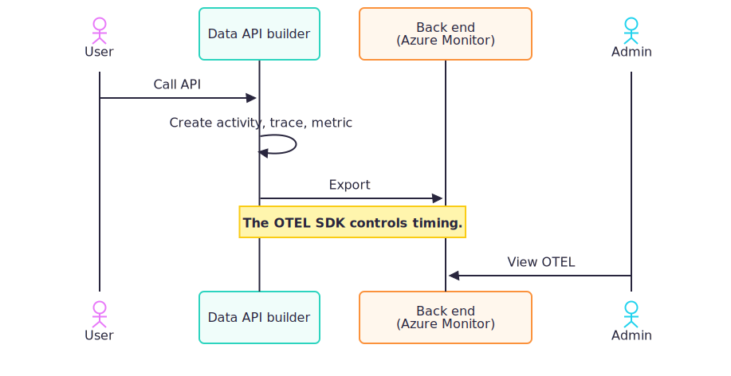

# Use OpenTelemetry and activity traces

Data API builder (DAB) supports OpenTelemetry for distributed tracing and metrics, enabling you to monitor and diagnose behavior across REST, GraphQL, database operations, and internal middleware.
 



## Prerequisites

- Existing DAB configuration file.
- Running OpenTelemetry collector or backend (for example, Azure Monitor or Jaeger).
- Data API builder CLI. [Install the CLI](../../command-line/install.md)

## Run tool

Use `dab add-telemetry` to add OpenTelemetry settings to your config.

1. Ensure you have a configuration file. If you need to create one, run:

    ```dotnetcli
    dab init \
        --database-type mssql \
        --connection-string "<sql-connection-string>"
    ```

1. Add OpenTelemetry settings to your configuration file.

    #### [Bash](#tab/bash)

    ```bash
    dab add-telemetry \
        -c dab-config.json \
        --otel-enabled true \
        --otel-endpoint "http://localhost:4317" \
        --otel-protocol "grpc" \
        --otel-service-name "dab"
    ```

    #### [Command Prompt](#tab/cmd)

    ```cmd
    dab add-telemetry ^
        -c dab-config.json ^
        --otel-enabled true ^
        --otel-endpoint "http://localhost:4317" ^
        --otel-protocol "grpc" ^
        --otel-service-name "dab"
    ```

1. Start DAB.

    ```dotnetcli
    dab start
    ```

## Test in your telemetry backend

1. Open your OpenTelemetry backend or collector UI.

1. Confirm that traces and metrics are arriving for REST, GraphQL, or database calls.

> [!NOTE]
> The .NET Aspire dashboard is an ideal part of the developer loop. It includes built-in views for OpenTelemetry traces and metrics.

## Data API builder traces

DAB creates OpenTelemetry "activities" for:

- **Incoming HTTP requests** (REST endpoints)
- **GraphQL operations**
- **Database queries** (per entity)
- **Internal middleware steps** (for example, request handling, error tracking)

Each activity includes detailed tags (metadata), such as:
- `http.method`, `http.url`, `http.querystring`, `status.code`
- `action.type` (CRUD, GraphQL operation)
- `user.role`, `user-agent`
- `data-source.type`, `data-source.name`
- `api.type` (REST or GraphQL)

Errors and exceptions are also traced with detailed info.

## Data API builder metrics

DAB emits OpenTelemetry metrics such as:

- **Total Requests**: Counter, labeled by HTTP method, status, endpoint, and API type.
- **Errors**: Counter, labeled by error type, HTTP method, status, endpoint, and API type.
- **Request Duration**: Histogram (in milliseconds), labeled by HTTP method, status, endpoint, and API type.
- **Active Requests**: Up/down counter for concurrent requests.

Metrics use the .NET `Meter` API and OpenTelemetry SDK.

## Configuration

Add an [`open-telemetry` section](../../configuration/runtime.md#opentelemetry-telemetry) under `runtime.telemetry` in your config file.

```json
{
    "runtime": {
        "telemetry": {
            "open-telemetry": {
                "enabled": true,
                "endpoint": "http://otel-collector:4317",
                "service-name": "dab",
                "exporter-protocol": "grpc"
            }
        }
    }
}
```

## Command-line

Configure OpenTelemetry via `dab add-telemetry`.

- `--otel-enabled`
- `--otel-endpoint`
- `--otel-protocol`
- `--otel-service-name`
- `--otel-headers`

### Example

#### [Bash](#tab/bash)

```bash
dab add-telemetry \
    -c dab-config.json \
    --otel-enabled true \
    --otel-endpoint "http://localhost:4317" \
    --otel-protocol "grpc" \
    --otel-service-name "dab"
```

#### [Command Prompt](#tab/cmd)

```cmd
dab add-telemetry ^
    -c dab-config.json ^
    --otel-enabled true ^
    --otel-endpoint "http://localhost:4317" ^
    --otel-protocol "grpc" ^
    --otel-service-name "dab"
```

---

### Resulting config

> [!NOTE]
> OpenTelemetry options aren't available on `dab configure`.

```json
{
    "runtime": {
        "telemetry": {
            "open-telemetry": {
                "enabled": true,
                "endpoint": "http://localhost:4317",
                "service-name": "dab",
                "exporter-protocol": "grpc"
            }
        }
    }
}
```

## Export and visualization

Telemetry is exported via .NET OpenTelemetry SDK to your configured back end such as Azure Monitor or Jaeger. Ensure your back end is running and reachable at the specified `endpoint`. You can use any OpenTelemetry-compatible back end for visualization.

The OpenTelemetry SDK controls export timing. It exports traces when activities complete. It exports metrics on a periodic interval configured by the SDK. If you don't set an interval, the SDK uses its default.

> [!NOTE]
> Ephemeral containers that shut down quickly can exit before exports complete. Allow a graceful shutdown window and avoid aggressive termination so pending telemetry can flush.

## Implementation notes

* Traces and metrics cover all REST, GraphQL, and database operations
* Middleware and error handlers also emit telemetry
* Context is propagated through requests

## Related content

- [Runtime configuration](../../configuration/runtime.md)
- [Use Azure Application Insights](application-insights.md)
