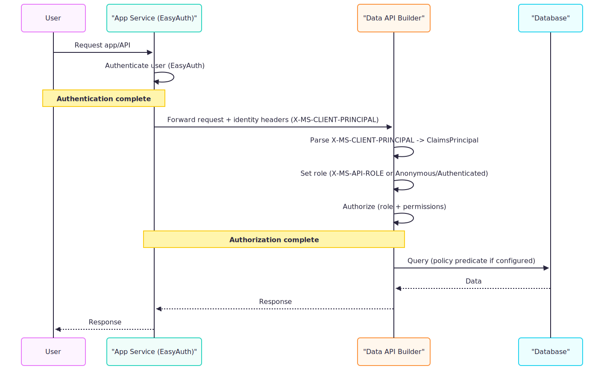

# Configure App Service authentication (EasyAuth)

Azure App Service provides built-in authentication (often called "EasyAuth") that handles user sign-in before requests reach your application. Data API builder can read the identity information that App Service injects, enabling authentication without managing tokens directly.

> [!IMPORTANT]
> The `AppService` provider trusts identity headers forwarded by EasyAuth. Ensure clients can't bypass EasyAuth and reach Data API builder directly.

## Authentication flow

When Data API builder runs behind Azure App Service with authentication enabled, App Service handles the OAuth flow and passes identity information via HTTP headers:



| Phase | What happens |
|-------|--------------|
| **User auth** | App Service intercepts unauthenticated requests and redirects to the identity provider |
| **Identity injection** | After authentication, App Service adds the `X-MS-CLIENT-PRINCIPAL` header |
| **DAB processing** | Data API builder Base64-decodes the header JSON and builds a `ClaimsPrincipal` from the `claims` array |
| **Authorization** | DAB uses `ClaimsPrincipal.IsInRole()` to validate the `X-MS-API-ROLE` header, then evaluates permissions and policies |

## Prerequisites

- An Azure subscription
- Azure App Service or Azure Functions (on App Service infrastructure)
- Data API builder CLI installed ([installation guide](../../command-line/install.md))
- An existing `dab-config.json` with at least one entity

## Quick reference

| Setting | Value |
|---------|-------|
| Provider | `AppService` |
| Identity header | `X-MS-CLIENT-PRINCIPAL` (Base64-encoded JSON) |
| Role selection header | `X-MS-API-ROLE` |
| Supports custom claims | Yes |
| Local testing | Yes (manually set headers) |

## Step 1: Enable App Service authentication

Configure authentication in Azure App Service:

1. In the [Azure portal](https://portal.azure.com), navigate to your App Service.

1. Select **Settings** > **Authentication**.

1. Select **Add identity provider**.

1. Choose **Microsoft** (or another supported provider).

1. Configure the settings:
   - **App registration type**: Create new or select existing
   - **Supported account types**: Choose based on your scenario
   - **Restrict access**: Require authentication

1. Select **Add**.

> [!TIP]
> App Service authentication works with multiple identity providers including Microsoft, Google, Facebook, Twitter, and OpenID Connect.

## Step 2: Configure Data API builder

Set the authentication provider to `AppService`:

### CLI

#### [Bash](#tab/bash)

```bash
dab configure \
  --runtime.host.authentication.provider AppService
```

#### [Command Prompt](#tab/cmd)

```cmd
dab configure ^
  --runtime.host.authentication.provider AppService
```

---

### Resulting configuration

```json
{
  "runtime": {
    "host": {
      "authentication": {
        "provider": "AppService"
      }
    }
  }
}
```

> [!NOTE]
> Unlike the `EntraID`/`AzureAD` or `Custom` providers, `AppService` doesn't require `jwt.audience` or `jwt.issuer` settings. App Service validates the token before passing identity information to DAB.

## Step 3: Configure entity permissions

Define permissions for roles. Data API builder evaluates roles via `ClaimsPrincipal.IsInRole()`, which checks claims parsed from the `X-MS-CLIENT-PRINCIPAL` header. Include role claims in the `claims` array with the appropriate role claim type.

### Example configuration

#### [Bash](#tab/bash)

```bash
# Allow authenticated users to read
dab update Book \
  --permissions "authenticated:read"

# Allow editors to create and update
dab update Book \
  --permissions "editor:create,read,update"
```

#### [Command Prompt](#tab/cmd)

```cmd
REM Allow authenticated users to read
dab update Book ^
  --permissions "authenticated:read"

REM Allow editors to create and update
dab update Book ^
  --permissions "editor:create,read,update"
```

---

### Resulting configuration

```json
{
  "entities": {
    "Book": {
      "source": "dbo.Books",
      "permissions": [
        {
          "role": "authenticated",
          "actions": ["read"]
        },
        {
          "role": "editor",
          "actions": ["create", "read", "update"]
        }
      ]
    }
  }
}
```

## Step 4: Test locally with X-MS-CLIENT-PRINCIPAL

You can test App Service authentication locally by manually providing the `X-MS-CLIENT-PRINCIPAL` header. This approach simulates what EasyAuth forwards to your app and lets you test role and claim-driven behavior without deploying to Azure.

### Create a client principal

The `X-MS-CLIENT-PRINCIPAL` header contains a Base64-encoded JSON object. Data API builder parses the following properties:

```json
{
  "auth_typ": "aad",
  "name_typ": "name",
  "role_typ": "roles",
  "claims": [
    { "typ": "name", "val": "Alice Smith" },
    { "typ": "email", "val": "alice@contoso.com" },
    { "typ": "roles", "val": "authenticated" },
    { "typ": "roles", "val": "editor" },
    { "typ": "http://schemas.microsoft.com/identity/claims/objectidentifier", "val": "abc-123-def" }
  ]
}
```

### Encode the principal

Encode the JSON as Base64. You can use any tool:

PowerShell:

```powershell
$json = @'
{
  "auth_typ": "aad",
  "name_typ": "name",
  "role_typ": "roles",
  "claims": [
    { "typ": "name", "val": "alice@contoso.com" },
    { "typ": "roles", "val": "authenticated" },
    { "typ": "roles", "val": "editor" }
  ]
}
'@
[Convert]::ToBase64String([Text.Encoding]::UTF8.GetBytes($json))
```

Bash:

```bash
echo '{
  "auth_typ": "aad",
  "name_typ": "name",
  "role_typ": "roles",
  "claims": [
    { "typ": "name", "val": "alice@contoso.com" },
    { "typ": "roles", "val": "authenticated" },
    { "typ": "roles", "val": "editor" }
  ]
}' | base64
```

---

### Send a request with the header

```bash
curl -X GET "http://localhost:5000/api/Book" \
  -H "X-MS-CLIENT-PRINCIPAL: eyJpZGVudGl0eVByb3ZpZGVyIjoiYWFkIiwidXNlcklkIjoidXNlci0xMjM0NSIsInVzZXJEZXRhaWxzIjoiYWxpY2VAY29udG9zby5jb20iLCJ1c2VyUm9sZXMiOlsiYXV0aGVudGljYXRlZCIsImVkaXRvciJdfQ==" \
  -H "X-MS-API-ROLE: editor"
```

## X-MS-CLIENT-PRINCIPAL structure

Data API builder parses the following properties from the client principal:

| Property | Type | Description |
|----------|------|-------------|
| `auth_typ` | string | The authentication type (for example, `aad`). Required for the identity to be considered authenticated. |
| `name_typ` | string | (Optional) The claim type used for the user's name |
| `role_typ` | string | (Optional) The claim type used for roles (defaults to `roles`) |
| `claims` | object[] | Array of claims with `typ` and `val` properties. Roles must be included here as claims. |

> [!IMPORTANT]
> Roles are evaluated via `ClaimsPrincipal.IsInRole()`, which checks the `claims` array for claims matching the `role_typ`. Include each role as a separate claim entry (for example, `{ "typ": "roles", "val": "editor" }`).

## Using claims in database policies

With the AppService provider, you can use claims in database policies. This enables row-level security based on user identity.

### Example: Filter by user object ID

This example uses the `oid` (object identifier) claim, which Microsoft Entra ID includes in tokens:

```json
{
  "entities": {
    "Order": {
      "source": "dbo.Orders",
      "permissions": [
        {
          "role": "authenticated",
          "actions": [
            {
              "action": "read",
              "policy": {
                "database": "@claims.oid eq @item.customerId"
              }
            }
          ]
        }
      ]
    }
  }
}
```

> [!TIP]
> Common claim types from Microsoft Entra ID include `oid` (object ID), `email`, `name`, and `preferred_username`. Use the exact claim type string from your identity provider.

### Available claim references

Claim references use the exact claim type string from the `claims` array:

| Claim reference | Description |
|-----------------|-------------|
| `@claims.<claim-type>` | Any claim from the `claims` array, matched by the `typ` property |

For example, if your principal includes `{ "typ": "email", "val": "alice@contoso.com" }`, use `@claims.email` in your policy. The claim type must match exactly.

## Anonymous requests

When App Service allows unauthenticated requests, or when testing locally without the `X-MS-CLIENT-PRINCIPAL` header, Data API builder's authentication middleware sets the `X-MS-API-ROLE` header to `anonymous` automatically. Requests are then evaluated using the `anonymous` role:

```bash
# No principal header = anonymous role (X-MS-API-ROLE set automatically)
curl -X GET "http://localhost:5000/api/Book"
```

For this to work, your entity must have permissions for the `anonymous` role:

```json
{
  "permissions": [
    {
      "role": "anonymous",
      "actions": ["read"]
    }
  ]
}
```

## Troubleshooting

| Symptom | Possible cause | Solution |
|---------|----------------|----------|
| `401 Unauthorized` (or redirect to sign-in) | EasyAuth blocked the request before it reached DAB | Sign in through EasyAuth or send valid credentials; verify App Service **Authentication** settings |
| `403 Forbidden` | Role not in permissions | Add the role to entity permissions |
| `403 Forbidden` | `X-MS-API-ROLE` not in user's roles | Ensure the header value matches a role claim in the principal's `claims` array |
| Claims not available | Missing `claims` array in principal | Add claims to the `X-MS-CLIENT-PRINCIPAL` JSON |
| Role not recognized | Roles not in `claims` array | Add role claims with correct `role_typ` (for example, `{ "typ": "roles", "val": "editor" }`) |
| Local testing fails | Header not Base64-encoded | Encode the JSON properly before sending |

## Complete configuration example

```json
{
  "$schema": "https://github.com/Azure/data-api-builder/releases/latest/download/dab.draft.schema.json",
  "data-source": {
    "database-type": "mssql",
    "connection-string": "@env('SQL_CONNECTION_STRING')"
  },
  "runtime": {
    "host": {
      "authentication": {
        "provider": "AppService"
      }
    }
  },
  "entities": {
    "Book": {
      "source": "dbo.Books",
      "permissions": [
        {
          "role": "anonymous",
          "actions": ["read"]
        },
        {
          "role": "authenticated",
          "actions": ["read"]
        },
        {
          "role": "editor",
          "actions": ["create", "read", "update", "delete"]
        }
      ]
    },
    "Order": {
      "source": "dbo.Orders",
      "permissions": [
        {
          "role": "authenticated",
          "actions": [
            {
              "action": "read",
              "policy": {
                "database": "@claims.oid eq @item.customerId"
              }
            }
          ]
        }
      ]
    }
  }
}
```

## Related content

- [Authorization and roles](authorization.md)
- [Row-level security with session context](row-level-security.md)
- [Configure Microsoft Entra ID authentication](how-to-authenticate-entra.md)
- [Configure Simulator authentication for testing](how-to-authenticate-simulator.md)
