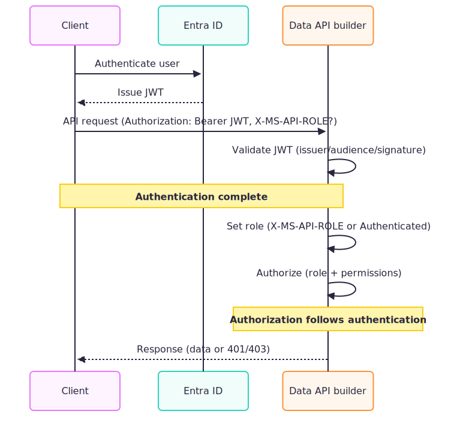

# Configure Microsoft Entra ID authentication

This guide walks you through configuring Microsoft Entra ID (formerly Azure Active Directory) authentication for Data API builder. By the end, your client app authenticates users through Entra, acquires tokens for Data API builder, and DAB can use managed identity to connect to Azure SQL.

Data API builder authenticates incoming requests using either JWT bearer validation (`EntraID`/`AzureAD`/`Custom`) or platform-provided identity headers (`AppService`). For local development and permission testing, use the `Simulator` provider.



## Authentication provider guides

Choose a guide based on your identity provider:

| Provider | Guide |
|----------|-------|
| Microsoft Entra ID | This article |
| Okta, Auth0, or other | [Configure custom JWT authentication](how-to-authenticate-custom.md) |
| Azure App Service | [Configure App Service authentication](how-to-authenticate-app-service.md) |
| Local testing | [Configure Simulator authentication](how-to-authenticate-simulator.md) |

## Authentication flow

The flow has three distinct phases:

| Phase | Description |
|-------|-------------|
| **User auth** | User signs in through your client app via Microsoft Entra ID |
| **Client auth** | Client app acquires a DAB-scoped token and calls Data API builder |
| **Database access** | Data API builder validates the token, then connects to the database using its own identity (managed identity or connection string credentials) |

> [!IMPORTANT]
> Data API builder validates the incoming user token for API authentication, but connects to the database using its **own** credentials (managed identity or SQL authentication). DAB does not perform On-Behalf-Of (OBO) token exchange to access the database as the calling user.

## Prerequisites

- An Azure subscription with Microsoft Entra ID tenant
- Data API builder CLI installed ([installation guide](../../command-line/install.md))
- An existing `dab-config.json` with at least one entity
- (Optional) Azure SQL Database for managed identity scenarios

## Quick reference

| Setting | Value |
|---------|-------|
| Provider | `EntraID` (or `AzureAD` for compatibility) |
| Required for validation | `aud`, `iss`, `exp`, valid signature |
| Required for authorization | `roles` claim (only if using custom roles) |
| Issuer format | `https://login.microsoftonline.com/<tenant-id>/v2.0` |
| Audience format | `api://<app-id>` or custom Application ID URI |
| Default role | `Authenticated` |
| Custom role header | `X-MS-API-ROLE` |
| Role claim type | `roles` (fixed, not configurable) |

> [!NOTE]
> When using `EntraID` or `AzureAD` as the provider, DAB enables extra signing key issuer validation specific to Microsoft Entra tokens. This provides stronger security compared to the generic `Custom` provider.

## Step 1: Register an application in Microsoft Entra ID

Create an app registration that represents your Data API builder API. Client apps will request tokens with an audience that matches this registration.

1. Sign in to the [Microsoft Entra admin center](https://entra.microsoft.com/).

1. Navigate to **Identity** > **Applications** > **App registrations**.

1. Select **New registration**.

1. Enter a **Name** (for example, `Data API Builder API`).

1. Select the appropriate **Supported account types** for your scenario:
   - **Single tenant**: Only users in your organization
   - **Multitenant**: Users in any Microsoft Entra directory

1. Leave **Redirect URI** blank (this registration is for the API, not the client).

1. Select **Register**.

1. On the app's **Overview** page, record these values:

   | Value | Where to find it | Used for |
   |-------|------------------|----------|
   | **Application (client) ID** | Overview page | Building the audience URI |
   | **Directory (tenant) ID** | Overview page | Building the issuer URL |

### Configure the Application ID URI

1. In the app registration, go to **Expose an API**.

1. Select **Add** next to **Application ID URI**.

1. Accept the default (`api://<app-id>`) or enter a custom URI.

1. Select **Save**.

> [!TIP]
> The Application ID URI becomes the `audience` value in your DAB configuration. Use a consistent format across environments.

### Add a scope

A scope is required so that client applications (including Azure CLI) can request delegated access tokens for your API.

1. In the app registration, go to **Expose an API**.

1. Under **Scopes defined by this API**, select **Add a scope**.

1. Enter:
   - **Scope name**: `Endpoint.Access`
   - **Who can consent?**: **Admins and users**
   - **Admin consent display name**: `Execute requests against Data API builder`
   - **Admin consent description**: `Allows client app to send requests to Data API builder endpoint.`
   - **User consent display name**: `Execute requests against Data API builder`
   - **User consent description**: `Allows client app to send requests to Data API builder endpoint.`
   - **State**: **Enabled**

1. Select **Add scope**.

> [!NOTE]
> The full scope value is `api://<app-id>/Endpoint.Access`. Client applications use this value when requesting tokens.

### Add app roles (optional)

If you want to use custom roles beyond `Anonymous` and `Authenticated`:

1. Go to **App roles**.

1. Select **Create app role**.

1. Enter:
   - **Display name**: `Reader`
   - **Allowed member types**: **Users/Groups** or **Both**
   - **Value**: `reader` (this value appears in the token's `roles` claim)
   - **Description**: `Read-only access to data`

1. Select **Apply**.

1. Repeat for additional roles (for example, `writer`, `admin`).

### Set the manifest token version

By default, the app registration manifest sets `accessTokenAcceptedVersion` to `null`, which produces v1.0 tokens. V1 tokens use a different issuer format (`https://sts.windows.net/<tenant-id>/`) than the v2.0 issuer configured in DAB, which causes token validation to fail.

1. In the app registration, go to **Manifest**.

1. Find `accessTokenAcceptedVersion` and change the value to `2`.

1. Select **Save**.

> [!IMPORTANT]
> If `accessTokenAcceptedVersion` is `null` or `1`, the `iss` claim in the token won't match the v2.0 issuer URL configured in DAB, and all requests will fail with `401 Unauthorized`.

### Assign users to app roles

Creating app roles doesn't automatically grant them to users. You must assign users or groups through the Enterprise Application.

1. In the [Microsoft Entra admin center](https://entra.microsoft.com/), navigate to **Identity** > **Applications** > **Enterprise applications**.

1. Search for and select your app (for example, `Data API Builder API`). An enterprise application was created automatically when you registered the app.

1. Go to **Users and groups**.

1. Select **Add user/group**.

1. Under **Users**, select the user account to assign and select **Select**.

1. Under **Select a role**, choose the role to assign (for example, `Reader`). If your role doesn't appear, wait a few minutes for Microsoft Entra replication to complete.

1. Select **Assign**.

1. Repeat for each role you want to assign.

> [!NOTE]
> Without role assignment, the `roles` claim in the user's token will be empty, and requests using `X-MS-API-ROLE` with a custom role will be rejected with `403 Forbidden`.

## Step 2: Configure Data API builder

Configure DAB to validate tokens issued by your Entra tenant for your API audience.

### CLI

#### [Bash](#tab/bash)

```bash
# Set the authentication provider
dab configure \
  --runtime.host.authentication.provider EntraID

# Set the expected audience (Application ID URI)
dab configure \
  --runtime.host.authentication.jwt.audience "api://<your-app-id>"

# Set the expected issuer (your tenant)
dab configure \
  --runtime.host.authentication.jwt.issuer "https://login.microsoftonline.com/<your-tenant-id>/v2.0"
```

#### [Command Prompt](#tab/cmd)

```cmd
REM Set the authentication provider
dab configure ^
  --runtime.host.authentication.provider EntraID

REM Set the expected audience (Application ID URI)
dab configure ^
  --runtime.host.authentication.jwt.audience "api://<your-app-id>"

REM Set the expected issuer (your tenant)
dab configure ^
  --runtime.host.authentication.jwt.issuer "https://login.microsoftonline.com/<your-tenant-id>/v2.0"
```

---

### Resulting configuration

```json
{
  "runtime": {
    "host": {
      "authentication": {
        "provider": "EntraID",
        "jwt": {
          "audience": "api://<your-app-id>",
          "issuer": "https://login.microsoftonline.com/<your-tenant-id>/v2.0"
        }
      }
    }
  }
}
```

## Step 3: Configure entity permissions

Define which roles can access each entity. Requests are evaluated against the role determined from the token.

### Grant access to authenticated users

#### [Bash](#tab/bash)

```bash
dab update Book \
  --permissions "Authenticated:read"
```

#### [Command Prompt](#tab/cmd)

```cmd
dab update Book ^
  --permissions "Authenticated:read"
```

---

### Grant access to a custom role

#### [Bash](#tab/bash)

```bash
dab update Book \
  --permissions "reader:read" \
  --permissions "writer:create,read,update"
```

#### [Command Prompt](#tab/cmd)

```cmd
dab update Book ^
  --permissions "reader:read" ^
  --permissions "writer:create,read,update"
```

---

### Resulting configuration

```json
{
  "entities": {
    "Book": {
      "source": "dbo.Books",
      "permissions": [
        {
          "role": "Authenticated",
          "actions": ["read"]
        },
        {
          "role": "reader",
          "actions": ["read"]
        },
        {
          "role": "writer",
          "actions": ["create", "read", "update"]
        }
      ]
    }
  }
}
```

## Step 4: Configure database connection

Data API builder connects to the database using its own identity, separate from the authenticated user. For production scenarios with Azure SQL, use managed identity.

> [!NOTE]
> The database connection uses DAB's service identity (managed identity or SQL credentials), not the calling user's identity. DAB does not pass through user tokens to the database.

### Option A: Managed identity (recommended for Azure)

#### System-assigned managed identity

```json
{
  "data-source": {
    "database-type": "mssql",
    "connection-string": "Server=tcp:<server>.database.windows.net,1433;Initial Catalog=<database>;Authentication=Active Directory Managed Identity;Encrypt=True;"
  }
}
```

#### User-assigned managed identity

```json
{
  "data-source": {
    "database-type": "mssql",
    "connection-string": "Server=tcp:<server>.database.windows.net,1433;Initial Catalog=<database>;Authentication=Active Directory Managed Identity;User Id=<uami-client-id>;Encrypt=True;"
  }
}
```

### Option B: SQL authentication (development)

```json
{
  "data-source": {
    "database-type": "mssql",
    "connection-string": "@env('SQL_CONNECTION_STRING')"
  }
}
```

> [!IMPORTANT]
> Never commit connection strings with passwords to source control. Use environment variables or Azure Key Vault.

### Option C: Local development with `az login`

For local development against Azure SQL, use your Azure CLI credentials:

```json
{
  "data-source": {
    "database-type": "mssql",
    "connection-string": "Server=tcp:<server>.database.windows.net,1433;Initial Catalog=<database>;Authentication=Active Directory Default;Encrypt=True;"
  }
}
```

Before starting DAB, sign in:

```bash
az login
```

## Step 5: Test the configuration

### Authorize Azure CLI as a client application

Before Azure CLI can acquire tokens for your API, you must add it as an authorized client application.

1. In the app registration, go to **Expose an API**.

1. Under **Authorized client applications**, select **Add a client application**.

1. Enter the Azure CLI client ID: `04b07795-a71b-4346-935f-02f9a1efa4ce`.

1. Select the `api://<app-id>/Endpoint.Access` scope.

1. Select **Add application**.

### Acquire a token with Azure CLI

Sign in to Azure CLI and set the tenant where your app registration exists:

```azurecli
az login
az account set --tenant <your-tenant-id>
```

Request a token scoped to your API:

```azurecli
az account get-access-token --scope api://<your-app-id>/Endpoint.Access --query "accessToken" -o tsv
```

> [!NOTE]
> If you receive an `AADSTS65001` consent error, verify that you added the Azure CLI client ID (`04b07795-a71b-4346-935f-02f9a1efa4ce`) as an authorized client application in the previous step.

You can inspect the token at [jwt.ms](https://jwt.ms) to verify the `aud`, `iss`, and `roles` claims.

### Start DAB and send a request

1. Start Data API builder:

   ```bash
   dab start
   ```

1. Call the API with the token:

   ```bash
   curl -X GET "http://localhost:5000/api/Book" \
     -H "Authorization: Bearer <your-token>"
   ```

1. To use a custom role, include the `X-MS-API-ROLE` header:

   ```bash
   curl -X GET "http://localhost:5000/api/Book" \
     -H "Authorization: Bearer <your-token>" \
     -H "X-MS-API-ROLE: reader"
   ```

> [!NOTE]
> The role specified in `X-MS-API-ROLE` must exist in the token's `roles` claim. If the role isn't in the token, the request is rejected.

## Role selection behavior

Data API builder determines the request's role using this logic:

| Token present? | X-MS-API-ROLE header? | Role in token? | Result |
|----------------|----------------------|----------------|----------------|
| No | No | — | `Anonymous` |
| Yes (valid) | No | — | `Authenticated` |
| Yes (valid) | Yes | No | Rejected (403 Forbidden) |
| Yes (valid) | Yes | Yes | Header value |
| Yes (invalid) | — | — | Rejected (401 Unauthorized) |

## Troubleshooting

| Symptom | Possible cause | Solution |
|---------|----------------|----------|
| `401 Unauthorized` | Token expired or malformed | Acquire a fresh token; check token at [jwt.ms](https://jwt.ms) |
| `401 Unauthorized` | Audience mismatch | Verify `jwt.audience` matches the token's `aud` claim |
| `401 Unauthorized` | Issuer mismatch | Verify `jwt.issuer` matches the token's `iss` claim exactly |
| `403 Forbidden` | Role not in token | Ensure the user is assigned the app role in Entra |
| `403 Forbidden` | No permissions for role | Add the role to the entity's `permissions` array |

## Complete configuration example

```json
{
  "$schema": "https://github.com/Azure/data-api-builder/releases/latest/download/dab.draft.schema.json",
  "data-source": {
    "database-type": "mssql",
    "connection-string": "Server=tcp:myserver.database.windows.net,1433;Initial Catalog=mydb;Authentication=Active Directory Managed Identity;Encrypt=True;"
  },
  "runtime": {
    "host": {
      "authentication": {
        "provider": "EntraID",
        "jwt": {
          "audience": "api://dab-api-12345678",
          "issuer": "https://login.microsoftonline.com/contoso.onmicrosoft.com/v2.0"
        }
      }
    }
  },
  "entities": {
    "Book": {
      "source": "dbo.Books",
      "permissions": [
        {
          "role": "Authenticated",
          "actions": ["read"]
        },
        {
          "role": "librarian",
          "actions": ["create", "read", "update", "delete"]
        }
      ]
    }
  }
}
```

## Related content

- [Authorization and roles](authorization.md)
- [Configure Simulator authentication for testing](how-to-authenticate-simulator.md)
- [Configure App Service authentication](how-to-authenticate-app-service.md)
- [Runtime configuration reference](../../configuration/runtime.md)
