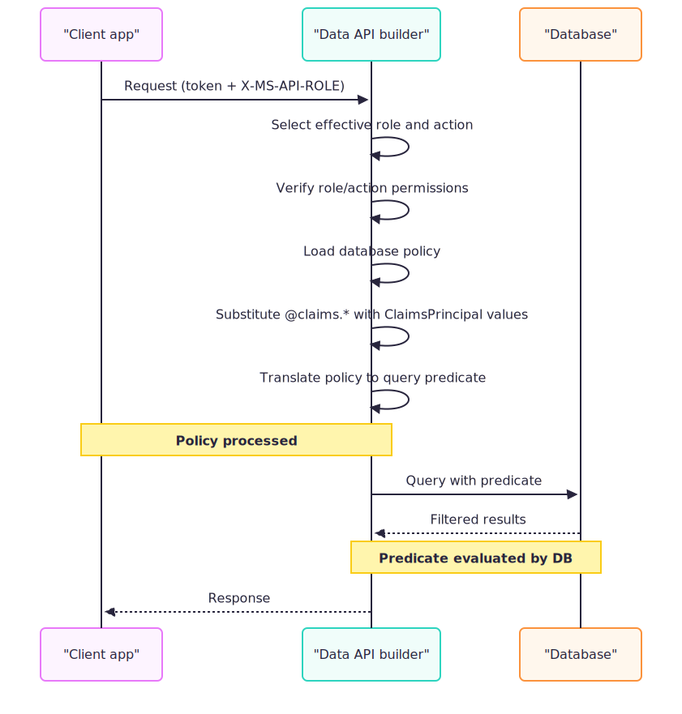

# Configure database policies for row-level filtering

Data API builder supports **database policies** that filter query results based on expressions you define. These policies translate to query predicates (WHERE clauses) that the database evaluates, ensuring users see only the data they're authorized to access.



## When to use database policies

Database policies are ideal when you need to:

- Restrict records based on a field value (for example, `status eq 'published'`)
- Filter data based on the authenticated user's claims (for example, `@claims.userId`)
- Implement row-level access control without modifying stored procedures or views
- Apply different filtering rules per role

> [!NOTE]
> Azure Cosmos DB for NoSQL doesn't currently support database policies.

## Supported actions

Database policies apply to these actions:

| Action | Supported | How it works |
|--------|-----------|--------------|
| `read` | ✔️ Yes | Adds a WHERE predicate to SELECT queries |
| `update` | ✔️ Yes | Adds a WHERE predicate to UPDATE statements |
| `delete` | ✔️ Yes | Adds a WHERE predicate to DELETE statements |
| `create` | ❌ No | INSERT statements don't support WHERE predicates |
| `execute` | ❌ No | Stored procedures don't support query predicates |

## Prerequisites

- Data API builder CLI installed ([installation guide](../../command-line/install.md))
- An existing configuration file with at least one entity
- An authentication provider configured (policies require authenticated requests)

## Quick reference

| Concept | Syntax | Example |
|---------|--------|---------|
| Field reference | `@item.<field>` | `@item.status` |
| Claim reference | `@claims.<type>` | `@claims.userId` |
| Equality | `eq` | `@item.ownerId eq @claims.userId` |
| Inequality | `ne` | `@item.status ne 'draft'` |
| Comparison | `gt`, `ge`, `lt`, `le` | `@item.price lt 100` |
| Logical AND | `and` | `@item.active eq true and @item.published eq true` |
| Logical OR | `or` | `@item.role eq 'admin' or @item.role eq 'editor'` |

## Step 1: Define the policy expression

Database policies use OData-style predicates. The expression must evaluate to true for a row to be included in the results.

### Field references with @item

Use `@item.<field>` to reference entity fields. If you mapped a database column to a different API field name, use the mapped name.

```text
@item.status eq 'published'
```

### Claim references with @claims

Use `@claims.<claimType>` to inject values from the authenticated user's token. At runtime, Data API builder substitutes the claim value into the expression.

```text
@item.ownerId eq @claims.userId
```

> [!IMPORTANT]
> If a referenced claim is missing from the token, the request is rejected with a 403 Forbidden response.

### Compound expressions

Combine conditions using `and` or `or`:

```text
@item.ownerId eq @claims.userId and @item.status ne 'deleted'
```

## Step 2: Add the policy to entity configuration

Policies are defined per action within a role's permissions:

### Configuration file format

```json
{
  "entities": {
    "<entity-name>": {
      "permissions": [
        {
          "role": "<role-name>",
          "actions": [
            {
              "action": "read",
              "policy": {
                "database": "<predicate-expression>"
              }
            }
          ]
        }
      ]
    }
  }
}
```

### Example: User can only read their own records

```json
{
  "entities": {
    "Order": {
      "source": "dbo.Orders",
      "permissions": [
        {
          "role": "customer",
          "actions": [
            {
              "action": "read",
              "policy": {
                "database": "@item.customerId eq @claims.userId"
              }
            }
          ]
        }
      ]
    }
  }
}
```

### Example: Multiple actions with the same policy

Apply the same policy to read, update, and delete:

```json
{
  "entities": {
    "Document": {
      "source": "dbo.Documents",
      "permissions": [
        {
          "role": "author",
          "actions": [
            {
              "action": "read",
              "policy": {
                "database": "@item.authorId eq @claims.sub"
              }
            },
            {
              "action": "update",
              "policy": {
                "database": "@item.authorId eq @claims.sub"
              }
            },
            {
              "action": "delete",
              "policy": {
                "database": "@item.authorId eq @claims.sub"
              }
            }
          ]
        }
      ]
    }
  }
}
```

### Example: Static value filter

Filter by a fixed value rather than a claim:

```json
{
  "entities": {
    "Article": {
      "source": "dbo.Articles",
      "permissions": [
        {
          "role": "Anonymous",
          "actions": [
            {
              "action": "read",
              "policy": {
                "database": "@item.status eq 'published'"
              }
            }
          ]
        }
      ]
    }
  }
}
```

## Step 3: Configure using the CLI

Use the `dab update` command to add policies through the CLI:

### [Bash](#tab/bash)

```bash
dab update Order \
  --permissions "customer:read" \
  --policy-database "@item.customerId eq @claims.userId"
```

### [Command Prompt](#tab/cmd)

```cmd
dab update Order ^
  --permissions "customer:read" ^
  --policy-database "@item.customerId eq @claims.userId"
```

---

> [!TIP]
> When the policy expression contains special characters, enclose it in quotes appropriate for your shell.

## How policies are processed

When a request arrives, Data API builder:

1. **Identifies the effective role** from the `X-MS-API-ROLE` header or system role
1. **Looks up the policy** for the entity, role, and action combination
1. **Substitutes claims** by replacing `@claims.<type>` tokens with actual values from the token
1. **Parses the expression** as an OData $filter
1. **Generates query predicates** that are appended to the database query

For example, if the policy is `@item.ownerId eq @claims.userId` and the token contains `userId: "user123"`, the generated SQL includes:

```sql
WHERE [ownerId] = 'user123'
```

## Claim substitution

Data API builder extracts claims from the authenticated user's JWT or identity principal. Common claims include:

| Claim | Description | Example value |
|-------|-------------|---------------|
| `sub` | Subject identifier (user ID) | `a1b2c3d4-e5f6-7890-abcd-ef1234567890` |
| `userId` | Custom user identifier | `user123` |
| `email` | User's email address | `user@example.com` |
| `name` | User's display name | `Jane Doe` |
| `roles` | Role memberships (array) | `["reader", "editor"]` |

> [!WARNING]
> If a claim referenced in the policy doesn't exist in the token, Data API builder rejects the request with a 403 Forbidden response. Ensure your identity provider includes all required claims.

## Combine with field restrictions

Policies work alongside field-level access control. You can restrict both which rows and which columns a role can access:

```json
{
  "role": "auditor",
  "actions": [
    {
      "action": "read",
      "fields": {
        "include": ["id", "amount", "status"],
        "exclude": ["internalNotes"]
      },
      "policy": {
        "database": "@item.status eq 'completed'"
      }
    }
  ]
}
```

## Limitations

| Limitation | Details |
|------------|---------|
| No `create` action | INSERT statements don't support WHERE predicates |
| No `execute` action | Stored procedures don't accept query predicates |
| No Azure Cosmos DB for NoSQL | The NoSQL API doesn't currently support database policies |
| No named authorization policies | DAB doesn't support ASP.NET/HotChocolate-style named policies |

## Troubleshooting

### Claim not found (403 Forbidden)

If the request fails with 403 Forbidden, verify:

- The claim exists in the access token
- The claim name matches exactly (case-sensitive)
- The identity provider is configured to include the claim

### Policy not applied

If results aren't being filtered:

- Verify the role name matches the `X-MS-API-ROLE` header value
- Confirm the action (read, update, delete) has a policy defined
- Check that authentication is configured and the request is authenticated

### Syntax errors

If the engine reports a policy parsing error:

- Verify the expression uses OData syntax (`eq`, `ne`, `and`, `or`)
- Check that field names match the mapped API names (not database column names)
- Ensure string values are enclosed in single quotes

## Related content

- [Authorization and roles](authorization.md)
- [Row-level security with session context](row-level-security.md)
- [Configuration reference: Permissions](../../configuration/entities.md#permissions-entity-name-entities)
