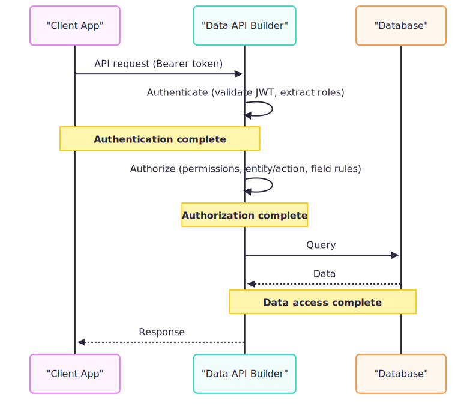
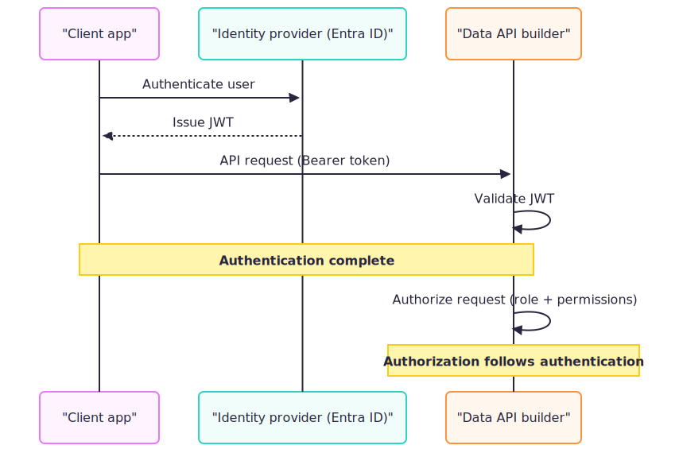
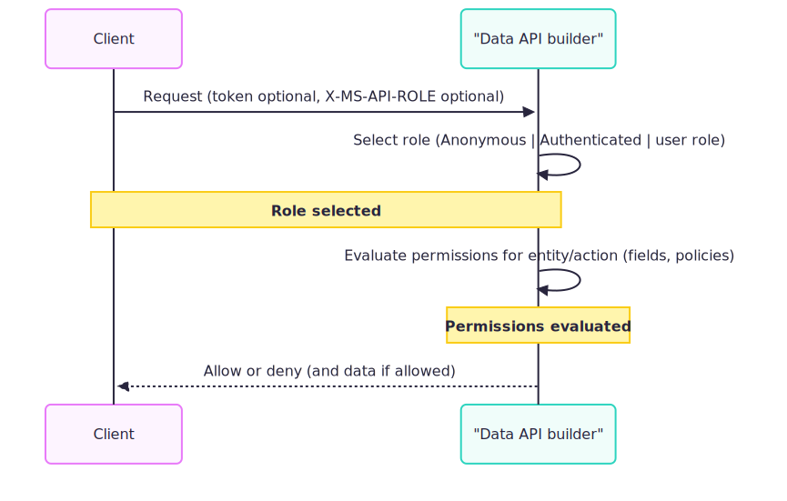

# Secure your Data API builder solution

Data API builder exposes your data through REST and GraphQL endpoints. Securing your API requires attention to three core areas: **authentication** (who is calling?), **authorization** (what can they do?), and **transport security** (is the connection protected?).



## Three pillars of security

| Pillar | Question it answers | Key concept |
|--------|---------------------|-------------|
| **Authentication** | Who is the caller? | Validate tokens from an identity provider |
| **Authorization** | What can they do? | Role-based permissions on entities |
| **Transport** | Is the connection secure? | TLS encryption for all traffic |

## Choose your authentication provider

Data API builder supports multiple authentication providers. Choose the one that matches your deployment scenario:

| Provider | Use case | Guide |
|----------|----------|-------|
| **Microsoft Entra ID** (`EntraID`/`AzureAD`) | Production apps using Microsoft identity | [Configure Entra authentication](how-to-authenticate-entra.md) |
| **Custom JWT** | Third-party IdPs (Okta, Auth0, Keycloak) | [Configure custom JWT authentication](how-to-authenticate-custom.md) |
| **App Service** | Apps running behind Azure App Service EasyAuth (platform headers) | [Configure App Service authentication](how-to-authenticate-app-service.md) |
| **Simulator** | Local development and testing | [Configure Simulator authentication](how-to-authenticate-simulator.md) |
| **Static Web Apps** | Apps fronted by SWA auth headers | [Configure App Service authentication](how-to-authenticate-app-service.md)

> [!TIP]
> Start with the **Simulator** provider during development to test permissions without configuring an identity provider. Switch to a production provider before deploying.

## Authentication

Authentication verifies the caller's identity. Data API builder authenticates requests by either validating JWT bearer tokens (`EntraID`/`AzureAD`, `Custom`) or trusting platform-provided identity headers (`AppService`, `StaticWebApps`). `Simulator` skips external validation for development.



### How it works

1. For JWT providers, the client acquires a token from the identity provider
1. The client sends the token in the `Authorization: Bearer <token>` header (JWT providers) or platform injects identity headers (EasyAuth/SWA)
1. Data API builder validates the token or platform header (issuer, audience, signature for JWT providers)
1. DAB extracts the user's roles from the token or identity header

### Quick reference

| Setting | Description |
|---------|-------------|
| `runtime.host.authentication.provider` | The authentication provider (`EntraID`/`AzureAD`, `Custom`, `AppService`, `StaticWebApps`, `Simulator`) |
| `runtime.host.authentication.jwt.audience` | Expected audience claim for JWT providers (not used by AppService/StaticWebApps/Simulator) |
| `runtime.host.authentication.jwt.issuer` | Expected issuer/authority for JWT providers (not used by AppService/StaticWebApps/Simulator) |

For detailed configuration, see [Configure Microsoft Entra ID authentication](how-to-authenticate-entra.md).

## Authorization

Authorization determines what an authenticated (or anonymous) user can do. Data API builder uses role-based access control (RBAC) to restrict access to entities and actions.



### How it works

1. DAB assigns a role to the request based on the token and headers
1. DAB looks up the entity's permissions for that role
1. If the role has permission for the requested action, DAB executes the query
1. If not, DAB returns a `403 Forbidden` response

### System roles vs. user roles

| Role type | Description |
|-----------|-------------|
| **`Anonymous`** | Assigned when no authenticated identity is present |
| **`Authenticated`** | Assigned when a request is authenticated (JWT accepted or trusted platform header) and no specific user role is selected |
| **User roles** | Custom roles from the token's `roles` claim (or platform roles), selected via `X-MS-API-ROLE` header |

### Secure by default

Entities have **no permissions by default**. You must explicitly grant access:

```json
{
  "entities": {
    "Book": {
      "permissions": [
        { "role": "authenticated", "actions": ["read"] }
      ]
    }
  }
}
```

For detailed configuration, see [Authorization and roles](authorization.md).

## Row-level and field-level security

Go beyond entity-level permissions with fine-grained access control:

| Feature | Description | Guide |
|---------|-------------|-------|
| **Database policies (row-level security)** | Translate policy expressions into query predicates that filter rows based on claims or session context | [Implement row-level security](row-level-security.md) |
| **Field-level security** | Include or exclude specific columns per role | [Field access](authorization.md#field-access) |

## Transport and configuration security

### Transport security

- **Use TLS for all connections**: Encrypt traffic between clients and DAB
- **Disable legacy TLS versions**: Rely on TLS 1.2+ only
- **Use HTTPS endpoints**: Never expose DAB over unencrypted HTTP in production

For details, see [Security best practices](../../deployment/best-practices-security.md).

### Configuration security

- **Store secrets in environment variables**: Use `@env('SECRET_NAME')` in your config
- **Use Azure Key Vault**: Reference secrets with `@azure('key-vault-uri')`
- **Never commit secrets**: Keep `dab-config.json` free of passwords and connection strings

```json
{
  "data-source": {
    "connection-string": "@env('SQL_CONNECTION_STRING')"
  }
}
```

## Monitoring and updates

- **Monitor access**: Use [Application Insights](../monitor/application-insights.md) to track requests and detect anomalies
- **Review logs**: Check for failed authentication attempts and permission denials
- **Keep DAB updated**: Apply security patches by upgrading to the [latest version](../../whats-new/index.yml)

## Quick start guides

| Task | Guide |
|------|-------|
| Set up Microsoft Entra ID authentication | [Configure Entra authentication](how-to-authenticate-entra.md) |
| Use Okta or Auth0 | [Configure custom JWT authentication](how-to-authenticate-custom.md) |
| Run behind Azure App Service | [Configure App Service authentication](how-to-authenticate-app-service.md) |
| Test permissions locally | [Configure Simulator authentication](how-to-authenticate-simulator.md) |
| Restrict rows by user | [Implement row-level security](row-level-security.md) |
| Understand role assignment | [Authorization and roles](authorization.md) |

## Related content

- [Configure Microsoft Entra ID authentication](how-to-authenticate-entra.md)
- [Authorization and roles](authorization.md)
- [Security best practices](../../deployment/best-practices-security.md)
- [Runtime configuration reference](../../configuration/runtime.md)
