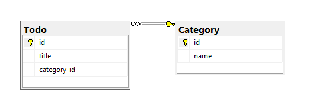

# Relationships

This section outlines options that define relationships between entities. [more](https://devblogs.microsoft.com/azure-sql/data-api-builder-relationships/)

```json
{
  "entities": {
    "entity-name": {
      ...
      "relationships": {
        "relationship-name": {
          "cardinality": "one" | "many",
          "target.entity": "target-entity-name",
          "source.fields": ["source-field-name"],
          "target.fields": ["target-field-name"],
          "linking.object": "linking-object-name",
          "linking.source.fields": ["linking-source-field-name"],
          "linking.target.fields": ["linking-target-field-name"]
        }
      }
    }
  }
}
```

> [!NOTE]
> Relationships are only relevant to GraphQL queries. REST endpoints access only one entity at a time and can't return nested types. 
 
The `relationships` section outlines how entities interact within the Data API builder, detailing associations and potential database support for these relationships. The `relationship-name` property for each relationship is both required and must be unique across all relationships for a given entity. Custom names ensure clear, identifiable connections and maintain the integrity of the GraphQL schema generated from these configurations.

| Relationship | Cardinality | Example
|-|-|-
| one-to-many | `many` | One category entity can relate to many todo entities.
| many-to-one | `one` | Many todo entities can relate to one category entity.
| many-to-many| `many`  | One todo entity can relate to many user entities, and one user entity can relate to many todo entities.

## One-To-Many relationship

A one-to-many relationship connects one entity to multiple entities in another table. This relationship allows you to model scenarios where a single entity can be associated with several instances of another entity. For instance, a single category can refence many todo tasks.

```json
{
  "entities": {
    "<entity-name>": {
      ...
      "relationships": {
        "<relationship-name>": {
          "cardinality": "many",
          "target.entity": "<entity-name>",
          "source.fields": ["<array-of-strings>"],
          "target.fields": ["<array-of-strings>"],
        }
      }
    }
  }
}
```

| Field           | Description
|-----------------|------------
| `source.fields` | Database fields in the *source* entity that are used to connect to the related item in the `target` entity. |
| `target.fields` | Database fields in the *target* entity that are used to connect to the related item in the `source` entity. |

These fields are optional and can be inferred automatically if there's a Foreign Key constraint between the two tables in the database.

### GraphQL Schema

The resulting GraphQL schema reflects this relationship by allowing queries on the `Category` entity to retrieve all related `Todo` items. This relationship enhances data retrieval efficiency and the relational context within your API.

```graphql
type Category
{
  id: Int!
  ...
  todos: [TodoConnection]!
}
```

### Example 

Consider a scenario where a `Category` entity is related to multiple `Todo` items. The configuration indicates that each category can be linked to many todos. The relationship is defined by matching the `Category` entity's ID (`source.fields`) with the `Todo` entity's category ID (`target.fields`).



```json
{
  "entities": {
    "<entity-name>": {
      ...
      "relationships": {
        "<relationship-name>": {
          "cardinality": "many",
          "target.entity": "Todo",
          "source.fields": ["id"],
          "target.fields": ["category_id"]
        }
      }
    }
  }
}
```

## Many-To-One Relationship

A Many-To-One relationship implies that multiple records in one entity are associated with a single record in another entity. They occur where each child record (for example, `Todo`) refers back to a parent record (`Category`).

```json
{
  "entities": {
    "<entity-name>": {
      ...
      "relationships": {
        "<relationship-name>": {
          "cardinality": "one",
          "target.entity": "<entity-name>",
          "source.fields": ["<array-of-strings>"],
          "target.fields": ["<array-of-strings>"],
        }
      }
    }
  }
}
```

| Field Type       | Description |
|------------------|-------------|
| `source.fields`  | Specifies the database fields in the source entity (`Todo`) used to link to the target entity (`Category`). Optional if a Foreign Key constraint exists. |
| `target.fields`  | Specifies the database fields in the target entity (`Category`) used for linking. Optional if a Foreign Key constraint exists. |

These fields are optional if there's an existing Foreign Key constraint that can automatically infer this information.

### GraphQL Schema

```graphql
type Todo {
  id: Int!
  ...
  category: Category
}
```

### Example

This configuration establishes a Many-To-One relationship between `Todo` and `Category` entities, allowing each `Todo` to be associated with a single `Category`.


```json
{
  "entities": {
    "<entity-name>": {
      ...
      "relationships": {
        "category": {
          "cardinality": "one",
          "target.entity": "Category",
          "source.fields": ["CategoryId"],
          "target.fields": ["Id"]
        }
      }
    }
  }
}
```

## Many-To-Many Relationship

In a many-to-many relationship, two entities can have multiple connections between them. This relationship type is essential for scenarios where instances of one entity need to be linked with multiple instances of another entity, and vice versa. For example, a book can have multiple authors, and an author can write multiple books.

### Basic Syntax

```json
{
  "entities": {
    "<entity-name>": {
      ...
      "relationships": {
        "<relationship-name>": {
          "cardinality": "many",
          "target.entity": "<entity-name>",
          "source.fields": ["<array-of-strings>"],
          "target.fields": ["<array-of-strings>"],
          "linking.object": "<entity-or-db-object-name",
          "linking.source.fields": ["<array-of-strings>"],
          "linking.target.fields": ["<array-of-strings>"]
        }
      }
    }
  }
}
```

The `linking` prefix in elements identifies those elements used to provide association table or entity information.

| Field Type       | Description |
|------------------|-------------|
| `linking.object` |Specifies the intermediary table or entity used to maintain the many-to-many relationship between the two entities.
| `linking.source.fields` |Define the database columns used to establish the relationship to the source entity in the linking entity.
| `linking.target.fields` |Define the database columns used to establish the relationship in the target entity in the linking entity.

Both `source.fields` and `target.fields` are required in many-to-many relationship definitions. However, these fields are optional in configuration if they can be inferred automatically in the database.

### GraphQL Schema

The GraphQL schema generated from the configuration allows for querying related entities through the intermediary, reflecting the many-to-many relationship.

```graphql
type Book {
  id: Int!
  ...
  authors: [Author]!
}

type Author {
  id: Int!
  ...
  books: [Book]!
}
```

### Example

Consider a scenario where books and authors are related through a many-to-many relationship. Each book can have multiple authors, and each author can write multiple books. The relationship is managed through an intermediary table, `BookAuthors`, which links books and authors based on their IDs.


The example creates two relationships, from `User` to `Todo` and from `Todo` to `User`. In fact, this comprehensive demo shows all of the possible relationships in one complete configuration file, including the CLI walkthrough to create the configuration file from only the command line. At the bottom, the SQL Server database schema is also provided for testing purposes.

```json
{
  "$schema": "https://github.com/Azure/data-api-builder/releases/download/v0.10.23/dab.draft.schema.json",
  "data-source": {
    "database-type": "mssql",
    "connection-string": "$env('my-connection-string')",
    "options": {
      "set-session-context": false
    }
  },
  "runtime": {
    "rest": {
      "enabled": true,
      "path": "/api",
      "request-body-strict": true
    },
    "graphql": {
      "enabled": true,
      "path": "/graphql",
      "allow-introspection": true
    },
    "host": {
      "cors": {
        "origins": [],
        "allow-credentials": false
      },
      "authentication": {
        "provider": "StaticWebApps"
      },
      "mode": "development"
    }
  },
  "entities": {
    "Todo": {
      "source": {
        "object": "Todos",
        "type": "table"
      },
      "graphql": {
        "enabled": true,
        "type": {
          "singular": "Todo",
          "plural": "Todos"
        }
      },
      "rest": {
        "enabled": true
      },
      "permissions": [
        {
          "role": "authenticated",
          "actions": [
            {
              "action": "*"
            }
          ]
        }
      ],
      "relationships": {
        "users": {
          "cardinality": "many",
          "target.entity": "User",
          "source.fields": [],
          "target.fields": [],
          "linking.object": "users_todos",
          "linking.source.fields": [
            "todo_id"
          ],
          "linking.target.fields": [
            "user_id"
          ]
        },
        "category": {
          "cardinality": "one",
          "target.entity": "Category",
          "source.fields": [
            "category_id"
          ],
          "target.fields": [
            "id"
          ],
          "linking.source.fields": [],
          "linking.target.fields": []
        }
      }
    },
    "User": {
      "source": {
        "object": "Users",
        "type": "table"
      },
      "graphql": {
        "enabled": true,
        "type": {
          "singular": "User",
          "plural": "Users"
        }
      },
      "rest": {
        "enabled": true
      },
      "permissions": [
        {
          "role": "authenticated",
          "actions": [
            {
              "action": "*"
            }
          ]
        }
      ],
      "relationships": {
        "todos": {
          "cardinality": "many",
          "target.entity": "Todo",
          "source.fields": [],
          "target.fields": [],
          "linking.object": "users_todos",
          "linking.source.fields": [
            "user_id"
          ],
          "linking.target.fields": [
            "todo_id"
          ]
        }
      }
    },
    "Category": {
      "source": {
        "object": "Categories",
        "type": "table"
      },
      "graphql": {
        "enabled": true,
        "type": {
          "singular": "Category",
          "plural": "Categories"
        }
      },
      "rest": {
        "enabled": true
      },
      "permissions": [
        {
          "role": "anonymous",
          "actions": [
            {
              "action": "*"
            }
          ]
        }
      ],
      "relationships": {
        "todos": {
          "cardinality": "many",
          "target.entity": "Todo",
          "source.fields": [
            "id"
          ],
          "target.fields": [
            "category_id"
          ],
          "linking.source.fields": [],
          "linking.target.fields": []
        }
      }
    }
  }
}
```

**Walkthrough**

`linking.object`: the database object that is used in the backend database to support the M:N relationship

`linking.source.fields`: database fields, in the *linking* object (`users_todos` in the example), that is used to connect to the related item in the `source` entity (`Todo` in the sample)

`linking.target.fields`: database fields, in the *linking* object (`users_todos` in the example), that is used to connect to the related item in the `target` entity (`User` in the sample)

**[Command-line](../data-api-builder-cli.md) walkthrough for this example**

To create the entities `User` and `Todo` and set up the many-to-many relationship using the `users_todos` linking table through the Data API builder CLI, you must run a series of `dab` commands. 

1. Initialize the configuration for a specific database:
   ```shell
   dab init --database-type mssql --connection-string "$env('my-connection-string')" --host-mode "development"
   ```

2. Add the `User`, `Todo`, and `Category` entities:

   ```shell
   dab add User --source Users --permissions "anonymous:*"
   dab add Todo --source Todos --permissions "anonymous:*"
   dab add Category --source Categories --permissions "anonymous:*"
   ```

4. Set up the one-to-many relationship between `Category` and `Todo`.

   ```shell
   dab update Category --relationship todos --cardinality many --target.entity Todo --relationship.fields "id:category_id"
   ```

1. Set up the many-to-one relationship between `Todo` and `Category`.

   ```shell
   dab update Todo --relationship category --cardinality one --target.entity Category --relationship.fields "category_id:id"
   ```

1. Set up the many-to-many relationship between `User` and `Todo` through the `users_todos` linking table. 

   ```shell
   dab update User --relationship "todos" --cardinality many --target.entity Todo --linking.object users_todos --linking.source.fields "user_id" --linking.target.fields "todo_id" 
   ```

2. Set up the many-to-many relationship between `Todo` and `User` through the `users_todos` linking table. 

   ```shell
   dab update Todo --relationship "users" --cardinality many --target.entity User --linking.object users_todos --linking.source.fields "todo_id" --linking.target.fields "user_id" 
   ```

**Database setup for this example**

Want a backing database for testing? These scripts are the DDL (Data Definition Language) and DML (Data Manipulation Language) SQL statements to create the `User`, `Todo`, `Category`, and `users_todos` tables, along with their relationships.

```sql
CREATE TABLE User (
    id INT PRIMARY KEY,
    name NVARCHAR(100) NOT NULL
);

CREATE TABLE Todo (
    id INT PRIMARY KEY,
    title NVARCHAR(255) NOT NULL,
    category_id INT,
    FOREIGN KEY (category_id) REFERENCES Category(id)
);

CREATE TABLE Category (
    id INT PRIMARY KEY,
    name NVARCHAR(100) NOT NULL
);

CREATE TABLE users_todos (
    user_id INT,
    todo_id INT,
    PRIMARY KEY (user_id, todo_id),
    FOREIGN KEY (user_id) REFERENCES User(id),
    FOREIGN KEY (todo_id) REFERENCES Todo(id)
);
```

After creating the tables, you can insert some initial data using DML statements.

```sql
INSERT INTO User (id, name) VALUES (1, 'Alice');
INSERT INTO User (id, name) VALUES (2, 'Bob');

INSERT INTO Category (id, name) VALUES (1, 'Work');
INSERT INTO Category (id, name) VALUES (2, 'Home');

INSERT INTO Todo (id, title, category_id) VALUES (1, 'Finish report', 1);
INSERT INTO Todo (id, title, category_id) VALUES (2, 'Buy groceries', 2);

INSERT INTO users_todos (user_id, todo_id) VALUES (1, 1);
INSERT INTO users_todos (user_id, todo_id) VALUES (1, 2);
INSERT INTO users_todos (user_id, todo_id) VALUES (2, 1);
INSERT INTO users_todos (user_id, todo_id) VALUES (2, 2);
```