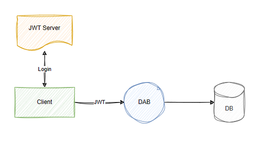

# Runtime

This section outlines options that influence the runtime behavior and settings for all exposed entities.

## Overview

```json
{
  "runtime": {
    "rest": {
      "path": "/api" (default),
      "enabled": true (default) | false,
      "request-body-strict": true (default) | false
    },
    "graphql": {
      "path": "/graphql" (default),
      "enabled": true (default) | false,
      "allow-introspection": true (default) | false
    },
    "host": {
      "mode": "production" (default) | "development",
      "cors": {
        "origins": ["<array-of-strings>"],
        "credentials": true | false (default)
      },
      "authentication": {
        "provider": "StaticWebApps" (default) | ...,
        "jwt": {
          "audience": "<client-id>",
          "issuer": "<issuer-url>"
        }
      }
    }
  },
  "cache": {
    "enabled": <true> | <false> (default),
    "ttl-seconds": <integer; default: 5>
  },
  "telemetry": {
    "application-insights": {
      "connection-string": "<connection-string>",
      "enabled": <true> (default) | <false>
    }
  }
}
```

## Rest property

This section outlines the global settings for the REST endpoints. These settings serve as defaults for all entities but can be overridden on a per-entity basis in their respective configurations.

### Overview

```json
{
  "runtime": {
    "rest": {
      "path": "/api" (default),
      "enabled": true (default) | false,
      "request-body-strict": true (default) | false
    },
    ...
  }
}
```

### Path property

Sets the URL path for accessing all exposed REST endpoints. For instance, setting `path` to `/api` makes the REST endpoint accessible at `/api/<entity>`. Subpaths aren't permitted. This field is optional, with `/api` as the default.

> [!NOTE]
> When deploying Data API builder using Static Web Apps (preview), the Azure service automatically injects the additional subpath `/data-api` to the url. This behavior ensures compatibility with existing Static Web App features. The resulting endpoint would be `/data-api/api/<entity>`. This is only relevant to Static Web Apps.

### Enabled property

A Boolean flag that determines the global availability of REST endpoints. If disabled, entities can't be accessed via REST, regardless of individual entity settings.

### Request-body-strict property

This boolean flag determines whether the request body for a REST mutation operation can contain extraneous fields. By default, the value is true, meaning that extra fields in the request body results in a `BadRequest` exception. However, setting this flag to false allows users to include extra fields in the request body, which are ignored. It's important to note that this flag doesn't affect REST query (GET) requests, as the request body is always ignored for GET operations.

## GraphQL property

This section outlines the global settings for the GraphQL endpoint. 

### Overview

```json
{
  "runtime": {
    "graphql": {
      "path": "/graphql" (default),
      "enabled": true (default) | false,
      "allow-introspection": true (default) | false
    }
  }
}
```

### Path property

Specifies the URL path for the GraphQL endpoint. Setting `path` to `/graphql` exposes the endpoint at `/graphql`. Subpaths aren't allowed. This field is optional, with `graphql` as the default. Custom paths for the GraphQL endpoint are currently unsupported.

### Enabled property

A Boolean flag that determines the global availability of GraphQL endpoints. If disabled, entities can't be accessed via GraphQL, regardless of individual entity settings.

### Allow-introspection property

This Boolean flag controls the ability to perform schema introspection queries on the GraphQL endpoint. Enabling introspection allows clients to query the schema for information about the types of data available, the kinds of queries they can perform, and the mutations available. 

This feature is useful during development for understanding the structure of the GraphQL API and for tooling that automatically generates queries. However, for production environments, it might be disabled to obscure the API's schema details and enhance security. By default, introspection is enabled, allowing for immediate and comprehensive exploration of the GraphQL schema.

## Host property

The `host` section within the runtime configuration provides settings crucial for the operational environment of the Data API builder. These settings include operational modes, CORS configuration, and authentication details.

### Syntax overview

```json
{
  "runtime": {
    ...
    "host": {
      "mode": "production" (default) | "development",
      "cors": {
        "origins": ["<array-of-strings>"],
        "credentials": true | false (default)
      },
      "authentication": {
        "provider": "StaticWebApps" (default) | ...,
        "jwt": {
          "audience": "<client-id>",
          "issuer": "<issuer-url>"
        }
      }
    }
  }
  ...
}
```

### Mode property

Indicates how the engine should operate. 


| Mode | Description |
| - | - |
| `production` | In `production` mode, the engine optimizes for security and performance, setting the default `-LogLevel` to `Error`. This mode limits the detail of error messages, particularly from the database, to prevent sensitive information exposure. |
| `development` | In `development` mode, the engine increases the verbosity of logging (`Debug` level) and provides detailed error messages, including from the database. This mode is beneficial for troubleshooting and development. |

### Anonymous 

Requests can also be made without being authenticated. In such cases, the request is automatically assigned to the `anonymous` system role so that it can be properly authorized. In this case, the configuration doesn't require either `cors` or `authentication` properties - since they would be ignored. 

```json
{
  "runtime": {
    "host": {
      "mode": "development" | "production" (default)
    }
  }
}
```

### Cors property

The `host.cors` section within the runtime configuration specifies the Cross-Origin Resource Sharing (CORS) policies for the Data API builder. The `cors` property defines how resources in your API can be requested from a different domain than the one that served the initial request.

### Syntax overview

```json
{
  "host": {
    "mode": "development",
    "cors": {
      "origins": ["https://dev.example.com"],
      "credentials": true
    },
    "authentication": {
      "provider": "StaticWebApps"
    }
  }
}
```

#### Origins property

This parameter defines the allowed origins that can make requests to your API, enhancing security by limiting cross-site interactions to trusted domains only.
 
#### Credentials property

Controls whether browsers should include credentials, like cookies or HTTP authentication, in cross-origin requests. Setting `credentials` to `true` allows credentials on cross-origin requests, while `false` prohibits them, aligning with security best practices and specific application needs. 

More about the [`Access-Control-Allow-Credentials`](https://developer.mozilla.org/en-US/docs/Web/HTTP/Headers/Access-Control-Allow-Credentials) header.

By default, `credentials` is `false`.

### Authentication property

Configures the authentication process.

### Syntax overview

```json
{
  "runtime": {
    ...
    "host": {
      ...
      "authentication": {
        "provider": "StaticWebApps" (default) | "AppService" | "AzureAD" | "Simulator",
        "jwt": {
          "audience": "<Client_ID>",
          "issuer": "<Identity_Provider_Issuer_URL>"
        }
      }
    }
  }
}
```

#### Provider property

The `authentication.provider` setting within the `host` configuration defines the method of authentication used by the Data API builder. It determines how the API validates the identity of users or services attempting to access its resources. This setting allows for flexibility in deployment and integration by supporting various authentication mechanisms tailored to different environments and security requirements. 

| Provider | Description |
| - | - |
| StaticWebApps (default) | Instructs Data API builder to look for a set of HTTP headers only present when running within a Static Web Apps environment. [more](../local-authentication.md) |
| AppService | When the runtime is hosted in Azure AppService with AppService Authentication enabled and configured (EasyAuth). [more](https://github.com/Azure/data-api-builder/pull/97) |
| AzureAd | Microsoft Entra Identity needs to be configured so that it can authenticate a request sent to Data API builder (the "Server App"). [more](../authentication-azure-ad.md) |
| Simulator | A configurable authentication provider that instructs the Data API builder engine to treat all requests as authenticated. [more](../local-authentication.md) |

> [!NOTE]
> Effective July 2023, Azure Active Directory (Azure AD) underwent a name change and is now known as Microsoft Entra ID. This transition occurred as part of Microsoft’s commitment to simplifying secure access experiences for everyone. 

#### Jwt property
 
Required if the authentication provider is `AzureAD` for Microsoft Entra Identity (previously known as Azure Active Directory). This section must specify the `audience` and `issuer` to validate the received JWT token against the intended `AzureAD` tenant for authentication. [Learn more about Microsoft Entra Identity in DAB.](../authentication-azure-ad.md)

| Setting | Description |
| - | - |
| audience | Identifies the intended recipient of the token; typically the application's identifier registered in Microsoft Entra Identity (or your identity provider), ensuring that the token was indeed issued for your application. |
| issuer | Specifies the issuing authority's URL, which is the token service that issued the JWT. This URL should match the identity provider's issuer URL from which the JWT was obtained, validating the token's origin. |

**Flexible security**

The Data API builder (DAB) offers flexible authentication support, integrating with Microsoft Entra Identity and custom JSON Web Token (JWT) servers. In this image, the **JWT Server** represents the authentication service that issues JWT tokens to clients upon successful sign-in. The client then passes the token to DAB, which can interrogate its claims and properties.



## Examples

The following are examples of the `host` property given various architectural choices you might make in your solution.

**StaticWebApps**

````json
{
 "host": {
  "mode": "development",
  "cors": {
   "origins": ["https://dev.example.com"],
   "credentials": true
  },
  "authentication": {
   "provider": "StaticWebApps"
  }
 }
}
````

With `StaticWebApps`, Data API builder expects Azure Static Web Apps to authenticate the request and the `X-MS-CLIENT-PRINCIPAL` HTTP header is present. 

**AppService**

````json
{
 "host": {
  "mode": "production",
  "cors": {
   "origins": [ "https://api.example.com" ],
   "credentials": false
  },
  "authentication": {
   "provider": "AppService",
   "jwt": {
    "audience": "9e7d452b-7e23-4300-8053-55fbf243b673",
    "issuer": "https://example-appservice-auth.com"
   }
  }
 }
}
````

Authentication is delegated to a supported identity provider where access token can be issued. An acquired access token must be included with incoming requests to Data API builder. Data API builder then validates any presented access tokens, ensuring that Data API builder was the intended audience of the token.

**AzureAD** (Microsoft Entra Identity)

````json
{
 "host": {
  "mode": "production",
  "cors": {
   "origins": [ "https://api.example.com" ],
   "credentials": true
  },
  "authentication": {
   "provider": "AzureAD",
   "jwt": {
    "audience": "c123d456-a789-0abc-a12b-3c4d56e78f90",
    "issuer": "https://login.microsoftonline.com/98765f43-21ba-400c-a5de-1f2a3d4e5f6a/v2.0"
   }
  }
 }
}
````

**Simulator** (Development-only)

````json
{
 "host": {
  "mode": "development",
  "authentication": {
   "provider": "Simulator"
  }
 }
}
````