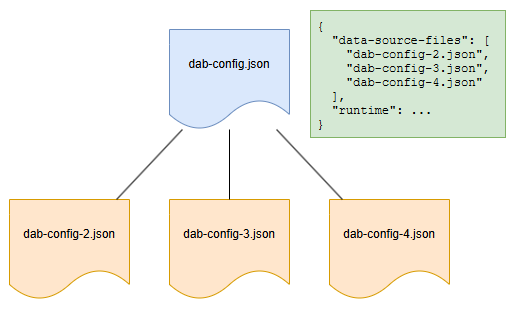

# Data API builder configuration schema reference

Data API builder requires at least one configuration file to run. This JSON-based file defines your API setup, from environment settings to entity definitions. It begins with a `$schema` property, which enables schema validation for the rest of the file.

### Top-level properties

|Property|Description|
|-|-|
|[$schema](#schema)|URI of the JSON schema for this configuration.|
|[data-source](data-source.md#data-source-1)|Object containing database connectivity settings.|
|[data-source-files](#data-source-files)|Array of other configuration file paths.|
|[runtime](runtime.md#runtime)|Object configuring runtime behaviors.|
|[entities](entities.md#entities)|Object defining all entities exposed via REST or GraphQL.|

### Data-source properties

|Property|Description|
|-|-|
|[data-source](data-source.md#data-source-1)|Object containing database connectivity settings.|
|[data-source.database-type](data-source.md#data-source-1)|Database type used in the backend (mssql, postgresql, mysql, cosmosdb_nosql, cosmosdb_postgresql).|
|[data-source.connection-string](data-source.md#data-source-1)|Connection string for the selected database type.|
|[data-source.options](data-source.md#data-source-1)|Database-specific options and advanced settings.|
|[data-source.health](data-source.md#health-data-source)|Health check configuration for the data source.|
|[data-source-files](#data-source-files)|Array of other configuration file paths.|

### Runtime properties

|Property|Description|
|-|-|
|[runtime](runtime.md#runtime)|Object configuring runtime behaviors.|
|[runtime.pagination](runtime.md#pagination-runtime)|Pagination settings for API responses.|
|[runtime.rest](runtime.md#rest-runtime)|REST API global configuration.|
|[runtime.graphql](runtime.md#graphql-runtime)|GraphQL API global configuration.|
|[runtime.cache](runtime.md#cache-runtime)|Global response caching configuration.|
|[runtime.telemetry](runtime.md#telemetry-runtime)|Telemetry, logging, and monitoring configuration.|
|[runtime.health](runtime.md#health-runtime)|Global health check configuration.|

### Entities properties

|Property|Description|
|-|-|
|[entities](entities.md#entities)|Object defining all entities exposed via REST or GraphQL.|
|[entities.entity-name.source](entities.md#source-entity-name-entities)|Database source details for the entity.|
|[entities.entity-name.rest](entities.md#rest-entity-name-entities)|REST API configuration for the entity.|
|[entities.entity-name.graphql](entities.md#graphql)|GraphQL API configuration for the entity.|
|[entities.entity-name.permissions](entities.md#permissions-entity-name-entities)|Permissions and access control for the entity.|
|[entities.entity-name.relationships](entities.md#relationships-entity-name-entities)|Relationships to other entities.|
|[entities.entity-name.cache](entities.md#cache-entity-name-entities)|Entity-level caching configuration.|
|[entities.entity-name.health](entities.md#health-entity-name-entities)|Entity-level health check configuration.|

## Schema

| Parent | Property | Type | Required | Default |
|-|-|-|-|-
|`$root` | `$schema` | string | ✔️ Yes | None |

Each configuration file begins with a `$schema` property, specifying the [JSON schema](https://code.visualstudio.com/Docs/languages/json#_json-schemas-and-settings) for validation.

#### Format

```json
{
  "$schema": <string>
}
```

#### Example
```json
{
  "$schema": "https://github.com/Azure/data-api-builder/releases/latest/download/dab.draft.schema.json"
}
```

> [!TIP]
> The latest schema is always available at <https://github.com/Azure/data-api-builder/releases/latest/download/dab.draft.schema.json>.

#### Versioning

Schema files are available at specific URLs, ensuring you can use the correct version or the latest available schema.

```https
https://github.com/Azure/data-api-builder/releases/download/<VERSION>-<suffix>/dab.draft.schema.json
```

Replace `VERSION-suffix` with the version you want.

```https
https://github.com/Azure/data-api-builder/releases/download/v0.3.7-alpha/dab.draft.schema.json
```

## Data source files

| Parent | Property | Type | Required | Default |
| - | - | - | - | - |
| `$root` | `data-source-files` | string array | ❌ No | None |

Data API builder supports multiple configuration files, with one designated as the top-level file managing `runtime` settings. All configurations share the same JSON schema, allowing `runtime` settings in any or every file without error. Split entities for better organization.



### Format

```json
{
  "data-source-files": [ "<string>" ]
}
```

### Multiple configuration rules

* Every configuration file must include the `data-source` property.
* Every configuration file must include the `entities` property.
* The top-level configuration must include `runtime`.
* Child configurations can include `runtime`, but it's ignored.
* Child configuration files can include their own child files.
* Configuration files can be organized into subfolders.
* Entity names must be unique across all configuration files.
* Relationships between entities in different configuration files aren't supported.

### Examples

```json
{
  "data-source-files": [
    "dab-config-2.json",
    "my-folder/dab-config-3.json",
    "my-folder/my-other-folder/dab-config-4.json"
  ]
}
```