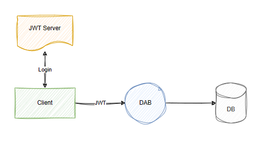

# Runtime

Configuration settings that determine runtime behavior.

### Pagination settings

|Property|Default|Description|
|-|-|-|
|[runtime.pagination.max-page-size](#pagination-runtime)|Defines maximum records per page|
|[runtime.pagination.default-page-size](#pagination-runtime)|Sets default records per response|

### REST settings

|Property|Default|Description|
|-|-|-|
|[runtime.rest.path](#rest-runtime)|`"/api"`|Base path for REST endpoints|
|[runtime.rest.enabled](#rest-runtime)|`true`|Allows enabling or disabling REST requests for all entities|
|[runtime.rest.request-body-strict](#rest-runtime)|`true`|Disallows extraneous fields in request body when true|

### GraphQL settings

|Property|Default|Description|
|-|-|-|
|[runtime.graphql.allow-introspection](#graphql-runtime)|`true`|Allows querying of underlying GraphQL schema|
|[runtime.graphql.path](#graphql-runtime)|`"/graphql"`|Base path for the GraphQL endpoint|
|[runtime.graphql.enabled](#graphql-runtime)|`true`|Allows enabling or disabling GraphQL requests for all entities|
|[runtime.graphql.depth-limit](#graphql-runtime)|`null`|Maximum allowed depth of a GraphQL query|
|[runtime.graphql.multiple-mutations.create.enabled](#graphql-runtime)|`false`|Allows multiple-create mutations for all entities|

### Host settings

|Property|Default|Description|
|-|-|-|
|[runtime.host.max-response-size-mb](#maximum-response-size-host-runtime)|`100`|Maximum size (MB) of database response allowed in a single result|
|[runtime.host.mode](#mode-host-runtime)|`"production"`|Running mode; `"production"` or `"development"`|

### CORS settings

|Property|Default|Description|
|-|-|-|
|[runtime.host.cors.origins](#cors-host-runtime)|`[]`|Allowed CORS origins|
|[runtime.host.cors.allow-credentials](#cors-host-runtime)|`false`|Sets value for Access-Control-Allow-Credentials header|

### Authentication settings

|Property|Default|Description|
|-|-|-|
|[runtime.host.authentication.provider](#provider-authentication-host-runtime)|`null`|Authentication provider|
|[runtime.host.authentication.jwt.audience](#jwt-authentication-host-runtime)|`null`|JWT audience|
|[runtime.host.authentication.jwt.issuer](#jwt-authentication-host-runtime)|`null`|JWT issuer|

### Cache settings

|Property|Default|Description|
|-|-|-|
|[runtime.cache.enabled](#cache-runtime)|`false`|Enables caching of responses globally|
|[runtime.cache.ttl-seconds](#cache-runtime)|`5`|Time to live (seconds) for global cache|

### Telemetry settings

|Property|Default|Description|
|-|-|-|
|[runtime.telemetry.application-insights.connection-string](#telemetry-runtime)|`null`|Application Insights connection string|
|[runtime.telemetry.application-insights.enabled](#telemetry-runtime)|`false`|Enables or disables Application Insights telemetry|
|[runtime.telemetry.open-telemetry.endpoint](#telemetry-runtime)|`null`|OpenTelemetry collector URL|
|[runtime.telemetry.open-telemetry.headers](#telemetry-runtime)|`{}`|OpenTelemetry export headers|
|[runtime.telemetry.open-telemetry.service-name](#telemetry-runtime)|`"dab"`|OpenTelemetry service name|
|[runtime.telemetry.open-telemetry.exporter-protocol](#telemetry-runtime)|`"grpc"`|OpenTelemetry protocol ("grpc" or "httpprotobuf")|
|[runtime.telemetry.open-telemetry.enabled](#telemetry-runtime)|`true`|Enables or disables OpenTelemetry|
|[runtime.telemetry.log-level.namespace](#telemetry-runtime)|`null`|Namespace-specific log level override|
|[runtime.health.enabled](#health-runtime)|`true`|Enables or disables the health check endpoint globally|
|[runtime.health.roles](#health-runtime)|`null`|Allowed roles for the comprehensive health endpoint|
|[runtime.health.cache-ttl-seconds](#health-runtime)|`30`|Time to live (seconds) for the health check report cache entry|

## Format overview

```json
{
  "runtime": {
    "pagination": {
      "max-page-size": <integer|null> (default: `100000`),
      "default-page-size": <integer|null> (default: `100`)
    },
    "rest": {
      "path": <string> (default: "/api"),
      "enabled": <true>|<false>,
      "request-body-strict": <true>|<false> (default: `true`)
    },
    "graphql": {
      "path": <string> (default: "/graphql"),
      "enabled": <true>|<false>,
      "allow-introspection": <true>|<false>,
      "depth-limit": <integer|null> (default: `null`),
      "multiple-mutations": {
        "create": {
          "enabled": <true>|<false> (default: `false`)
        }
      }
    },
    "host": {
      "mode": <"production"> (default) | <"development">,
      "max-response-size-mb": <integer|null> (default: `158`),
      "cors": {
        "origins": [ "<string>" ],
        "allow-credentials": <true>|<false> (default: `false`)
      },
      "authentication": {
        "provider": <string> (default: "AppService"),
        "jwt": {
          "audience": "<string>",
          "issuer": "<string>"
        }
      }
    }
  },
  "cache": {
    "enabled": <true>|<false> (default: `false`),
    "ttl-seconds": <integer> (default: `5`)
  },
  "telemetry": {
    "application-insights": {
      "connection-string": "<string>",
      "enabled": <true>|<false> (default: `true`)
    },
    "open-telemetry": {
      "endpoint": "<string>",
      "headers": "<string>",
      "service-name": <string> (default: "dab"),
      "exporter-protocol": <"grpc"> (default) | <"httpprotobuf">,
      "enabled": <true>|<false> (default: `true`)
    },
    "log-level": {
      // namespace keys
      "<namespace>": <"trace"|"debug"|"information"|"warning"|"error"|"critical"|"none"|null>
    }
  },
  "health": {
    "enabled": <true>|<false> (default: `true`),
    "roles": [ "<string>" ],
    "cache-ttl-seconds": <integer> (default: `5`)
  }
}
```

## Mode (Host runtime)

| Parent | Property | Type | Required | Default |
|-|-|-|-|-|
| `runtime` | `host` | enum (`production` \| `development`) | ❌ No | `production` |

#### Development behavior

- Enabled Nitro (formerly Banana Cake Pop) for GraphQL testing
- Enabled Swagger UI for REST testing
- Enabled anonymous health checks
- Increased logging verbosity (Debug)

### Format

```json
{
  "runtime": {
    "host": {
      "mode": "production" (default) | "development"
    }
  }
}
```

## Maximum response size (Host runtime)

| Parent | Property | Type | Required | Default |
|-|-|-|-|-|
| `runtime.host` | `max-response-size-mb` | integer | ❌ No | 158 |

Sets the maximum size (in megabytes) for any given result. As large responses can strain the system, `max-response-size-mb` caps the total size (different from row count) to prevent overload, which is especially with large columns like text or JSON.

| Value | Result |
|-|-|
| not set | Use default |
| `null` | Use default |
| `integer` | Any positive 32-bit integer |
| `<= 0` | Not supported |

### Format

```json
{
  "runtime": {
    "host": {
      "max-response-size-mb": <integer; default: 158>
    }
  }
}
```

## GraphQL (runtime)

| Parent | Property | Type | Required | Default |
|-|-|-|-|-|
| `runtime` | `graphql` | object | ❌ No | - |

Global GraphQL configuration.

### Nested properties

| Parent | Property | Type | Required | Default |
| - | - | - | - | - |
| `runtime.graphql` | `enabled` | boolean | ❌ No | None |
| `runtime.graphql` | `path` | string | ❌ No | "/graphql" |
| `runtime.graphql` | `depth-limit` | integer | ❌ No | None (unlimited) |
| `runtime.graphql` | `allow-introspection` | boolean | ❌ No | True |
| `runtime.graphql` | `multiple-mutations.create.enabled` | boolean | ❌ No | False |

#### Property notes

* Sub-paths are not allowed for the `path` property. 
* Use `depth-limit` to constrain nested queries. 
* Set `allow-introspection` to `false` to hide the GraphQL schema.
* Use `multiple-mutations` to insert multiple entities in a single mutation. 

### Format

```json
{
  "runtime": {
    "graphql": {
      "enabled": <true> (default) | <false>
      "depth-limit": <integer|null> (default: `null`),
      "path": <string> (default: /graphql),
      "allow-introspection": <true> (default) | <false>,
      "multiple-mutations": {
        "create": {
          "enabled": <true> (default) | <false>
        }
    }
  }
}
```

### Example: multiple mutations

Configuration

```json
{
  "runtime": {
    "graphql": {
      "multiple-mutations": {
        "create": {
          "enabled": true
        }
      }
    }
  },
  "entities": {
    "User": {
      "source": "dbo.Users",
      "permissions": [
        {
          "role": "anonymous",
          "actions": ["create"] // entity permissions are required
        }
      ]
    }
  }
}
```

GraphQL mutation

```graphql
mutation {
  createUsers(input: [
    { name: "Alice", age: 30, isAdmin: true },
    { name: "Bob", age: 25, isAdmin: false },
    { name: "Charlie", age: 35, isAdmin: true }
  ]) {
    id
    name
    age
    isAdmin
  }
}
```

## REST (runtime)

| Parent | Property | Type | Required | Default |
|-|-|-|-|-|
| `runtime` | `rest` | object | ❌ No | - |

Global REST configuration.

### Nested properties

| Parent | Property | Type | Required | Default |
| - | - | - | - | - |
| `runtime.rest` | `enabled` | boolean | ❌ No | None |
| `runtime.rest` | `path` | string | ❌ No | "/api" |
| `runtime.rest` | `request-body-strict` | boolean | ❌ No | True |

### Property notes

 - If global `enabled` is `false`, individual entity-level `enabled` doesn't matter.
 - The `path` property doesn't support subpath values like `/api/data`. 
 - `request-body-strict` was introduced to help simplify .NET POCO objects. 

| `request-body-strict` | Behavior
| - | -
| **`true`** | Extra fields in the request body cause a `BadRequest` exception.  
| **`false`** | Extra fields in the request body are ignored.

### Format

```json
{
  "runtime": {
    "rest": {
      "enabled": <true> (default) | <false>,
      "path": <string> (default: /api),
      "request-body-strict": <true> (default) | <false>
    }
  }
}
```

> [!NOTE]
> When deploying Data API builder using Static Web Apps (preview), the Azure service automatically injects another subpath `/data-api` to the url. This behavior ensures compatibility with existing Static Web App features. The resulting endpoint would be `/data-api/api/<entity>`. This note is only relevant to Static Web Apps.

### Example: request-body-strict

   - Columns with a `default()` value are ignored during `INSERT` only when their value in the payload is `null`. As a consequence, `INSERT` operations into `default()` columns, when `request-body-strict` is `true`, can't result in explicit `null` values. To accomplish this, an `UPDATE` operation is required.
   - Columns with a `default()` aren't ignored during `UPDATE` regardless of payload value.
   - Computed columns are always ignored.
   - Autogenerated columns are always ignored.

Sample table

```sql
CREATE TABLE Users (
    Id INT PRIMARY KEY IDENTITY, -- auto-generated column
    Name NVARCHAR(50) NOT NULL,
    Age INT DEFAULT 18, -- column with default
    IsAdmin BIT DEFAULT 0, -- column with default
    IsMinor AS IIF(Age <= 18, 1, 0) -- computed column
);
```

Request payload

```json
{
  "Id": 999,
  "Name": "Alice",
  "Age": null,
  "IsAdmin": null,
  "IsMinor": false,
  "ExtraField": "ignored"
}
```

#### Insert behavior when `request-body-strict = false`

```sql
INSERT INTO Users (Name) VALUES ('Alice');
-- Default values for Age (18) and IsAdmin (0) are applied by the database.
-- IsMinor is ignored because it’s a computed column.
-- ExtraField is ignored.
-- The database generates the Id value.
```

Response payload

```json
{
  "Id": 1,          // Auto-generated by the database
  "Name": "Alice",
  "Age": 18,        // Default applied
  "IsAdmin": false, // Default applied
  "IsMinor": true   // Computed
}
```

#### Update behavior when `request-body-strict = false`

```sql
UPDATE Users
SET Name = 'Alice Updated', Age = NULL
WHERE Id = 1;
-- IsMinor and ExtraField are ignored.
```

Response payload

```json
{
  "Id": 1,
  "Name": "Alice Updated",
  "Age": null,
  "IsAdmin": false,
  "IsMinor": false // Recomputed by the database (false when age is `null`)
}
```

## CORS (host runtime)

| Parent | Property | Type | Required | Default |
|-|-|-|-|-|
| `runtime.host` | `cors` | object | ❌ No | - |

Global CORS configuration.

> [!TIP]
> CORS stands for "Cross-Origin Resource Sharing." It is a browser security feature controlling whether web pages can make requests to a different domain than the one that served them.

### Nested properties

| Parent | Property | Type | Required | Default |
|-|-|-|-|-|
| `runtime.host.cors` | `allow-credentials` | boolean | ❌ No | False |
| `runtime.host.cors` | `origins` | string array | ❌ No | None |

> [!NOTE]
> The `allow-credentials` property sets the [`Access-Control-Allow-Credentials`](https://developer.mozilla.org/docs/Web/HTTP/Headers/Access-Control-Allow-Credentials) CORS header.

### Format

```json
{
  "runtime": {
    "host": {
      "cors": {
        "allow-credentials": <true> (default) | <false>,
        "origins": ["<array-of-strings>"]
      }
    }
  }
}
```

> [!NOTE]
> The wildcard `*` is valid as a value for `origins`.

## Provider (Authentication host runtime)

| Parent | Property | Type | Required | Default |
|-|-|-|-|-|
| `runtime.host.authentication` | `provider` | enum (`AppService` \| `EntraId` \| `Simulator`) | ❌ No | `AppService` |

Defines the method of authentication used by the Data API builder.

| Provider | Description |
|-|-|
| `AppService` | EasyAuth via Azure Static Web Apps. `X-MS-CLIENT-PRINCIPAL` is injected only on authenticated requests; if it is absent, DAB treats the request as anonymous. No token validation is performed by DAB in this mode. Optional `X-MS-API-ROLE` header can select a specific role. |
| `StaticWebApps` | [ *Deprecated* ] Functionally identical to `AppService`. Please use `AppService`. |
| `EntraId` | Direct JWT validation by DAB (no EasyAuth front end). Requires `Authorization: Bearer <JWT>` for authenticated access. If the header is missing or invalid, the user is treated as anonymous. Optional `X-MS-API-ROLE` header can select a specific role. |
| `AzureAd` | [ *Deprecated* ] Functionally identical to `EntraId`. Future versions of DAB maybe remove this value. |
| `Simulator` | Development/testing only. No auth headers required; DAB fabricates an authenticated context. Optional `X-MS-API-ROLE` may still be sent to simulate a role. Not for production use. See [local authentication](../local-authentication.md). |

> [!TIP]
> Data API builder authentication providers `StaticWebApps` (Deprecated) and `AppService` both support EasyAuth. EasyAuth is not a formal standard; it's the nickname for Azure App Service Authentication/Authorization, a built-in feature of Azure App Service, Azure Functions, and Azure Static Web Apps. It isn't part of OAuth, OIDC, SAML, or any other open standard, though it uses those protocols under the hood. EasyAuth handles sign-in flows with identity providers such as Microsoft Entra ID, Google, and GitHub. 
> 
> The "easy" part is that you enable it in the Azure portal or through ARM templates without writing custom authentication middleware. A common misunderstanding is to treat EasyAuth as a cross-platform standard when, in fact, it's a Microsoft PaaS feature built on top of existing identity standards. In DAB, both `StaticWebApps` (Deprecated) and `AppService` providers read the same EasyAuth headers. They behave the same way in DAB but are named separately to allow for differences in Azure hosting environments.

### Format

```json
{
  "runtime": {
    "host": {
      "authentication": {
        "provider": "AppService" | ...
      }
    }
  }
}
```
> [!NOTE]
> If the provider is `EntraId`, the `JWT` section is required.

### Example: App Service

````json
{
 "host": {
  "authentication": {
   "provider": "AppService"
   }
  }
 }
}
````

### Example: Microsoft Entra ID

````json
{
 "host": {
  "authentication": {
   "provider": "AzureAD",
   "jwt": {
    "audience": "c123d456-a789-0abc-a12b-3c4d56e78f90",
    "issuer": "https://login.microsoftonline.com/98765f43-21ba-400c-a5de-1f2a3d4e5f6a/v2.0"
   }
  }
 }
}
````

### Example: Simulator (Development-only)

````json
{
 "host": {
  "mode": "development", // Simulator is not intended for production
  "authentication": {
   "provider": "Simulator"
  }
 }
}
````

## JWT (Authentication host runtime)

| Parent | Property | Type | Required | Default |
|-|-|-|-|-|
| `runtime.host.authentication` | `jwt` | object | ❌ No | - |

Global JSON Web Token (JWT) configuration.



### Nested properties

| Parent | Property | Type | Required | Default |
|-|-|-|-|-|
| `runtime.host.authentication.jwt` | `audience` | string | ❌ No | None |
| `runtime.host.authentication.jwt` | `issuer` | string | ❌ No | None |

### Format

```json
{
  "runtime": {
    "host": {
      "authentication": {
        "jwt": {
          "audience": "<client-id>",
          "issuer": "<issuer-url>"
        }
      }
    }
  }
}
```

## Pagination (Runtime)

| Parent | Property | Type | Required | Default |
|-|-|-|-|-|
| `runtime` | `pagination` | object | ❌ No | - |

Global pagination limits for REST and GraphQL endpoints.

### Nested properties

| Parent | Property | Type | Required | Default |
|-|-|-|-|-|
| `runtime.pagination` | `max-page-size` | int | ❌ No | 100,000 |
| `runtime.pagination` | `default-page-size` | int | ❌ No | 100 |

### Max-page-size supported values

| Value | Result |
|-|-|
| `integer` | Any positive 32-bit integer is supported. |
| `0` | Not supported. |
| `-1` | Defaults to the maximum supported value. |
| `< -1` | Not supported. |

### Default-page-size supported values

| Value | Result |
|-|-|
| `integer` | Any positive integer less than the current `max-page-size`. |
| `0` | Not supported. |
| `-1` | Defaults to the current `max-page-size` setting. |
| `< -1` | Not supported. |

### Format

```json
{
  "runtime": {
    "pagination": {
      "max-page-size": <integer; default: 100000>,
      "default-page-size": <integer; default: 100>
    }
  }
}
```

> [!NOTE]
> When the value is greater than `max-page-size`, the results are capped at `max-page-size`.

### Example: Paging in REST

Request
```http
GET https://localhost:5001/api/users
```

Response payload
```json
{
  "value": [
    {
      "Id": 1,
      "Name": "Alice",
      "Age": 30,
      "IsAdmin": true,
      "IsMinor": false
    },
    {
      "Id": 2,
      "Name": "Bob",
      "Age": 17,
      "IsAdmin": false,
      "IsMinor": true
    }
  ],
  "nextLink": "https://localhost:5001/api/users?$after=W3siRW50aXR5TmFtZSI6InVzZXJzIiwiRmllbGROYW1lI=="
}
```

Request Next Page

```http
GET https://localhost:5001/api/users?$after=W3siRW50aXR5TmFtZSI6InVzZXJzIiwiRmllbGROYW1lI==
```

### Example: Paging in GraphQL

Request payload (Query)

```graphql
query {
  users {
    items {
      Id
      Name
      Age
      IsAdmin
      IsMinor
    }
    hasNextPage
    endCursor
  }
}
```

Response payload
```json
{
  "data": {
    "users": {
      "items": [
        {
          "Id": 1,
          "Name": "Alice",
          "Age": 30,
          "IsAdmin": true,
          "IsMinor": false
        },
        {
          "Id": 2,
          "Name": "Bob",
          "Age": 17,
          "IsAdmin": false,
          "IsMinor": true
        }
      ],
      "hasNextPage": true,
      "endCursor": "W3siRW50aXR5TmFtZSI6InVzZXJzIiwiRmllbGROYW1lI=="
    }
  }
}
```

Request Next Page

```graphql
query {
  users(after: "W3siRW50aXR5TmFtZSI6InVzZXJzIiwiRmllbGROYW1lI==") {
    items {
      Id
      Name
      Age
      IsAdmin
      IsMinor
    }
    hasNextPage
    endCursor
  }
}
```

### Example: Accessing `max-page-size` in Requests

Use the `max-page-size` value by setting `$limit` (REST) or `first` (GraphQL) to `-1`.

REST 

```http
GET https://localhost:5001/api/users?$limit=-1
```

GraphQL 

```graphql
query {
  users(first: -1) {
    items {
      ...
    }
  }
}
```

## Cache (runtime)

| Parent | Property | Type | Required | Default |
|-|-|-|-|-|
| `runtime` | `cache` | object | ❌ No | - |

Global Cache configuration.

### Nested properties

| Parent | Property | Type | Required | Default |
|-|-|-|-|-|
| `runtime.cache` | `enabled` | boolean | ❌ No | False |
| `runtime.cache` | `ttl-seconds` | integer | ❌ No | 5 |

> [!TIP]
> The entity-level `cache.ttl-seconds` property defaults to this global value. 

### Format

```json
{
  "runtime": {
    "cache":  {
      "enabled": <boolean>,
      "ttl-seconds": <integer>
    }
  }
}
```

> [!IMPORTANT]
> If global `enabled` is `false`, individual entity-level `enabled` doesn't matter.

## Telemetry (runtime)

| Parent | Property | Type | Required | Default |
| - | - | - | - | - |
| `runtime` | `telemetry` | object | ❌ No | - |

Global telemetry configuration.

### Nested properties

| Parent | Property | Type | Required | Default |
| - | - | - | - | - |
| `runtime.telemetry` | `log-level` | dictionary | ❌ No | None |
| `runtime.telemetry` | [`application-insights`](#application-insights-telemetry) | object | ❌ No | - |
| `runtime.telemetry` | [`open-telemetry`](#opentelemetry-telemetry) | object | ❌ No | - |

Configures logging verbosity per namespace. This follows standard .NET logging conventions and allows granular control, though it assumes some familiarity with Data API builder internals. Data API builder is open source: [https://aka.ms/dab](https://aka.ms/dab)

### Format

```json
{
  "runtime": {
    "telemetry": {
      "log-level": {
        "namespace": "log-level",
        "namespace": "log-level"
      }
    }
  }
}
```

> [!TIP]
> `log-level` can be hot-reloaded in both development and production. It's currently the only property that supports hot reload in production.

### Example

```json
{
  "runtime": {
    "telemetry": {
      "log-level": {
        "Azure.DataApiBuilder.Core.Configurations.RuntimeConfigValidator": "debug",
        "Azure.DataApiBuilder.Core": "information",
        "default": "warning"
      }
    }
  }
}
```

## Application Insights (telemetry)

| Parent | Property | Type | Required | Default |
|-|-|-|-|-|
| `runtime.telemetry` | `application-insights` | object | ❌ No | - |

Configures logging to [Application Insights](../deployment/how-to-use-application-insights.md). 

### Nested properties

| Parent | Property | Type | Required | Default |
|-|-|-|-|-|
| `runtime.telemetry.application-insights` | `enabled` | boolean | ❌ No | False |
| `runtime.telemetry.application-insights` | `connection-string` | string | ✔️ Yes | None |

### Format

```json
{
  "runtime": {
    "telemetry": {
      "application-insights": {
        "enabled": <true; default: true> | <false>
        "connection-string": <string>
      }
    }
  }
}
```

## OpenTelemetry (telemetry)

| Parent | Property | Type | Required | Default |
|-|-|-|-|-|
| `runtime.telemetry` | `open-telemetry` | object | ❌ No | - |

Configures logging to Open Telemetry. 

### Nested properties

| Parent | Property | Type | Required | Default |
|-|-|-|-|-|
| `runtime.telemetry.open-telemetry` | `enabled` | boolean | ❌ No | true |
| `runtime.telemetry.open-telemetry` | `endpoint` | string | ✔️ Yes | None |
| `runtime.telemetry.open-telemetry` | `headers` | string | ❌ No | None |
| `runtime.telemetry.open-telemetry` | `service-name` | string | ❌ No | "dab" |
| `runtime.telemetry.open-telemetry` | `exporter-protocol` | enum (`grpc` \| `httpprotobuf`) | ❌ No | `grpc` |

Multiple headers are `,` (comma) separated. 

### Format

```json
{
  "runtime": {
    "telemetry": {
      "open-telemetry": {
        "enabled": <true> (default) | <false>,
        "endpoint": <string>,
        "headers": <string>,
        "service-name": <string> (default: "dab"),
        "exporter-protocol": <"grpc" (default) | "httpprotobuf">
      }
    }
  }
}
```

### Example

```json
{
  "runtime": {
    "telemetry": {
      "open-telemetry": {
        "enabled": true,
        // a gRPC endpoint example
        "endpoint": "http://localhost:4317",
        // an HTTP/protobuf endpoint example
        "endpoint": "http://localhost:4318/v1/metrics",
        "headers": "api-key=key,other-config-value=value",
        "service-name": "dab",
      }
    }
  }
}
```

Learn more about [OTEL_EXPORTER_OTLP_HEADERS](https://opentelemetry.io/docs/languages/sdk-configuration/otlp-exporter/#otel_exporter_otlp_headers:~:text=or%20HTTP%20requests.-,OTEL_EXPORTER_OTLP_HEADERS,Example:%20export%20OTEL_EXPORTER_OTLP_HEADERS%3D%22api-key%3Dkey%2Cother-config-value%3Dvalue%22,-OTEL_EXPORTER_OTLP_TRACES_HEADERS).

> [!NOTE]
> gRPC (`4317`) is faster and supports streaming but requires more setup. HTTP/protobuf (`4318`) is simpler and easier to debug but less efficient. 

## Health (runtime)

| Parent | Property | Type | Required | Default |
| - | - | - | - | - |
| `runtime` | `health` | object | ❌ No | - |

Global [health check endpoint](../concept/monitor/health-checks.md) (`/health`) configuration.

### Nested properties

| Parent | Property | Type | Required | Default |
| - | - | - | - | - |
| `runtime.health` | `enabled` | boolean | ❌ No | true |
| `runtime.health` | `roles` | string array | ✔️ Yes | None |
| `runtime.health` | `cache-ttl-seconds` | integer | ❌ No | 5 |

### Behavior in development vs. production

| Condition | Development Behavior | Production Behavior |
| - | - | - |
| `health.enabled` = false | `403` status | `403` status |
| `health.enabled` = true | Depends on role | Depends on role |
| `roles` omitted or `null` | Health displayed | `403` status |
| current role not in `roles` | `403` status | `403` status |
| current role in `roles` | Health displayed | Health displayed |
| `roles` includes `anonymous`  | Health displayed | Health displayed |

### Format

```json
{
  "health": {
    "enabled": <true> (default) | <false>,
    "roles": [ <string> ], // required in production
    "cache-ttl-seconds": <integer>
  }
}
```

> [!NOTE]
> If global `enabled` is `false`, individual entity-level `enabled` doesn't matter.

### Example

```json
{
  "health": {
    "enabled": true,
    "roles": ["admin", "support"],
    "cache-ttl-seconds": 10
  }
}
```