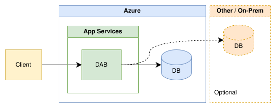

# Deploy Data API builder to Azure App Service

This guide shows you how to deploy Data API builder (DAB) to Azure App Service without building or managing container images. App Service provides built-in support for TLS, custom domains, scaling, monitoring, and Microsoft Entra authentication.



> [!TIP]
> If your environment uses containers, see [Deploy to Azure Container Apps](azure-container-apps.md) or [Deploy to Azure Kubernetes Service](azure-kubernetes-service.md) instead.

## Prerequisites

- An Azure account with an active subscription. [Create an account for free](https://azure.microsoft.com/pricing/purchase-options/azure-account?cid=msft_learn).
- Data API builder CLI. [Install the CLI](../command-line/install.md).
- Azure CLI. [Install the Azure CLI](/cli/azure/install-azure-cli).
- [.NET 8 SDK](https://dotnet.microsoft.com/download/dotnet/8.0) or later installed on your local development or build machine.
- An existing supported database that Azure can access.

> [!IMPORTANT]
> The built-in .NET App Service stack contains the .NET runtime, but doesn't contain the .NET SDK. Restore DAB and assemble the deployment package on your local development or build machine. Don't run `dotnet tool restore` when the App Service starts.

## Build the configuration file

Build a DAB configuration file to connect to your existing database.

1. Create an empty directory on your local machine to store the configuration file and deployment artifacts.

1. Initialize a new base configuration file using [`dab init`](../command-line/dab-init.md). Use the [`@env()`](../concept/config/env-function.md) function to reference the `DATABASE_CONNECTION_STRING` environment variable so credentials aren't stored in the configuration file.

    ```dotnetcli
    dab init --database-type "<database-type>" --connection-string "@env('DATABASE_CONNECTION_STRING')"
    ```

    > [!IMPORTANT]
    > Replace `<database-type>` with a [supported database type](../configuration/data-source.md#data-source), such as `mssql`, `postgresql`, `mysql`, or `cosmosdb_nosql`. Some database types require extra configuration settings on initialization.

1. Add at least one database entity to the configuration. Use the [`dab add`](../command-line/dab-add.md) command to configure an entity. Repeat `dab add` as many times as you need for your entities.

    ```dotnetcli
    dab add "<entity-name>" --source "<schema>.<table>" --permissions "anonymous:*"
    ```

1. Open and review the contents of the *dab-config.json* file. Verify that:

    - `data-source.connection-string` uses `@env('DATABASE_CONNECTION_STRING')`
    - Your entities and permissions are correct

    > [!IMPORTANT]
    > Don't embed literal connection strings or secrets in `dab-config.json`. Use the `@env()` function so values are resolved from environment variables at runtime.

## Pin DAB for the build

Use a local .NET tool manifest to pin the DAB version on your development or build machine. The manifest makes builds reproducible, but it doesn't contain the restored DAB binaries. You copy those binaries into the deployment package later in this guide.

1. Create a .NET local tool manifest in your project directory.

    ```dotnetcli
    dotnet new tool-manifest
    ```

1. Install a specific Data API builder version as a local tool. Replace `<dab-version>` with the version you want to deploy, such as `2.0.9`.

    ```dotnetcli
    dotnet tool install microsoft.dataapibuilder --version "<dab-version>"
    ```

1. Verify the manifest exists at `.config/dotnet-tools.json`.

1. Restore the pinned tool on the development or build machine.

    ```dotnetcli
    dotnet tool restore
    ```

    > [!NOTE]
    > The restore operation populates the local NuGet package cache. The App Service deployment package must include the restored runtime payload; deploying only `.config/dotnet-tools.json` isn't sufficient.

## Test locally

Before deploying to Azure, confirm the runtime starts and your endpoints work.

1. Set the connection string as a local environment variable.

    ### [PowerShell](#tab/powershell)

    ```powershell
    $env:DATABASE_CONNECTION_STRING = "<your-connection-string>"
    ```

    ### [Bash](#tab/bash)

    ```bash
    export DATABASE_CONNECTION_STRING="<your-connection-string>"
    ```

    ---

1. Start the DAB runtime locally.

    ```dotnetcli
    dotnet tool run dab start
    ```

1. Test the REST endpoint by navigating to the Swagger UI or making a request to `/api/<entity-name>`.

1. Test the GraphQL endpoint at `/graphql`.

1. Stop the runtime after verifying all endpoints.

## Create the App Service resources

Create the Azure resources required to host DAB on App Service.

1. Create a new resource group. You use this resource group for all new resources in this guide.

    ```azurecli
    az group create --name "<resource-group-name>" --location "<location>"
    ```

    > [!TIP]
    > Consider naming the resource group **msdocs-dab-appservice**.

1. Create an App Service plan.

    ```azurecli
    az appservice plan create --name "<plan-name>" --resource-group "<resource-group-name>" --sku B1 --is-linux
    ```

    > [!NOTE]
    > This guide uses the **B1** (Basic) tier on Linux.

1. Create the web app with the .NET 8 runtime and a system-assigned managed identity.

    ```azurecli
    az webapp create --name "<app-name>" --resource-group "<resource-group-name>" --plan "<plan-name>" --runtime "DOTNETCORE:8.0" --assign-identity "[system]"
    ```

    > [!TIP]
    > Validate available runtimes for your plan with `az webapp list-runtimes --os linux`.

## Configure App Service settings

Configure the environment variables and startup command that App Service needs to run DAB.

1. Set the database connection string as an App Service application setting.

    ```azurecli
    az webapp config appsettings set --name "<app-name>" --resource-group "<resource-group-name>" --settings DATABASE_CONNECTION_STRING="<your-connection-string>"
    ```

    > [!TIP]
    > Use a connection string that doesn't include secrets. Instead, use managed identities and Microsoft Entra authentication to manage access between your database and App Service. For more information, see [Azure services that use managed identities](/entra/identity/managed-identities-azure-resources/managed-identities-status).

1. Configure the address that DAB listens on. Port `8080` is the application port for the built-in Linux App Service stack.

    ```azurecli
    az webapp config appsettings set --name "<app-name>" --resource-group "<resource-group-name>" --settings ASPNETCORE_URLS="http://0.0.0.0:8080"
    ```

1. Enable Always On and filesystem logging before the first deployment. Always On is available on the B1 tier used in this guide.

    ```azurecli
    az webapp config set --name "<app-name>" --resource-group "<resource-group-name>" --always-on true

    az webapp log config --name "<app-name>" --resource-group "<resource-group-name>" --application-logging filesystem --docker-container-logging filesystem --level information
    ```

1. Create a startup script that starts the DAB runtime payload included in the deployment package. Create a file named `startup.sh` in your project directory.

    ```bash
    #!/bin/sh
    set -eu
    exec dotnet ./dab/Microsoft.DataApiBuilder.dll start --config ./dab-config.json
    ```

    > [!IMPORTANT]
    > Ensure `startup.sh` uses LF (Unix) line endings, not CRLF. Windows editors may save with CRLF by default, which causes the script to fail on the Linux App Service host.

1. Set the startup command in App Service.

    ```azurecli
    az webapp config set --name "<app-name>" --resource-group "<resource-group-name>" --startup-file "sh startup.sh"
    ```

## Configure managed identity for Azure SQL

If your data source is Azure SQL, authorize the web app's system-assigned managed identity in the database. Skip this section if you use a different database or authentication method.

1. Connect to the target database as its Microsoft Entra administrator.

1. Create a contained database user for the web app identity and grant only the permissions required by your DAB entities. The following example supports read and write operations.

    ```sql
    CREATE USER [<app-name>] FROM EXTERNAL PROVIDER;
    ALTER ROLE [db_datareader] ADD MEMBER [<app-name>];
    ALTER ROLE [db_datawriter] ADD MEMBER [<app-name>];
    ```

    > [!NOTE]
    > Microsoft Entra identity propagation can take a few minutes after web app creation. If `CREATE USER` can't resolve the identity immediately, wait and retry.

1. Set `DATABASE_CONNECTION_STRING` to an Azure SQL managed identity connection string.

    ```azurecli
    az webapp config appsettings set --name "<app-name>" --resource-group "<resource-group-name>" --settings DATABASE_CONNECTION_STRING="Server=tcp:<sql-server-name>.database.windows.net,1433;Initial Catalog=<database-name>;Authentication=Active Directory Managed Identity;Encrypt=True;TrustServerCertificate=False;"
    ```

## Deploy to App Service

Copy the restored DAB runtime into your application directory, then deploy the directory using ZIP deploy.

1. Create an application directory that contains the DAB configuration, startup script, and restored runtime payload.

    The examples use DAB version `2.0.9`. Set the version to the same version you pinned in `.config/dotnet-tools.json`.

    ### [PowerShell](#tab/powershell)

    ```powershell
    $dabVersion = "2.0.9"
    $globalPackages = (dotnet nuget locals global-packages --list) -replace '^global-packages:\s*', ''
    $dabPayload = Join-Path $globalPackages "microsoft.dataapibuilder/$dabVersion/tools/net8.0/any"
    $appDirectory = Join-Path (Get-Location) "app"

    Remove-Item $appDirectory -Recurse -Force -ErrorAction SilentlyContinue
    New-Item -ItemType Directory -Path (Join-Path $appDirectory "dab") -Force | Out-Null
    Copy-Item dab-config.json, startup.sh -Destination $appDirectory
    Copy-Item (Join-Path $dabPayload "*") -Destination (Join-Path $appDirectory "dab") -Recurse

    if (-not (Test-Path (Join-Path $appDirectory "dab/Microsoft.DataApiBuilder.dll"))) {
        throw "The restored DAB runtime payload wasn't found."
    }
    ```

    ### [Bash](#tab/bash)

    ```bash
    dab_version="2.0.9"
    global_packages="$(dotnet nuget locals global-packages --list | sed 's/^global-packages: //')"
    dab_payload="$global_packages/microsoft.dataapibuilder/$dab_version/tools/net8.0/any"

    rm -rf app
    mkdir -p app/dab
    cp dab-config.json startup.sh app/
    cp -R "$dab_payload"/. app/dab/

    test -f app/dab/Microsoft.DataApiBuilder.dll
    ```

    ---

    > [!IMPORTANT]
    > Run these commands on the same machine where you restored the pinned DAB tool. If your environment overrides the NuGet global packages directory, `dotnet nuget locals` resolves its location.

1. Create a ZIP with portable `/` entry separators. The archive root must contain `dab-config.json`, `startup.sh`, and the `dab/` directory directly. Don't zip the parent `app` directory.

    ### [PowerShell](#tab/powershell)

    ```powershell
    Remove-Item deploy.zip -Force -ErrorAction SilentlyContinue
    tar.exe -a -c -f deploy.zip -C $appDirectory dab-config.json startup.sh dab
    ```

    ### [Bash](#tab/bash)

    ```bash
    rm -f deploy.zip
    (cd app && zip -r ../deploy.zip dab-config.json startup.sh dab)
    ```

    ---

    > [!WARNING]
    > On Windows, `Compress-Archive` can store nested entries with `\` separators. Kudu ZIP deployment can reject that archive with HTTP 400. Use a ZIP tool that stores `/` separators, and inspect the archive entries if deployment returns HTTP 400 without details.

1. Deploy the ZIP package to App Service.

    ```azurecli
    az webapp deploy --resource-group "<resource-group-name>" --name "<app-name>" --src-path deploy.zip --type zip --clean true --restart false --timeout 600000
    ```

1. Restart the web app after the deployment completes.

    ```azurecli
    az webapp restart --resource-group "<resource-group-name>" --name "<app-name>"
    ```

## Verify the deployment

After deployment, confirm that DAB starts successfully on App Service.

1. Open the App Service URL. The root response includes the DAB status and version.

    ```text
    https://<app-name>.azurewebsites.net
    ```

1. Test REST and GraphQL endpoints using the same entity paths you tested locally. The deployed app uses the same `dab-config.json`, so endpoint behavior should match your local runtime.

    ```text
    https://<app-name>.azurewebsites.net/api/<entity-name>
    https://<app-name>.azurewebsites.net/graphql
    ```

    > [!NOTE]
    > In production mode, `/health` can return HTTP 403 when the caller isn't authorized to view the comprehensive health report. If the root and authorized entity endpoints return successfully, a 403 response from `/health` doesn't indicate a startup failure.

1. If an endpoint returns an unexpected error, review or download the application logs. Logging was enabled before deployment in this guide.

    ```azurecli
    az webapp log tail --name "<app-name>" --resource-group "<resource-group-name>"

    az webapp log download --name "<app-name>" --resource-group "<resource-group-name>" --log-file appservice-logs.zip
    ```

## Configure authentication (optional)

Protect your App Service endpoint with Microsoft Entra ID for production use.

For detailed steps, see [Configure App Service authentication](/azure/app-service/overview-authentication-authorization).

After you enable App Service authentication, configure DAB to trust identity headers injected by App Service. Run this command on your development machine, then rebuild and redeploy the ZIP package.

```dotnetcli
dab configure --runtime.host.authentication.provider AppService
```

> [!IMPORTANT]
> The `AppService` authentication provider in `dab-config.json` trusts headers injected by App Service authentication. Make sure App Service authentication is enabled when using this provider in production. For more information, see [Easy Auth (App Service)](../concept/security/authenticate-easy-auth.md).

> [!NOTE]
> App Service authentication protects ingress to your endpoint. DAB entity permissions still govern what operations the runtime allows. For an anonymous demo, don't rely on App Service identity headers. For role-based access, enable App Service authentication and update your entity permissions to use authenticated or custom roles instead of `anonymous:*`.

## Troubleshoot deployment

Use the following symptoms to identify common deployment problems.

| Symptom | Cause and resolution |
|---|---|
| ZIP deployment returns HTTP 400 without details | Inspect the ZIP root and entry separators. Recreate the ZIP with `/` separators and ensure it contains `dab-config.json`, `startup.sh`, and `dab/` directly. |
| The app returns HTTP 503 and logs contain `No .NET SDKs were found` or `The application 'tool' does not exist` | The startup command is trying to run `dotnet tool`. Rebuild the package with the restored DAB payload and invoke `Microsoft.DataApiBuilder.dll` directly. |
| Startup reaches the user command but App Service warmup fails | Verify the startup script uses LF endings, use `sh startup.sh`, confirm the DAB payload paths, and check the listen URL and database errors in the logs. |
| DAB starts but database requests fail | Verify the web app managed identity exists as a database user and has the permissions required by the configured entities. |
| `/health` returns HTTP 403 while REST or GraphQL works | DAB is running, but the caller isn't authorized to view the comprehensive health report. Validate the root or an authorized entity endpoint instead. |
| A larger ZIP deployment returns HTTP 502 | Check deployment history before retrying. Deploy synchronously with an explicit timeout, disable the implicit restart, and restart after deployment completes. |

## Clean up resources

When you no longer need the web app and its resources, delete the resource group.

```azurecli
az group delete --name "<resource-group-name>" --yes --no-wait
```

## Related content

- [Easy Auth (App Service) authentication](../concept/security/authenticate-easy-auth.md)
- [Configuration file reference](../configuration/index.md)
- [Runtime host and authentication configuration](../configuration/runtime.md#runtime)
- [Deploy to Azure Container Apps](azure-container-apps.md)
- [Integrate with Application Insights](../concept/monitor/application-insights.md)
