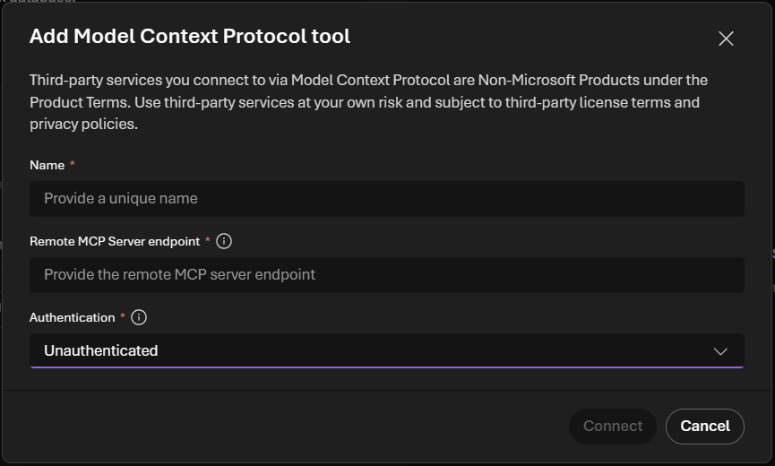

# Configure authentication for SQL MCP Server

[!INCLUDE[Note - Preview](includes/note-preview.md)]

SQL MCP Server exposes a Model Context Protocol (MCP) endpoint in Data API builder. Some authentication options use JSON Web Tokens (JWTs).

When you connect a client (for example, a Microsoft AI Foundry agent) to SQL MCP Server, authentication becomes a two-direction setup:

- **Inbound authentication** (client to SQL MCP Server): how the client authenticates when calling your MCP endpoint (for example, `https://<host>/mcp`).
- **Outbound authentication** (SQL MCP Server to database): how SQL MCP Server authenticates to your database.

Use the following diagram to orient yourself. In the rest of this article, you configure **outbound** first (so the server can reach the database), then configure **inbound** (so your client can securely call the server).


> [!NOTE]
> The "Client App" can be a Microsoft AI Foundry agent, a custom MCP client app, or another agent runtime. The inbound configuration on SQL MCP Server is the same regardless of which client calls the MCP endpoint.

## Prerequisites

- SQL MCP Server running (Data API builder 1.7+)
- An existing `dab-config.json` with at least one entity
- A Microsoft AI Foundry project with an agent where you can add an MCP tool connection

## Step 1: Configure outbound authentication (SQL MCP Server to database)

You define outbound authentication in your `data-source` configuration. It's most commonly the connection string.


### Multiple data sources

SQL MCP Server supports multiple data sources through `data-source-files`. Each data source can have its own outbound authentication settings. For example, one database can use managed identity while another uses a SQL username and password. Data sources can also share a single identity, depending on how you configure database access.


For more information, see [Add more than one data source](../concept/config/multi-data-source.md) and [Data source configuration](../configuration/data-source.md).

### Configure the database connection

In your `dab-config.json`, set `data-source.database-type` and `data-source.connection-string`.

> [!TIP]
> Use `@env()` to keep secrets out of the configuration file.

#### Example: SQL user/password (development)

SQL MCP Server supports SQL authentication with a username and password. This approach is common for development, testing, and certain production environments.


```json
{
	"data-source": {
		"database-type": "mssql",
		"connection-string": "@env('SQL_CONNECTION_STRING')"
	}
}
```

Example environment variable value:

```text
Server=tcp:<server>.database.windows.net,1433;Initial Catalog=<database>;User ID=<user>;Password=<password>;Encrypt=True;TrustServerCertificate=False;
```

#### Example: Managed identity (recommended for Azure)

SQL MCP Server supports Managed Service Identities (MSI) for Azure SQL using `DefaultAzureCredential`. Configure your connection string to use managed identity authentication.


```text
Server=tcp:<server>.database.windows.net,1433;Initial Catalog=<database>;Authentication=Active Directory Managed Identity;
```

For user-assigned managed identity (UAMI), include the identity client ID:

```text
Server=tcp:<server>.database.windows.net,1433;Initial Catalog=<database>;Authentication=Active Directory Managed Identity;User Id=<uami-client-id>;
```

For complete details, see [Data source configuration](../configuration/data-source.md).

## Step 2: Configure inbound authentication (client to SQL MCP Server)

Inbound authentication controls how the MCP client authenticates to SQL MCP Server.


### OAuth providers

SQL MCP Server can validate JSON Web Tokens (JWTs) issued by an OAuth provider (for example, Microsoft Entra ID). The client includes the token with each request, and SQL MCP Server validates it.


### Gateway authentication (optional)

If your MCP client requires API keys or another non-JWT scheme, front SQL MCP Server with a gateway or proxy that authenticates the client and forwards requests to the MCP endpoint.

For an Azure-hosted pattern, see [Secure access to MCP servers in API Management](/azure/api-management/secure-mcp-servers).


### Multiple clients

Inbound authentication is configured once per SQL MCP Server instance, for example by using `runtime.host.authentication.provider`. All clients that call the same MCP endpoint must use a compatible authentication approach. For example, all clients can use Microsoft Entra tokens for the same audience.


> [!TIP]
> If you need two different inbound authentication schemes (for example, one client uses Microsoft Entra and another uses a different identity provider), run two SQL MCP Server instances with different `runtime.host.authentication` settings.

### Microsoft AI Foundry

Use these steps when your client is a Microsoft AI Foundry agent.

1. In your agent project, select **Add a tool**.
2. Select the **Custom** tab.
3. Select **Model Context Protocol**.
4. Set the **Remote MCP Server endpoint** (for example, `https://<your-server>/mcp`).
5. Select an **Authentication** mode.



After you configure Foundry, you must configure SQL MCP Server to accept the same inbound authentication mode.

> [!NOTE]
> This article focuses on the MCP tool connection. It doesn't cover configuring authentication for Foundry Agent Service REST endpoints.

### Foundry authentication modes

#### Unauthenticated
Configure SQL MCP Server to treat requests as `anonymous` (for example, set `provider: AppService` or omit `runtime.host.authentication`) and grant only the `anonymous` permissions you intend.


#### Microsoft Entra or OAuth identity passthrough
Configure SQL MCP Server to validate JWTs (`provider: EntraId`).


#### Key-based
Not supported directly. If you must use a key, front the MCP endpoint with a gateway such as Azure API Management. See [Secure access to MCP servers in API Management](/azure/api-management/secure-mcp-servers).


For Foundry-specific configuration details, see [Foundry MCP authentication guidance](/azure/ai-foundry/agents/how-to/mcp-authentication).

### Register an app in Microsoft Entra ID

An app registration is required for **Microsoft Entra** and **OAuth identity passthrough**.

- Record the **Directory (tenant) ID** (used to build `jwt.issuer`).
- Record the **Application ID URI** (recommended for `jwt.audience` and the Foundry audience).

For app registration steps, see [Register an application in Microsoft Entra ID](/entra/identity-platform/quickstart-register-app).

### Configure SQL MCP Server with Entra ID

Configure the `EntraId` provider and set the `jwt.audience` and `jwt.issuer` values.

#### Command-Line examples

The following examples use the `dab configure` and `dab update` commands to set authentication options.

#### [Bash](#tab/bash)

```bash
dab configure \
  --runtime.host.authentication.provider EntraId

dab configure \
  --runtime.host.authentication.jwt.audience "api://<app-id-or-audience>"

dab configure \
  --runtime.host.authentication.jwt.issuer "https://login.microsoftonline.com/<tenant-id>/v2.0"

# Grant permissions for authenticated users (repeat per entity)
dab update \
  Products \
  --permissions "authenticated:read"
```

#### [Command Prompt](#tab/cmd)

```cmd
dab configure ^
  --runtime.host.authentication.provider EntraId

dab configure ^
  --runtime.host.authentication.jwt.audience "api://<app-id-or-audience>"

dab configure ^
  --runtime.host.authentication.jwt.issuer "https://login.microsoftonline.com/<tenant-id>/v2.0"

REM Grant permissions for authenticated users (repeat per entity)
dab update ^
  Products ^
  --permissions "authenticated:read"
```

---

## Related content

- [Data source configuration](../configuration/data-source.md)
- [Runtime configuration: authentication provider](../configuration/runtime.md)
- [Local authentication (Simulator/AppService)](../concept/security/how-to-authenticate-simulator.md)
- [Azure authentication (JWT/roles)](../concept/security/how-to-authenticate-entra.md)
- [Foundry MCP authentication guidance](/azure/ai-foundry/agents/how-to/mcp-authentication)
