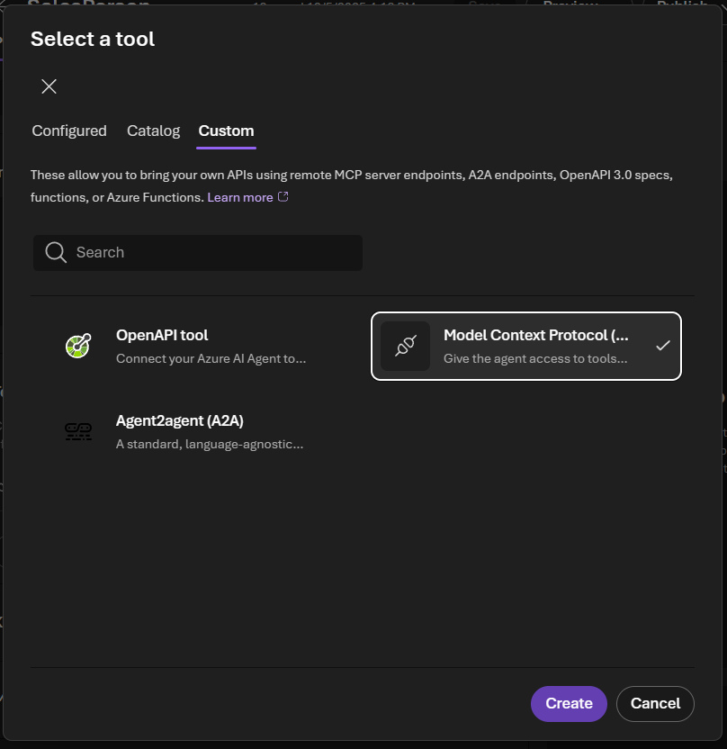

# Configure authentication for SQL MCP Server

[!INCLUDE[Note - Preview](includes/note-preview.md)]

When you connect a client (for example, a Microsoft AI Foundry agent) to SQL MCP Server, authentication becomes a two-direction setup:

- **Inbound authentication** (client to SQL MCP Server): how the client authenticates when calling your MCP endpoint (for example, `https://<host>/mcp`).
- **Outbound authentication** (SQL MCP Server to database): how SQL MCP Server authenticates to your database.

Use the following diagram to orient yourself. In the rest of this article, you configure **outbound** first (so the server can reach the database), then configure **inbound** (so your client can securely call the server).


> [!NOTE]
> The “Client App” can be a Microsoft AI Foundry agent, a custom MCP client app, or another agent runtime. The inbound configuration on SQL MCP Server is the same regardless of which client calls the MCP endpoint.

## Prerequisites

- SQL MCP Server running (Data API builder 1.7+)
- An existing `dab-config.json` with at least one entity
- A Microsoft AI Foundry project with an agent where you can add an MCP tool connection

## Step 1: Configure outbound authentication (SQL MCP Server to database)

Outbound authentication is defined by your `data-source` configuration—most commonly, the connection string.


### Configure the database connection

In your `dab-config.json`, set `data-source.database-type` and `data-source.connection-string`.

> [!TIP]
> Use `@env()` to keep secrets out of the configuration file.

#### Example: SQL user/password (development)

```json
{
	"data-source": {
		"database-type": "mssql",
		"connection-string": "@env('SQL_CONNECTION_STRING')"
	}
}
```

Example environment variable value:

```text
Server=tcp:<server>.database.windows.net,1433;Initial Catalog=<database>;User ID=<user>;Password=<password>;Encrypt=True;TrustServerCertificate=False;
```

#### Example: Managed identity (recommended for Azure)

SQL MCP Server supports Managed Service Identities (MSI) for Azure SQL using `DefaultAzureCredential`. Configure your connection string to use managed identity authentication.

```text
Server=tcp:<server>.database.windows.net,1433;Initial Catalog=<database>;Authentication=Active Directory Managed Identity;
```

For user-assigned managed identity (UAMI), include the identity client ID:

```text
Server=tcp:<server>.database.windows.net,1433;Initial Catalog=<database>;Authentication=Active Directory Managed Identity;User Id=<uami-client-id>;
```

For complete details, see [Data source configuration](../configuration/data-source.md).

## Step 2: Configure inbound authentication (client to SQL MCP Server)

Inbound authentication controls how the MCP client authenticates to SQL MCP Server.


### Add an MCP tool in Microsoft AI Foundry

Use these steps when your client is a Microsoft AI Foundry agent.

1. In your agent project, select **Add a tool**.
2. Select the **Custom** tab.
3. Select **Model Context Protocol**.



4. In the **Add Model Context Protocol tool** dialog:
	- Set **Name** (for example, `MySalesData`).
	- Set the **Remote MCP Server endpoint** (for example, `https://<your-server>/mcp`).
	- Select an **Authentication** mode.


After you configure Foundry, you must configure SQL MCP Server to accept the same inbound authentication mode.

### Authentication options (Foundry)

Foundry currently offers these authentication modes when adding an MCP tool:

- **Unauthenticated**
- **Key-based**
- **Microsoft Entra**
- **OAuth Identity Passthrough**

Use this table as a quick mapping between the Foundry selection and the SQL MCP Server configuration.

|Foundry setting (inbound)|SQL MCP Server setting (inbound)|Notes|
|---|---|---|
|Unauthenticated|`provider: AppService` (or omit `runtime.host.authentication`)|Requests run as `anonymous` unless your hosting platform injects identity headers.|
|Key-based|Not supported|Use Microsoft Entra/OAuth tokens, or front the server with a gateway.|
|Microsoft Entra|`provider: EntraId` + `jwt.audience` + `jwt.issuer`|Requests run as `authenticated` unless a role header is provided by the client.|
|OAuth Identity Passthrough|`provider: EntraId` (Entra tokens) or `provider: Custom` (non-Entra JWTs)|Uses `Authorization: Bearer <token>`.|

The following sections describe each option in the same order.

> [!TIP]
> In Data API builder, authentication and authorization are separate. Even when authentication is enabled, *authorization is still enforced* by entity permissions.

## Unauthenticated (inbound)

Use **Unauthenticated** when you want Foundry to call SQL MCP Server without presenting any identity. On the Data API builder side, you must ensure those requests land in the `anonymous` role and that your entities grant only the permissions you intend to allow.

### What happens

- Foundry sends no access token.
- Data API builder evaluates the request as `anonymous`.

> [!IMPORTANT]
> In Data API builder, the strictest way to enforce anonymous-only access is to omit the `runtime.host.authentication` section entirely. However, this article assumes the SQL MCP Server is hosted behind an Azure App Service-style platform and uses `AppService` authentication, where requests without identity headers are treated as `anonymous`.

### Configure Foundry

Set **Authentication** to **Unauthenticated**.

### Configure SQL MCP Server (DAB)

1. Configure DAB to use the `AppService` provider.
2. Ensure each entity includes `anonymous` permissions.

#### CLI

#### [Bash](#tab/bash)

```bash
# 1) Set host authentication provider
dab configure \
  --runtime.host.authentication.provider AppService

# 2) Grant anonymous permissions per entity (repeat per entity)
dab update \
  Products \
  --permissions "anonymous:read"
```

#### [Command Prompt](#tab/cmd)

```cmd
REM 1) Set host authentication provider
dab configure ^
  --runtime.host.authentication.provider AppService

REM 2) Grant anonymous permissions per entity (repeat per entity)
dab update ^
  Products ^
  --permissions "anonymous:read"
```

---

#### Resulting config (snippet)

```json
{
	"runtime": {
		"host": {
			"authentication": {
				"provider": "AppService"
			}
		}
	},
	"entities": {
		"Products": {
			"permissions": [
				{
					"role": "anonymous",
					"actions": [
						{ "action": "read" }
					]
				}
			]
		}
	}
}
```

## Key-based (not supported)

Foundry’s **Key-based** authentication mode typically sends a static API key (for example, `x-api-key`). **SQL MCP Server doesn’t support key-based authentication**, so you can’t secure the MCP endpoint with a shared secret directly in Data API builder.

### What to do instead

- Use **Microsoft Entra** (recommended) or **OAuth Identity Passthrough** so SQL MCP Server can validate JWTs.
- If you must use a static key, front SQL MCP Server with a gateway that validates the key and then forwards an authenticated request (for example, by exchanging the key for a token). This gateway pattern is outside the scope of this article.

In Foundry, this option appears in the authentication list, but SQL MCP Server doesn't support key-based authentication.

## Microsoft Entra

Use **Microsoft Entra** when you want Foundry to acquire a Microsoft Entra access token and send it to SQL MCP Server. On the Data API builder side, configure the `EntraId` provider so DAB validates the JWT’s issuer and audience.

### What happens

- Foundry acquires an access token from Microsoft Entra.
- Foundry calls the MCP endpoint with `Authorization: Bearer <token>`.
- Data API builder validates the token (issuer + audience) and assigns a role:
	- If no `X-MS-API-ROLE` header is sent, the request runs as the system role `authenticated`.
	- If a valid `X-MS-API-ROLE` header is sent and matches a role claim in the token, the request runs as that role.
	- If no token is sent, the request runs as `anonymous`.

> [!NOTE]
> Many MCP clients (including managed experiences) don’t let you set arbitrary headers like `X-MS-API-ROLE`. In that case, plan your permissions around the `authenticated` system role.

### Configure Foundry

Set **Authentication** to **Microsoft Entra**, then select the appropriate Entra configuration for your tenant/app.

### Configure SQL MCP Server (DAB)

Configure the `EntraId` provider and set the `jwt.audience` and `jwt.issuer` values.

#### CLI

#### [Bash](#tab/bash)

```bash
dab configure \
  --runtime.host.authentication.provider EntraId

dab configure \
  --runtime.host.authentication.jwt.audience "api://<app-id-or-audience>"

dab configure \
  --runtime.host.authentication.jwt.issuer "https://login.microsoftonline.com/<tenant-id>/v2.0"

# Grant permissions for authenticated users (repeat per entity)
dab update \
  Products \
  --permissions "authenticated:read"
```

#### [Command Prompt](#tab/cmd)

```cmd
dab configure ^
  --runtime.host.authentication.provider EntraId

dab configure ^
  --runtime.host.authentication.jwt.audience "api://<app-id-or-audience>"

dab configure ^
  --runtime.host.authentication.jwt.issuer "https://login.microsoftonline.com/<tenant-id>/v2.0"

REM Grant permissions for authenticated users (repeat per entity)
dab update ^
  Products ^
  --permissions "authenticated:read"
```

---

#### Resulting config (snippet)

```json
{
	"runtime": {
		"host": {
			"authentication": {
				"provider": "EntraId",
				"jwt": {
					"audience": "api://<app-id-or-audience>",
					"issuer": "https://login.microsoftonline.com/<tenant-id>/v2.0"
				}
			}
		}
	},
	"entities": {
		"Products": {
			"permissions": [
				{
					"role": "authenticated",
					"actions": [
						{ "action": "read" }
					]
				}
			]
		}
	}
}
```

### Entra configuration notes

Keep these points in mind when troubleshooting:

- **Audience**: Must match the token’s `aud` claim (often `api://<app-id>` or an App ID URI).
- **Issuer**: Must match the token’s `iss` claim. For tenant-specific tokens, use `https://login.microsoftonline.com/<tenant-id>/v2.0`.
- **Roles**: Data API builder expects role values in the token’s `roles` claim.

For the full list of supported providers and fields, see [Runtime configuration: authentication provider](../configuration/runtime.md).

## OAuth Identity Passthrough

Use **OAuth Identity Passthrough** when Foundry can obtain an OAuth access token from an identity provider and pass it through to the MCP server. Conceptually this is the same as the **Microsoft Entra** option, but it can work with non-Entra identity providers.

### What happens

- Foundry obtains an OAuth access token and calls the MCP endpoint with `Authorization: Bearer <token>`.
- SQL MCP Server validates the JWT using either:
	- `provider: EntraId` (Microsoft Entra), or
	- `provider: Custom` (non-Entra JWT issuer).

### Configure Foundry

Set **Authentication** to **OAuth Identity Passthrough**, then configure the OAuth provider details as required by Foundry.

### Configure SQL MCP Server (DAB)

Choose one of the following DAB configurations.

#### Option A: Microsoft Entra tokens (recommended)

Use the same steps as [Microsoft Entra](#microsoft-entra).

#### Option B: Non-Entra OAuth provider

Configure Data API builder to use `Custom` JWT validation.

##### CLI

##### [Bash](#tab/bash)

```bash
dab configure \
  --runtime.host.authentication.provider Custom

dab configure \
  --runtime.host.authentication.jwt.audience "<your-api-audience>"

dab configure \
  --runtime.host.authentication.jwt.issuer "https://<your-issuer>/"
```

##### [Command Prompt](#tab/cmd)

```cmd
dab configure ^
  --runtime.host.authentication.provider Custom

dab configure ^
  --runtime.host.authentication.jwt.audience "<your-api-audience>"

dab configure ^
  --runtime.host.authentication.jwt.issuer "https://<your-issuer>/"
```

---

##### Resulting config (snippet)

```json
{
	"runtime": {
		"host": {
			"authentication": {
				"provider": "Custom",
				"jwt": {
					"audience": "<your-api-audience>",
					"issuer": "https://<your-issuer>/"
				}
			}
		}
	}
}
```

## Related content

- [Data source configuration](../configuration/data-source.md)
- [Runtime configuration: authentication provider](../configuration/runtime.md)
- [Local authentication (Simulator/AppService)](../concept/security/authentication-local.md)
- [Azure authentication (JWT/roles)](../concept/security/authentication-azure.md)
- [Foundry MCP authentication guidance](/azure/ai-foundry/agents/how-to/mcp-authentication)
