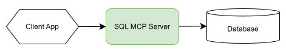

# What is SQL MCP Server?

[!INCLUDE[Note - Preview](includes/note-preview.md)]

SQL MCP Server gives developers a simple, predictable, and secure way to bring AI agents into their data workflows. SQL MCP Server accomplishes this goal without exposing the database or relying on fragile natural language parsing. By building on Data API builder's [entity abstraction](../configuration/entities.md), [RBAC](../concept/security/authorization.md), [caching](/azure/data-api-builder/concept/cache/level-1), and telemetry, the server delivers a production-ready surface that works the same across REST, GraphQL, and MCP. You configure it once, and the engine handles the rest.



## Model Context Protocol (MCP)

Model Context Protocol (MCP) is a standard that defines how AI agents discover and call external tools. A tool is a single operation such as creating a record or reading data. Each tool describes its inputs, outputs, and behavior. MCP provides a predictable way for agents to discover and use capabilities.

## MCP server for SQL

SQL MCP Server is Microsoft's dynamic, open source engine for agentic apps. You configure it with a JSON file that defines:

- How to connect to your database
- Which tables, views, or stored procedures to expose
- The permissions that apply to each object

SQL MCP Server is included as part of Data API builder (DAB) starting in version 1.7. It exposes SQL operations as a small [family of MCP tools](#the-dml-tools) so agents can interact with database entities through a controlled contract. The server is self hosted but, for developers, it can also run locally through the [DAB command-line](/azure/data-api-builder/command-line).

> [!TIP]
> Data API builder is open source and free to use.

### MCP protocol details

SQL MCP Server implements MCP protocol version 2025-06-18 as a fixed default. It supports two transports: streamable HTTP for standard hosting scenarios and stdio for local or CLI scenarios. During initialization, the server advertises tool and logging capabilities, returns server metadata (name and DAB version), and returns the [`instructions` field](./how-to-add-descriptions.md) from `runtime.mcp.description` so clients understand the server's purpose.

#### Stdio transport

The stdio transport is useful for local development and CLI-based workflows. You can specify a role with `role:<role-name>`, which defaults to `anonymous` when omitted. In this mode, authentication uses [the simulator provider](../concept/security/how-to-authenticate-simulator.md) and incoming requests are limited to 1 MB.

```bash
dab --mcp-stdio role:<role-name>
```

You can test SQL MCP Server with the MCP Inspector.

## Use cases

Here are some typical use cases for SQL MCP Server:

- Allow copilots or chatbots to perform safe CRUD operations
- Build internal automations without writing SQL
- Add agent capabilities without exposing the database directly

## Securing the schema

Data API builder uses a well-defined [entity abstraction layer](../configuration/entities.md) that lists all tables, views, and stored procedures exposed through the API in the configuration. This layer lets you alias names and columns, describe objects and parameters, and limit which fields are available to different roles.

> [!IMPORTANT]
> Data API builder (DAB) is role-aware and only exposes the entities and operations the current role is permitted to access.

Because the SQL MCP Server is a feature of Data API builder, it also uses this abstraction layer. This approach prevents the internal schema from being exposed to external consumers and allows you to define complex, and even cross-datasource, families of objects and relationships at the API layer.

## Solving NL2SQL

SQL MCP Server takes [a different approach](#the-dml-tools) from many of the short-sighted database MCP servers available today. A key example is that **SQL MCP Server intentionally doesn't support NL2SQL**.

Why? Models aren't deterministic, and complex queries are the most likely to produce subtle errors. These complex queries are often the ones users hope AI can generate, yet they're also the ones that require the most scrutiny when produced in a nondeterministic way.

> [!NOTE]
> Deterministic means the same input always produces the same output. There's no randomness or variation across calls, which makes results predictable, testable, and safe to automate.

Instead, SQL MCP Server supports what might be called an NL2DAB model. This approach uses the secure Data API builder entity abstraction layer and the built-in DAB Query Builder. Together, they produce accurate, well-formed Transact-SQL (T-SQL) in a fully deterministic way. This approach removes the risk, overhead, and nuisance associated with NL2SQL while preserving safety and reliability for agent-generated queries.

## Support for DDL

DDL (Data Definition Language) is the database language used to create and alter objects such as tables and views. SQL MCP Server is built around [DML (Data Manipulation Language)](./data-manipulation-language-tools.md), the database language used to create, read, update, and delete data in existing tables and views. DML also covers the execution of stored procedures. As a result, SQL MCP Server is designed to work with data, not schema. This design aligns with production MCP use cases where AI agents interact with mission-critical or business-sensitive systems.

> [!TIP]
> To modify schema during local development, you can use the Microsoft SQL Server (MSSQL) extension in Visual Studio Code, which provides comprehensive DDL support.

## Support for RBAC

SQL MCP Server benefits from the same proven [role-based access control (RBAC)](../concept/security/authorization.md) system used throughout Data API builder. Each entity in your configuration defines which roles may read, create, update, or delete data, and which fields are included or excluded for those roles. These rules apply automatically to every MCP tool, ensuring security remains consistent across REST, GraphQL, and MCP with no extra configuration required.

> [!IMPORTANT]
> Role-based constraints apply at every step of agent interaction.

## Support for caching

SQL MCP Server automatically caches results from the `read_records` tool. [Caching in Data API builder](/azure/data-api-builder/concept/cache/level-1) is enabled globally, and you can configure it per entity. Both level 1 and level 2 caching help reduce database load, prevent request stampedes, and support warm-start scenarios in horizontally scaled environments.

## Support for monitoring

SQL MCP Server emits logs and telemetry that let enterprises monitor and validate activity from a single pane of glass. This capability includes Azure Log Analytics, [Application Insights](/azure/data-api-builder/concept/monitor/application-insights), and local file logs inside a container.

### Telemetry

SQL MCP Server is fully instrumented with OpenTelemetry (OTEL) spans and activities. Each operation is traced so developers can correlate behavior across distributed systems. Learn more about Data API builder's native [Open Telemetry](/azure/data-api-builder/concept/monitor/open-telemetry) support.

### Health checks

SQL MCP Server provides detailed health and entity checks across REST, GraphQL, and MCP endpoints. [Data API builder Health](/azure/data-api-builder/concept/monitor/health-checks) lets developers define performance expectations, set thresholds, and verify that each endpoint is functioning as expected.

## How to configure SQL MCP Server

MCP is configured in your [DAB configuration file](../configuration/index.md). If you already have a working Data API builder config, upgrading to version 1.7 or later automatically gives you a working SQL MCP Server with no extra steps required.

### Configuration

You can enable MCP globally or at the entity level. This capability lets you choose which entities surface MCP tools and which remain inaccessible to agents. MCP follows the same rules used for REST and GraphQL, so your configuration remains the single source of truth for permissions, projections, and policies.

When MCP is enabled, SQL MCP Server generates its tool surface automatically based on your configuration. You don't define MCP tools manually. The built-in `dml-tools` system discovers and exposes entities procedurally, which scales well from small schemas to very large databases.

### Get started

Getting started means creating the `dab-config.json` to control the engine. You can do this task manually, or you can use the [Data API builder (DAB) CLI](/azure/data-api-builder/command-line). The CLI simplifies the task, letting you initialize the file with a single command. Configuration property values can use literal strings, [environment variables](/azure/data-api-builder/concept/config/env-function), or [Azure Key Vault](/azure/data-api-builder/concept/config/akv-function) secrets. 

```bash
dab init --database-type mssql --connection-string "<your-connection-string>" --config dab-config.json --host-mode development
```

You can specify each table, view, or stored procedure you want the SQL MCP Server to expose by adding them to the configuration. The CLI lets you easily add them, assign aliases, configure their permissions, and map columns if you want. Most importantly, with the [`description` property](./how-to-add-descriptions.md), you can include semantic details to help language models better understand your data. 

```bash
dab add {entity-name} \                          # object alias (Employees)
  --source {table-or-view-name} \                # database object (dbo.Employees)
  --source.type {table|view|stored-procedure} \  # object type (table)
  --permissions "{role:actions}" \               # role and allowed actions (anonymous:*)
  --description "{text}"                         # semantic description (Company employee records)
```

### Runtime settings

The SQL MCP Server is enabled by default in the Data API builder configuration. In most cases, you don't need to add any settings. The server automatically follows the same permissions and security rules as your API and database. Configure MCP only when you want to narrow or restrict what agents can do.

```json
"runtime": {
  "mcp": {
    "enabled": true,              // default: true
    "path": "/mcp",               // default: /mcp
    "dml-tools": {
      "describe-entities": true,  // default: true
      "create-record": true,      // default: true
      "read-records": true,       // default: true
      "update-record": true,      // default: true
      "delete-record": true,      // default: true
      "execute-entity": true      // default: true
    }
  }
}
```

The CLI also lets you set every property individually or programmatically through scripting. 

```bash
dab configure --runtime.mcp.enabled true
dab configure --runtime.mcp.path "/mcp"
dab configure --runtime.mcp.dml-tools.describe-entities true
dab configure --runtime.mcp.dml-tools.create-record true
dab configure --runtime.mcp.dml-tools.read-records true
dab configure --runtime.mcp.dml-tools.update-record true
dab configure --runtime.mcp.dml-tools.delete-record true
dab configure --runtime.mcp.dml-tools.execute-entity true
```

#### Why disable individual tools?

Developers may want to restrict specific actions even when roles or entity permissions allow them. Disabling a tool at the runtime level ensures it never appears to agents. For example, turning off `delete_record` hides delete capability completely, regardless of configuration elsewhere. This scenario is uncommon but useful when strict operational boundaries are required.

### Entity settings

You also don't need to enable MCP on each entity. Entities participate automatically unless you choose to restrict them. The `dml-tools` property exists so you can exclude an entity from MCP or narrow its capabilities, but you don't need to set anything for normal use. The defaults handle everything.

```json
"entities": {
  "products": {
    "mcp": {
      "dml-tools": true
    }
  }
}
```

## The DML tools

SQL MCP Server exposes six [Data Manipulation Language (DML) tools](./data-manipulation-language-tools.md) that enable AI agents to perform secure, type-safe database operations: `describe_entities`, `create_record`, `read_records`, `update_record`, `delete_record`, and `execute_entity`. These tools form a predictable CRUD surface that always reflects your configuration, permissions, and schema.

Each tool respects role-based access control (RBAC), entity permissions, and policies. Agents never interact directly with your database - they work through the secure Data API builder abstraction layer.

## Related content

- [Adding semantic descriptions to SQL MCP Server](how-to-add-descriptions.md)
- [Configure authentication for SQL MCP Server](how-to-configure-authentication.md)
- [Data manipulation tools in SQL MCP Server](data-manipulation-language-tools.md)
- [Deploy SQL MCP Server to Azure Container Apps](quickstart-azure-container-apps.md)
- [Get started with SQL MCP Server in Visual Studio Code](quickstart-visual-studio-code.md)
- [Get started with SQL MCP Server in .NET Aspire](quickstart-dotnet-aspire.md)
- [Get started with SQL MCP Server in Azure AI Foundry](quickstart-azure-ai-foundry.md)
