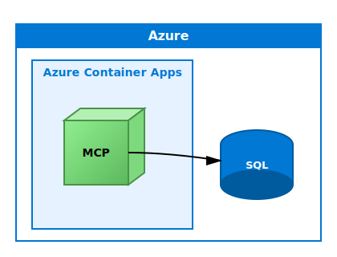

# Quickstart: Use SQL MCP Server with Azure Container Apps

[!INCLUDE[Section - Quickstart selector](includes/section-quickstart-selector.md)]



[!INCLUDE[Note - Preview](includes/note-preview.md)]

This quickstart shows you how to deploy SQL MCP Server to Azure Container Apps. Once deployed, you can connect to it from Visual Studio Code (VS Code), Microsoft Foundry, or any other Model Context Protocol (MCP) client as a remote server endpoint.


## Prerequisites

### Azure subscription

You need an active Azure subscription. If you don't have one, [create a free Azure account](https://azure.microsoft.com/free).

### Azure CLI

Install the Azure CLI to deploy resources:

#### [Windows](#tab/windows)

```bash
winget install Microsoft.AzureCLI
```

#### [macOS](#tab/macos)

```bash
brew install azure-cli
```

---

### .NET 9+

You may already have this tool installed. Run `dotnet --version` and confirm it reports version 9 or later.

#### [Windows](#tab/windows)

```bash
winget install Microsoft.DotNet.Runtime.9
```

#### [macOS](#tab/macos)

```bash
brew install dotnet@9
```

---

### Data API builder CLI

```bash
dotnet new tool-manifest
dotnet tool install microsoft.dataapibuilder --prerelease
```

> [!NOTE]
> SQL MCP Server is currently in prerelease. Using the `--prerelease` flag ensures you get the latest version of Data API builder with all the features used in this quickstart.

### PowerShell

[Install PowerShell](/powershell/scripting/install/install-powershell-on-windows) if it isn't already installed.

```bash
dotnet tool install --global PowerShell
```


## Step 1: Create and deploy Azure SQL Database

### 1. Sign in to Azure

```bash
az login
az account set --subscription "<your-subscription-id>"
```

### 2. Set variables for your deployment

```powershell
$RESOURCE_GROUP = "rg-sql-mcp"
$LOCATION = "eastus"
$SQL_SERVER = "sql-mcp-$(Get-Random -Minimum 1000 -Maximum 9999)"
$SQL_DATABASE = "ProductsDB"
$SQL_ADMIN = "sqladmin"
$SQL_PASSWORD = "<YourStrongPassword123!>"
```

### 3. Create a resource group

```bash
az group create \
  --name $RESOURCE_GROUP \
  --location $LOCATION
```

### 4. Create Azure SQL Server

```bash
az sql server create \
  --name $SQL_SERVER \
  --resource-group $RESOURCE_GROUP \
  --location $LOCATION \
  --admin-user $SQL_ADMIN \
  --admin-password $SQL_PASSWORD
```

### 5. Configure firewall to allow Azure services

```bash
az sql server firewall-rule create \
  --resource-group $RESOURCE_GROUP \
  --server $SQL_SERVER \
  --name AllowAzureServices \
  --start-ip-address 0.0.0.0 \
  --end-ip-address 0.0.0.0
```

### 6. Create the database

```bash
az sql db create \
  --resource-group $RESOURCE_GROUP \
  --server $SQL_SERVER \
  --name $SQL_DATABASE \
  --service-objective S0
```

### 7. Create a Products table with sample data

Get your connection string first:

```powershell
$CONNECTION_STRING = "Server=tcp:$SQL_SERVER.database.windows.net,1433;Database=$SQL_DATABASE;User ID=$SQL_ADMIN;Password=$SQL_PASSWORD;Encrypt=true;TrustServerCertificate=false;Connection Timeout=30;"
```

Create a SQL script file `create-products.sql`:

```sql
CREATE TABLE dbo.Products
(
    ProductID INT NOT NULL PRIMARY KEY IDENTITY(1,1),
    ProductName NVARCHAR(100) NOT NULL,
    Category NVARCHAR(50) NOT NULL,
    UnitPrice DECIMAL(10,2) NOT NULL,
    UnitsInStock INT NOT NULL,
    Discontinued BIT NOT NULL DEFAULT 0
);

INSERT INTO dbo.Products (ProductName, Category, UnitPrice, UnitsInStock, Discontinued) VALUES
('Laptop Pro 15', 'Electronics', 1299.99, 45, 0),
('Wireless Mouse', 'Electronics', 29.99, 150, 0),
('Office Chair', 'Furniture', 249.99, 30, 0),
('Standing Desk', 'Furniture', 599.99, 15, 0),
('Coffee Maker', 'Appliances', 89.99, 60, 0),
('Notebook Set', 'Office Supplies', 12.99, 200, 0),
('USB-C Hub', 'Electronics', 49.99, 80, 0),
('Desk Lamp', 'Furniture', 39.99, 100, 0),
('Bluetooth Headphones', 'Electronics', 149.99, 50, 0),
('Water Bottle', 'Office Supplies', 19.99, 120, 0);
```

Execute it using VS Code, SQL Server Management Studio, or sqlcmd.

## Step 2: Configure SQL MCP Server

### 1. Create your dab-config.json

Initialize the configuration:

```powershell
dab init `
  --database-type mssql `
  --connection-string "@env('MSSQL_CONNECTION_STRING')" `
  --host-mode Production `
  --config dab-config.json
```

### 2. Add the Products entity with descriptions

```powershell
dab add Products `
  --source dbo.Products `
  --permissions "anonymous:read" `
  --description "Product catalog with pricing, category, and inventory information"
```

### 3. Provide AI agent context with field descriptions

Add field descriptions to help AI agents understand your database schema:

```powershell
dab update Products `
  --fields.name ProductID `
  --fields.description "Unique product identifier" `
  --fields.primary-key true

dab update Products `
  --fields.name ProductName `
  --fields.description "Name of the product"

dab update Products `
  --fields.name Category `
  --fields.description "Product category (Electronics, Furniture, Office Supplies, Appliances)"

dab update Products `
  --fields.name UnitPrice `
  --fields.description "Retail price per unit in USD"

dab update Products `
  --fields.name UnitsInStock `
  --fields.description "Current inventory count available for purchase"

dab update Products `
  --fields.name Discontinued `
  --fields.description "True if product is no longer available for sale"
```

## Step 3: Deploy SQL MCP Server to Azure Container Apps

### 1. Create Azure Container Registry and build custom image

Create a container registry and build a custom image with your configuration embedded:

```powershell
$ACR_NAME = "acrsqlmcp$(Get-Random -Minimum 1000 -Maximum 9999)"

az acr create `
  --resource-group $RESOURCE_GROUP `
  --name $ACR_NAME `
  --sku Basic `
  --admin-enabled true
```

### 2. Create a Dockerfile

Create a file named `Dockerfile` in the same folder as your `dab-config.json`:

```dockerfile
FROM mcr.microsoft.com/azure-databases/data-api-builder:1.7.83-rc
COPY dab-config.json /App/dab-config.json
```

### 3. Build and push the image

```powershell
az acr build `
  --registry $ACR_NAME `
  --image sql-mcp-server:1 `
  .
```

### 4. Create Container Apps environment

```powershell
$CONTAINERAPP_ENV = "sql-mcp-env"
$CONTAINERAPP_NAME = "sql-mcp-server"

az containerapp env create `
  --name $CONTAINERAPP_ENV `
  --resource-group $RESOURCE_GROUP `
  --location $LOCATION
```

### 5. Deploy the SQL MCP Server container

```powershell
$ACR_LOGIN_SERVER = az acr show `
  --name $ACR_NAME `
  --query loginServer `
  --output tsv

$ACR_USERNAME = az acr credential show `
  --name $ACR_NAME `
  --query username `
  --output tsv

$ACR_PASSWORD = az acr credential show `
  --name $ACR_NAME `
  --query "passwords[0].value" `
  --output tsv

az containerapp create `
  --name $CONTAINERAPP_NAME `
  --resource-group $RESOURCE_GROUP `
  --environment $CONTAINERAPP_ENV `
  --image "$ACR_LOGIN_SERVER/sql-mcp-server:1" `
  --registry-server $ACR_LOGIN_SERVER `
  --registry-username $ACR_USERNAME `
  --registry-password $ACR_PASSWORD `
  --target-port 5000 `
  --ingress external `
  --min-replicas 1 `
  --max-replicas 3 `
  --secrets "mssql-connection-string=$CONNECTION_STRING" `
  --env-vars "MSSQL_CONNECTION_STRING=secretref:mssql-connection-string" `
  --cpu 0.5 `
  --memory 1.0Gi
```

#### Your resource group should resemble the following example:

:::image type="content" source="media/quickstart-azure-container-apps/azure-resource-group.png" lightbox="media/quickstart-azure-container-apps/azure-resource-group.png" alt-text="Screenshot of the Azure portal resource group after deployment.":::

### 6. Get your MCP endpoint URL

```powershell
$MCP_URL = az containerapp show `
  --name $CONTAINERAPP_NAME `
  --resource-group $RESOURCE_GROUP `
  --query "properties.configuration.ingress.fqdn" `
  --output tsv

Write-Host "Your MCP Server URL: https://$MCP_URL/mcp"
```

Save this URL - you use it to connect from MCP clients.

### 7. Test your deployment

```powershell
curl "https://$MCP_URL/health"
```

You should see a healthy response.

## Connect from MCP clients

Your SQL MCP Server is now deployed and ready to use. Here's how to connect from various clients:

### Visual Studio Code (VS Code)

Follow the [Quickstart with VS Code](quickstart-visual-studio-code.md) guide and use your deployed MCP server URL instead of running locally.

### From Microsoft Foundry

To add your MCP server as a Custom MCP Tool, follow the [Quickstart with Microsoft Foundry](quickstart-azure-ai-foundry.md) guide.

### Other MCP clients

Use the MCP server URL from Step 3.6 to connect from any MCP-compatible client.

## Monitoring and troubleshooting

### View Container Apps logs

```bash
az containerapp logs show \
  --name $CONTAINERAPP_NAME \
  --resource-group $RESOURCE_GROUP \
  --follow
```

### Check MCP endpoint health

```powershell
curl "https://$MCP_URL/health"
```

### Common issues

#### Connection failed error

- Ensure Container Apps ingress is set to `external`
- Verify the SQL connection string is correct
- Check firewall rules on Azure SQL

#### No data returned

- Verify the Products table was created and populated
- Check entity permissions in `dab-config.json`
- Review Container Apps logs for errors

#### Performance is slow

- Consider increasing CPU/memory allocation
- Check if you need to scale up replicas
- Review Application Insights metrics

## Security best practices for production

- **Enable authentication** - Configure Microsoft Entra ID authentication instead of anonymous access
- **Use managed identities** - Let Container Apps authenticate to SQL using managed identity
- **Implement CORS** - Restrict which domains can access your MCP server
- **Enable rate limiting** - Protect against abuse
- **Use Azure Key Vault** - Store connection strings securely
- **Monitor with Application Insights** - Track usage and performance
- **Restrict permissions** - Only grant necessary access levels

## Clean up resources

When you're done, delete the resource group to remove all resources:

```bash
az group delete --name $RESOURCE_GROUP --yes --no-wait
```

## Complete sample script

Here's a complete PowerShell script that performs all the steps in this quickstart. Before running, update the tenant ID, subscription ID, and password variables.

> [!TIP]
> For a production-ready deployment with managed identity authentication, health checks, and automatic cleanup, see the [Data API builder demo environment script](https://github.com/JerryNixon/dab-demo-environment-script).

```powershell
# ============================================
# Variables - UPDATE THESE VALUES
# ============================================
$RESOURCE_GROUP = "rg-sql-mcp"
$LOCATION = "centralus"
$SQL_SERVER = "sql-mcp-$(Get-Random -Minimum 1000 -Maximum 9999)"
$SQL_DATABASE = "ProductsDB"
$SQL_ADMIN = "sqladmin"
$SQL_PASSWORD = "P@ssw0rd!"  # Replace with a strong password
$ACR_NAME = "acrsqlmcp$(Get-Random -Minimum 1000 -Maximum 9999)"
$CONTAINERAPP_ENV = "sql-mcp-env"
$CONTAINERAPP_NAME = "sql-mcp-server"

# ============================================
# Sign in to Azure
# ============================================
az login --tenant "<your-tenant-id>"
az account set --subscription "<your-subscription-id>"

# ============================================
# Check if resource group exists and create unique name
# ============================================
$RG_COUNTER = 0
$ORIGINAL_RG = $RESOURCE_GROUP
while ($true) {
    $RG_EXISTS = az group exists --name $RESOURCE_GROUP
    if ($RG_EXISTS -eq "false") {
        break
    }
    $RG_COUNTER++
    $RESOURCE_GROUP = "$ORIGINAL_RG-$RG_COUNTER"
}
Write-Host "Using resource group: $RESOURCE_GROUP" -ForegroundColor Green

# ============================================
# Step 1: Create Azure SQL Database
# ============================================
az group create --name $RESOURCE_GROUP --location $LOCATION

az sql server create `
  --name $SQL_SERVER `
  --resource-group $RESOURCE_GROUP `
  --location $LOCATION `
  --admin-user $SQL_ADMIN `
  --admin-password $SQL_PASSWORD

az sql server firewall-rule create `
  --resource-group $RESOURCE_GROUP `
  --server $SQL_SERVER `
  --name AllowAzureServices `
  --start-ip-address 0.0.0.0 `
  --end-ip-address 0.0.0.0

# Add current client IP to firewall
$MY_IP = (Invoke-RestMethod -Uri 'https://api.ipify.org?format=text')
az sql server firewall-rule create `
  --resource-group $RESOURCE_GROUP `
  --server $SQL_SERVER `
  --name AllowMyIP `
  --start-ip-address $MY_IP `
  --end-ip-address $MY_IP

az sql db create `
  --resource-group $RESOURCE_GROUP `
  --server $SQL_SERVER `
  --name $SQL_DATABASE `
  --service-objective S0

$CONNECTION_STRING = "Server=tcp:$SQL_SERVER.database.windows.net,1433;Database=$SQL_DATABASE;User ID=$SQL_ADMIN;Password=$SQL_PASSWORD;Encrypt=true;TrustServerCertificate=false;Connection Timeout=30;"

# Create sample table using sqlcmd
Write-Host "Creating Products table and sample data..." -ForegroundColor Yellow

$SQL_SCRIPT = @"
CREATE TABLE dbo.Products (
    ProductID INT NOT NULL PRIMARY KEY IDENTITY(1,1),
    ProductName NVARCHAR(100) NOT NULL,
    Category NVARCHAR(50) NOT NULL,
    UnitPrice DECIMAL(10,2) NOT NULL,
    UnitsInStock INT NOT NULL,
    Discontinued BIT NOT NULL DEFAULT 0
);

INSERT INTO dbo.Products (ProductName, Category, UnitPrice, UnitsInStock, Discontinued) VALUES
('Laptop Pro 15', 'Electronics', 1299.99, 45, 0),
('Wireless Mouse', 'Electronics', 29.99, 150, 0),
('Office Chair', 'Furniture', 249.99, 30, 0),
('Standing Desk', 'Furniture', 599.99, 15, 0),
('Coffee Maker', 'Appliances', 89.99, 60, 0);
"@

# Use Invoke-Sqlcmd if available, otherwise skip table creation
try {
    $SQL_SCRIPT | Out-File -FilePath "create-table.sql" -Encoding utf8
    sqlcmd -S "$SQL_SERVER.database.windows.net" -d $SQL_DATABASE -U $SQL_ADMIN -P $SQL_PASSWORD -i "create-table.sql"
    Remove-Item "create-table.sql" -ErrorAction SilentlyContinue
    Write-Host "Products table created successfully!" -ForegroundColor Green
} catch {
    Write-Host "Note: Could not create table automatically. You can create it manually later." -ForegroundColor Yellow
    Write-Host "SQL Script saved for manual execution if needed." -ForegroundColor Yellow
}

# ============================================
# Step 2: Configure SQL MCP Server
# ============================================
# Remove existing config if present
if (Test-Path "dab-config.json") {
    Remove-Item "dab-config.json" -Force
}

dab init `
  --database-type mssql `
  --connection-string "@env('MSSQL_CONNECTION_STRING')" `
  --host-mode Production `
  --config dab-config.json

dab add Products `
  --source dbo.Products `
  --permissions "anonymous:read" `
  --description "Product catalog with pricing, category, and inventory information"

# ============================================
# Step 3: Deploy to Azure Container Apps
# ============================================
az acr create `
  --resource-group $RESOURCE_GROUP `
  --name $ACR_NAME `
  --sku Basic `
  --admin-enabled true

# Create Dockerfile
@"
FROM mcr.microsoft.com/azure-databases/data-api-builder:1.7.83-rc
COPY dab-config.json /App/dab-config.json
"@ | Out-File -FilePath Dockerfile -Encoding utf8

az acr build --registry $ACR_NAME --image sql-mcp-server:1 .

az containerapp env create `
  --name $CONTAINERAPP_ENV `
  --resource-group $RESOURCE_GROUP `
  --location $LOCATION

# Get ACR credentials for initial deployment
$ACR_LOGIN_SERVER = az acr show --name $ACR_NAME --query loginServer --output tsv
$ACR_USERNAME = az acr credential show --name $ACR_NAME --query username --output tsv
$ACR_PASSWORD = az acr credential show --name $ACR_NAME --query "passwords[0].value" --output tsv

az containerapp create `
  --name $CONTAINERAPP_NAME `
  --resource-group $RESOURCE_GROUP `
  --environment $CONTAINERAPP_ENV `
  --image "$ACR_LOGIN_SERVER/sql-mcp-server:1" `
  --registry-server $ACR_LOGIN_SERVER `
  --registry-username $ACR_USERNAME `
  --registry-password $ACR_PASSWORD `
  --target-port 5000 `
  --ingress external `
  --min-replicas 1 `
  --max-replicas 3 `
  --secrets "mssql-connection-string=$CONNECTION_STRING" `
  --env-vars "MSSQL_CONNECTION_STRING=secretref:mssql-connection-string" `
  --cpu 0.5 `
  --memory 1.0Gi

# ============================================
# Output
# ============================================
$MCP_URL = az containerapp show `
  --name $CONTAINERAPP_NAME `
  --resource-group $RESOURCE_GROUP `
  --query "properties.configuration.ingress.fqdn" `
  --output tsv

Write-Host ""
Write-Host "Deployment complete!" -ForegroundColor Green
Write-Host "MCP Server URL: https://$MCP_URL/mcp" -ForegroundColor Cyan
Write-Host "Health check:   https://$MCP_URL/health" -ForegroundColor Cyan
```

## Related content
- [Overview of SQL MCP Server](overview.md)
- [Data manipulation tools in SQL MCP Server](data-manipulation-language-tools.md)
- [Adding semantic descriptions to SQL MCP Server](how-to-add-descriptions.md)
