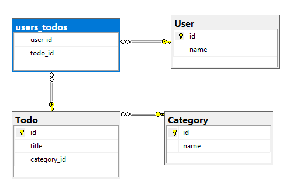

# Data API builder configuration schema reference

The Data API builder's engine requires a configuration file. The Data API Builder configuration file provides a structured and comprehensive approach to setting up your API, detailing everything from environmental variables to entity-specific configurations. This JSON-formatted document begins with a `$schema` property. This setup validates the document.

The properties `database-type` and `connection-string` ensure seamless integration with database systems, from Azure SQL Database to Cosmos DB NoSQL API.

The configuration file can include options such as:

- Database service and connection information
- Global and runtime configuration options
- Set of exposed entities
- Authentication method
- Security rules required to access identities
- Name mapping rules between API and database
- Relationships between entities that can't be inferred
- Unique features for specific database services

## Syntax overview

Here's a quick breakdown of the primary "sections" in a configuration file.

```json
{
  "$schema": "...",
  "data-source": { ... },
  "data-source-files": [ ... ],
  "runtime": {
    "rest": { ... },
    "graphql": { .. },
    "host": { ... },
    "cache": { ... },
    "telemetry": { ... }
  }
  "entities": [ ... ]
}
```

### Top-level properties

Here's the description of the top-level properties in a table format:

| Property              | Description |
|-----------------------|-------------|
| **[$schema](#schema)**           | Specifies the JSON schema for validation, ensuring the configuration adheres to the required format. |
| **[data-source](#data-source)**       | Contains the details about the [database type](#database-type) and the [connection string](#connection-string), necessary for establishing the database connection. |
| **[data-source-files](#data-source-files)** | An optional array specifying other configuration files that might define other data sources. |
| **[runtime](#runtime)**           | Configures runtime behaviors and settings, including subproperties for  [REST](#rest-runtime), [GraphQL](#graphql-runtime), [host](#host-runtime), [cache](#cache-runtime), and [telemetry](#telemetry-runtime). |
| **[entities](#entities)**          | Defines the set of entities ([database tables](#type-entities), views, etc.) that are exposed through the API, including their [mappings](#mappings-entities), [permissions](#permissions), and [relationships](#relationships-entities). |

## Sample configuration

Here's a sample configuration file that only includes required properties for a single simple entity. This sample is intended to illustrate a minimal scenario.

```json
{
  "$schema": "https://github.com/Azure/data-api-builder/releases/latest/download/dab.draft.schema.json",
  "data-source": {
    "database-type": "mssql",
    "connection-string": "@env('sql-connection-string')"
  },
  "entities": {
    "Book": {
      "source": "dbo.books",
      "permissions": [{
          "actions": ["*"],
          "role": "anonymous"
      }]
    }
  }
}
```

For an example of a more complex scenario, see the [end-to-end sample configuration](sample-configuration.md).

## Environments

Data API builder's configuration file can support scenarios where you need to support multiple environments, similar to the `appSettings.json` file in ASP.NET Core. The framework provides three [common environment values](/dotnet/api/microsoft.extensions.hosting.environments#fields); `Development`, `Staging`, and `Production`; but you can elect to use any environment value you choose. The environment that Data API builder uses must be configured using the `DAB_ENVIRONMENT` environment variable.

Consider an example where you want a baseline configuration and a development-specific configuration. This example requires two configuration files:

| | Environment |
| --- | --- |
| **dab-config.json** | Base |
| **dab-config.Development.json** | Development |

To use the development-specific configuration, you must set the `DAB_ENVIRONMENT` environment variable to `Development`.

Environment-specific configuration files override property values in the base configuration file. In this example, if the `connection-string` value is set in both files, the value from the **\*.Development.json** file is used.

Refer to this matrix to better understand which value is used depending on where that value is specified (or not specified) in either file.

| | **Specified in base configuration** | **Not specified in base configuration** |
| --- | --- | --- |
| **Specified in current environment configuration** | Current environment | Current environment |
| **Not specified in current environment configuration** | Base | None |

For an example of using multiple configuration files, see [use Data API builder with environments](how-to-use-environments.md).

## Configuration properties

This section includes all possible configuration properties that are available for a configuration file.

### Schema

**REQUIRED**: ✔️ Yes

Each configuration file begins with a `$schema` property, specifying the [JSON schema](https://code.visualstudio.com/Docs/languages/json#_json-schemas-and-settings) for validation.

#### Format

```json
{
  "$schema": "<string>"
}
```

#### Examples

Schema files are available for versions `0.3.7-alpha` onwards at specific URLs, ensuring you use the correct version or the latest available schema.

```https
https://github.com/Azure/data-api-builder/releases/download/<VERSION>-<suffix>/dab.draft.schema.json
```

Replace `VERSION-suffix` with the version you want.

```https
https://github.com/Azure/data-api-builder/releases/download/v0.3.7-alpha/dab.draft.schema.json
```

The latest version of the schema is always available at <https://github.com/Azure/data-api-builder/releases/latest/download/dab.draft.schema.json>.

Here are a few examples of valid schema values.

| Version | URI | Description |
| --- | --- | --- |
| 0.3.7-alpha | `https://github.com/Azure/data-api-builder/releases/download/v0.3.7-alpha/dab.draft.schema.json` | Uses the configuration schema from an alpha version of the tool. |
| 0.10.23 | `https://github.com/Azure/data-api-builder/releases/download/v0.10.23/dab.draft.schema.json` | Uses the configuration schema for a stable release of the tool. |
| Latest | `https://github.com/Azure/data-api-builder/releases/latest/download/dab.draft.schema.json` | Uses the latest version of the configuration schema. |

> [!NOTE]
> Versions of the Data API builder prior to **0.3.7-alpha** may have a different schema URI.

### Data source

**REQUIRED**: ✔️ Yes

The `data-source` section defines the database and access to the database through the connection string. It also defines database options. The `data-source` property configures the credentials necessary to connect to the backing database. The `data-source` section outlines backend database connectivity, specifying both the `database-type` and `connection-string`.

#### Format

```json
{
  "data-source": {
    "database-type": "...",
    "connection-string": "your-connection-string",
    
    // mssql-only
    "options": {
      "set-session-context": <true> (default) | <false>
    },
    
    // cosmosdb_nosql-only
    "options": {
      "database": "your-cosmosdb-database-name", 
      "container": "your-cosmosdb-container-name",
      "schema": "path-to-your-graphql-schema-file"
    }
  }
}
```

#### Properties

| | Required | Type |
| --- | --- | --- |
| **[`database-type`](#database-type)** | ✔️ Yes | enum string |
| **[`connection-string`](#connection-string)** | ✔️ Yes | string |
| **[`options`](#options)** | ❌ No | object |

### Database type

**REQUIRED**: ✔️ Yes

An enum string used to specify the type of database to use as the data source.

#### Format

```json
{
  "data-source"{
    "database-type": "<enum-string>"
  }
}
```

#### Values

The `type` property indicates the kind of backend database.

| Type                  | Description              | Min Version |
| --------------------- | ------------------------ | ----------- |
| `mssql`               | Azure SQL Database       | n/a         |
| `mssql`               | Azure SQL MI             | n/a         |
| `mssql`               | SQL Server               | SQL 2016    |
| `sqldw`               | Azure SQL Data Warehouse | n/a         |
| `postgresql`          | PostgreSQL               | v11         |
| `mysql`               | MySQL                    | v8          |
| `cosmosdb_nosql`      | Azure Cosmos DB for NoSQL      | n/a         |
| `cosmosdb_postgresql` | Azure Cosmos DB for PostgreSQL | n/a         |

### Connection string

**REQUIRED**: ✔️ Yes

A **string** value containing a valid connection string to connect to the target database service. The ADO.NET connection string to connect to the backend database. For more information, see [ADO.NET connection strings](/dotnet/framework/data/adonet/connection-strings).

#### Format

```json
{
  "data-source"{
    "connection-string": "<string>"
  }
}
```

#### Connection resiliency

Data API builder automatically retries database requests after detecting transient errors. The retry logic follows an **Exponential Backoff** strategy where the maximum number of retries is **five**. The retry backoff duration after subsequent requests is calculated using this formula (assuming the current retry attempt is `r`): $2^r$. Using this formula, you can calculate the time for each retry attempt in seconds.

| | Seconds |
| :-- | :-- |
| **First** | `2` |
| **Second** | `4` |
| **Third** | `8` |
| **Fourth** | `16` |
| **Fifth** | `32` |

#### Azure SQL and SQL Server

Data API builder uses the [`SqlClient`](https://www.nuget.org/packages/Microsoft.Data.SqlClient) library to connect to Azure SQL or SQL Server using the connection string you provide in the configuration file. A list of all the supported connection string options is available here: [SqlConnection.ConnectionString Property](/dotnet/api/system.data.sqlclient.sqlconnection.connectionstring).

Data API builder can also connect to the target database using Managed Service Identities (MSI). The `DefaultAzureCredential` defined in [`Azure.Identity`](https://www.nuget.org/packages/Azure.Identity) library is used when you don't specify a username or password in your connection string. For more information, see [`DefaultAzureCredential` examples](/dotnet/api/azure.identity.defaultazurecredential#examples).

#### Examples

The value used for the connection string largely depends on the database service used in your scenario. You can always elect to store the connection string in an environment variable and access it using the `@env()` function.

| | Value | Description |
| --- | --- | --- |
| **Use Azure SQL Database string value** | `Server=<server-address>;Database=<name-of-database>;User ID=<username>;Password=<password>;` | Connection string to an Azure SQL Database account. For more information, see [Azure SQL Database connection strings](/azure/azure-sql/database/connect-query-content-reference-guide?#get-adonet-connection-information-optional---sql-database-only). |
| **Use Azure Database for PostgreSQL string value** | `Server=<server-address>;Database=<name-of-database>;Port=5432;User Id=<username>;Password=<password>;Ssl Mode=Require;` | Connection string to an Azure Database for PostgreSQL account. For more information, see [Azure Database for PostgreSQL connection strings](/azure/postgresql/single-server/how-to-connection-string-powershell). |
| **Use Azure Cosmos DB for NoSQL string value** | `AccountEndpoint=<endpoint>;AccountKey=<key>;` | Connection string to an Azure Cosmos DB for NoSQL account. For more information, see [Azure Cosmos DB for NoSQL connection strings](/azure/cosmos-db/nosql/how-to-dotnet-get-started#retrieve-your-account-connection-string). |
| **Use Azure Database for MySQL string value** | `Server=<server-address>;Database=<name-of-database>;User ID=<username>;Password=<password>;Sslmode=Required;SslCa=<path-to-certificate>;` | Connection string to an Azure Database for MySQL account. For more information, see [Azure Database for MySQL connection strings](/azure/mysql/single-server/how-to-connection-string). |
| **Access environment variable** | `@env('database-connection-string')` | Access an environment variable from the local machine. In this example, the `database-connection-string` environment variable is referenced. |

> [!TIP]
> As a best practice, avoid storing sensitive information in your configuration file. When possible, use `@env()` to reference environment variables. For more information, see [`@env()` function](reference-functions.md#env).

These samples just illustrate how each database type might be configured. Your scenario might be unique, but this sample is a good starting place. Replace the placeholders such as `myserver`, `myDataBase`, `mylogin`, and `myPassword` with the actual values specific to your environment.

- `mssql`

  ```json
  "data-source": {
    "database-type": "mssql",
    "connection-string": "$env('my-connection-string')",
    "options": {
      "set-session-context": true
    }
  }
  ```

  - **Typical connection string format**: `"Server=tcp:myserver.database.windows.net,1433;Initial Catalog=myDataBase;Persist Security Info=False;User ID=mylogin;Password=myPassword;MultipleActiveResultSets=False;Encrypt=True;TrustServerCertificate=False;Connection Timeout=30;"`

- `postgresql`

  ```json
  "data-source": {
    "database-type": "postgresql",
    "connection-string": "$env('my-connection-string')"
  }
  ```

  - **Typical connection string format**: `"Host=myserver.postgres.database.azure.com;Database=myDataBase;Username=mylogin@myserver;Password=myPassword;"`

- `mysql`

  ```json
  "data-source": {
    "database-type": "mysql",
    "connection-string": "$env('my-connection-string')"
  }
  ```
  
  - **Typical connection string format**: `"Server=myserver.mysql.database.azure.com;Database=myDataBase;Uid=mylogin@myserver;Pwd=myPassword;"`

- `cosmosdb_nosql`

  ```json
  "data-source": {
    "database-type": "cosmosdb_nosql",
    "connection-string": "$env('my-connection-string')",
    "options": {
      "database": "Your_CosmosDB_Database_Name",
      "container": "Your_CosmosDB_Container_Name",
      "schema": "Path_to_Your_GraphQL_Schema_File"
    }
  }
  ```
  
  - **Typical connection string format**: `"AccountEndpoint=https://mycosmosdb.documents.azure.com:443/;AccountKey=myAccountKey;"`

- `cosmosdb_postgresql`

  ```json
  "data-source": {
    "database-type": "cosmosdb_postgresql",
    "connection-string": "$env('my-connection-string')"
  }
  ```
  
  - **Typical connection string format**: `"Host=mycosmosdb.postgres.database.azure.com;Database=myDataBase;Username=mylogin@mycosmosdb;Password=myPassword;Port=5432;SSL Mode=Require;"`

> [!NOTE]
> The "options" specified such as `database`, `container`, and `schema` are specific to Azure Cosmos DB's NoSQL API rather than the PostgreSQL API. For Azure Cosmos DB using the PostgreSQL API, the "options" would not include `database`, `container`, or `schema` as in the NoSQL setup.

### Options

**REQUIRED**: ❌ No

An optional section of extra key-value parameters for specific database connections.

#### Format

```json
{
  "data-source"{
    "options": {
        "<key>": "<value>"
    }
  }
}
```

#### Examples

Whether the `options` section is required or not is largely dependent on the database service being used.

| | Value | Description |
| --- | --- | --- |
| **Enable `SESSION_CONTEXT` in Azure SQL or SQL Server** | `"set-session-context": false` | For Azure SQL and SQL Server, Data API builder can take advantage of `SESSION_CONTEXT` to send user specified metadata to the underlying database. Such metadata is available to Data API builder by virtue of the claims present in the access token. The `SESSION_CONTEXT` data is available to the database during the database connection until that connection is closed. For more information, see [session context](azure-sql-session-context-rls.md). |

```json
{
  "data-source"{
    "options": {
        "set-session-context": false
    }
  }
}
```

### Data source files

**REQUIRED**: ❌ No

This property includes names of runtime configuration files referencing extra databases.

#### Format

```json
{
  "data-source-files": ["<string-array>"]
}
```

#### Configuration file considerations

- The `data-source` property in every configuration file is required.
- The `entities` property in every configuration file is required.
- Only the top-level configuration file `runtime` setting is used.
- Child-level configuration files can also identify child files.  
- Configuration files can be placed in subfolders as desired.  
- Entity names must be unique across all configuration files.
- Relationships across configuration files aren't supported.  

#### Known issues

- Currently, child configuration files are only supported in GraphQL.  
- Currently, child configuration files don't support environment variables.

#### Examples

```json
{
  "data-source-files": ["dab-config-two.json", "dab-config-three.json"]
}
```

Reference subfolders if in use:

```json
{
  "data-source-files": ["myfolder/dab-config-two.json"]
}
```

### Runtime

**REQUIRED**: ❌ No

The `runtime` section outlines options that influence the runtime behavior and settings for all exposed entities.

#### Format

```json
{
  "runtime": {
    "rest": {
      "path": "/api" (default),
      "enabled": <true> (default) | <false>,
      "request-body-strict": <true> (default) | <false>
    },
    "graphql": {
      "path": "/graphql" (default),
      "enabled": <true> (default) | <false>,
      "allow-introspection": <true> (default) | <false>
    },
    "host": {
      "mode": "production" (default) | "development",
      "cors": {
        "origins": ["<array-of-strings>"],
        "allow-credentials": <true> | <false> (default)
      },
      "authentication": {
        "provider": "StaticWebApps" (default) | ...,
        "jwt": {
          "audience": "<client-id>",
          "issuer": "<issuer-url>"
        }
      }
    }
  },
  "cache": {
    "enabled": <true> | <false> (default),
    "ttl-seconds": <integer; default: 5>
  },
  "telemetry": {
    "application-insights": {
      "connection-string": "<connection-string>",
      "enabled": <true> | <false> (default)
    }
  }
}
```

#### Properties

| | Required | Type |
| --- | --- | --- |
| **[`rest`](#rest-runtime)** | ❌ No | object |
| **[`graphql`](#graphql-runtime)** | ❌ No | object |
| **[`host`](#host-runtime)** | ❌ No | object |
| **[`cache`](#cache-runtime)** | ❌ No | object |

#### Examples

Here's an example of a runtime section with multiple common default parameters specified.

```json
{
  "runtime": {
    "rest": {
      "enabled": true,
      "path": "/api",
      "request-body-strict": true
    },
    "graphql": {
      "enabled": true,
      "path": "/graphql",
      "allow-introspection": true
    },
    "host": {
      "mode": "development",
      "cors": {
        "allow-credentials": false,
        "origins": [
          "*"
        ]
      },
      "authentication": {
        "provider": "StaticWebApps",
        "jwt": {
          "audience": "<client-id>",
          "issuer": "<identity-provider-issuer-uri>"
        }
      }
    },
    "cache": {
      "enabled": true,
      "ttl-seconds": 30
    }
  }
}
```

### GraphQL (runtime)

**REQUIRED**: ❌ No

This object defines whether GraphQL is enabled and the name\[s\] used to expose the entity as a GraphQL type. This object is optional and only used if the default name or settings aren't sufficient. This section outlines the global settings for the GraphQL endpoint.

#### Format

```json
{
  "runtime": {
    "graphql": {
      "path": "/graphql" (default),
      "enabled": <true> (default) | <false>,
      "allow-introspection": <true> (default) | <false>
      "multiple-mutations": <object>
    }
  }
}
```

#### Properties

| | Required | Type |
| --- | --- | --- |
| **[`enabled`](#enabled-graphql-runtime)** | ❌ No | boolean |
| **[`path`](#path-graphql-runtime)** | ❌ No | string |
| **[`allow-introspection`](#allow-introspection-graphql-runtime)** | ❌ No | boolean |
| **[`multiple-mutations`](#multiple-mutations-graphql-runtime)** | ❌ No | object |

### Enabled (GraphQL runtime)

**REQUIRED**: ❌ No

Defines whether to enable or disable the GraphQL endpoints globally. If disabled globally, no entities would be accessible via GraphQL requests irrespective of the individual entity settings.

#### Format

```json
{
  "runtime": {
    "graphql": {
      "enabled": "<boolean>"
    }
  }
}
```

#### Examples

In this example, the GraphQL endpoint is disabled for all entities.

```json
{
  "runtime": {
    "graphql": {
      "enabled": false
    }
  }
}
```

### Path (GraphQL runtime)

**REQUIRED**: ❌ No

Defines the URL path where the GraphQL endpoint is made available. For example, if this parameter is set to `/graphql`, the GraphQL endpoint is exposed as `/graphql`. By default, the path is `/graphql`.

> [!IMPORTANT]
> Sub-paths are not allowed for this property. A customized path value for the GraphQL endpoint is not currently available.

#### Format

```json
{
  "runtime": {
    "graphql": {
      "path": "<string>"
    }
  }
}
```

#### Examples

In this example, the root GraphQL URI is `/query`.

```json
{
  "runtime": {
    "graphql": {
      "path": "/query"
    }
  }
}
```

### Allow introspection (GraphQL runtime)

**REQUIRED**: ❌ No

This Boolean flag controls the ability to perform schema introspection queries on the GraphQL endpoint. Enabling introspection allows clients to query the schema for information about the types of data available, the kinds of queries they can perform, and the mutations available.

This feature is useful during development for understanding the structure of the GraphQL API and for tooling that automatically generates queries. However, for production environments, it might be disabled to obscure the API's schema details and enhance security. By default, introspection is enabled, allowing for immediate and comprehensive exploration of the GraphQL schema.

#### Format

```json
{
  "runtime": {
    "graphql": {
      "allow-introspection": "<boolean>"
    }
  }
}
```

#### Examples

In this example, the introspection is disabled.

```json
{
  "runtime": {
    "graphql": {
      "allow-introspection": false
    }
  }
}
```

### Multiple mutations (GraphQL runtime)

**REQUIRED**: ❌ No

TODO

#### Format

```json
{
  "runtime": {
    "graphql": {
      "multiple-mutations": {
        "create": <object>
      }
    }
  }
}
```

#### Properties

| | Required | Type |
| --- | --- | --- |
| **[`create`](#multiple-mutations---create-graphql-runtime)** | ❌ No | object |

### Multiple mutations - create (GraphQL runtime)

**REQUIRED**: ❌ No

TODO

#### Format

```json
{
  "runtime": {
    "graphql": {
      "multiple-mutations": {
        "create": {
          "enabled": <false> (default) | <true>
        }
      }
    }
  }
}
```

#### Properties

| | Required | Type |
| --- | --- | --- |
| **`enabled`** | ✔️ Yes | boolean |

#### Examples

TODO

```json
{
  "runtime": {
    "graphql": {
      "multiple-mutations": {
        "create": {
          "enabled": true
        }
      }
    }
  }
}
```

### REST (runtime)

**REQUIRED**: ❌ No

This section outlines the global settings for the REST endpoints. These settings serve as defaults for all entities but can be overridden on a per-entity basis in their respective configurations.

#### Format

```json
{
  "runtime": {
    "rest": {
      "path": "/api" (default),
      "enabled": <true> (default) | <false>,
      "request-body-strict": <true> (default) | <false>
    },
    ...
  }
}
```

#### Properties

| | Required | Type |
| --- | --- | --- |
| **[`enabled`](#enabled-rest-runtime)** | ❌ No | boolean |
| **[`path`](#path-rest-runtime)** | ❌ No | string |
| **[`request-body-strict`](#request-body-strict-rest-runtime)** | ❌ No | boolean |

### Enabled (REST runtime)

**REQUIRED**: ❌ No

A Boolean flag that determines the global availability of REST endpoints. If disabled, entities can't be accessed via REST, regardless of individual entity settings.

#### Format

```json
{
  "runtime": {
    "rest": {
      "enabled": "<boolean>"
    }
  }
}
```

#### Examples

In this example, the REST API endpoint is disabled for all entities.

```json
{
  "runtime": {
    "rest": {
      "enabled": false
    }
  }
}
```

### Path (REST runtime)

**REQUIRED**: ❌ No

Sets the URL path for accessing all exposed REST endpoints. For instance, setting `path` to `/api` makes the REST endpoint accessible at `/api/<entity>`. Subpaths aren't permitted. This field is optional, with `/api` as the default.

> [!NOTE]
> When deploying Data API builder using Static Web Apps (preview), the Azure service automatically injects the additional subpath `/data-api` to the url. This behavior ensures compatibility with existing Static Web App features. The resulting endpoint would be `/data-api/api/<entity>`. This is only relevant to Static Web Apps.

> [!IMPORTANT]
> Sub-paths are not allowed for this property.

#### Format

```json
{
  "runtime": {
    "rest": {
      "path": "<string>"
    }
  }
}
```

#### Examples

In this example, the root REST API URI is `/data`.

```json
{
  "runtime": {
    "rest": {
      "path": "/data"
    }
  }
}
```

> [!TIP]
> If you define an `Author` entity, the endpoint for this entity would be `/data/Author`.

### Request body strict (REST runtime)

**REQUIRED**: ❌ No

This boolean flag determines whether the request body for a REST mutation operation can contain extraneous fields. By default, the value is true, meaning that extra fields in the request body results in a `BadRequest` exception. However, setting this flag to false allows users to include extra fields in the request body, which are ignored. It's important to note that this flag doesn't affect REST query (GET) requests, as the request body is always ignored for GET operations.

> [!NOTE]
> This flag does not affect HTTP GET requests to the REST API endpoint. The request body is always ignored for GET operations.

#### Format

```json
{
  "runtime": {
    "rest": {
      "request-body-strict": "<boolean>"
    }
  }
}
```

#### Examples

In this example, strict request body validation is disabled.

```json
{
  "runtime": {
    "rest": {
      "request-body-strict": false
    }
  }
}
```

### Host (runtime)

**REQUIRED**: ❌ No

The `host` section within the runtime configuration provides settings crucial for the operational environment of the Data API builder. These settings include operational modes, CORS configuration, and authentication details.

#### Format

```json
{
  "runtime": {
    ...
    "host": {
      "mode": "production" (default) | "development",
      "cors": {
        "origins": ["<array-of-strings>"],
        "allow-credentials": <true> | <false> (default)
      },
      "authentication": {
        "provider": "StaticWebApps" (default) | ...,
        "jwt": {
          "audience": "<client-id>",
          "issuer": "<issuer-url>"
        }
      }
    }
  }
  ...
}
```

#### Properties

| | Required | Type |
| --- | --- | --- |
| **[`mode`](#mode-host-runtime)** | ❌ No | enum string |
| **[`cors`](#cors-host-runtime)** | ❌ No | object |
| **[`authentication`](#authentication-host-runtime)** | ❌ No | object |

#### Examples

Here's an example of a runtime configured for development hosting.

```json
{
  "runtime": {
    "host": {
      "mode": "development",
      "cors": {
        "allow-credentials": false,
        "origins": ["*"]
      },
      "authentication": {
        "provider": "Simulator"
      }
    }
  }
}
```

### Mode (Host runtime)

**REQUIRED**: ❌ No

Defines if the Data API builder engine should run in `development` or `production` mode. The default value is `production`.

Typically, the underlying database errors are exposed in detail by setting the default level of detail for logs to `Debug` when running in development. In production, the level of detail for logs is set to `Error`.

> [!TIP]
> The default log level can be further overriden using `dab start --LogLevel <level-of-detail>`. For more information, see [command-line interface (CLI) reference](reference-command-line-interface.md#start).

#### Format

```json
{
  "runtime": {
    "host": {
      "mode": "<enum-string>"
    }
  }
}
```

#### Values

Here's a list of allowed values for this property:

| | Description |
| --- | --- |
| **`production`** | Use when hosting in production on Azure |
| **`development`** | Use in development on local machine |

### CORS (Host runtime)

**REQUIRED**: ❌ No

Cross-origin resource sharing (CORS) settings for the Data API builder engine host.

#### Format

```json
{
  "runtime": {
    "host": {
      "cors": "<object>"
    }
  }
}
```

#### Properties

| | Required | Type |
| --- | --- | --- |
| **[`allow-credentials`](#allow-credentials-host-runtime)** | ❌ No | boolean |
| **[`origins`](#origins-host-runtime)** | ❌ No | string array |

### Allow credentials (Host runtime)

**REQUIRED**: ❌ No

If true, sets the `Access-Control-Allow-Credentials` CORS header. By default, the value is `false`.

> [!NOTE]
> For more infromation on the `Access-Control-Allow-Credentials` CORS header, see [MDN Web Docs CORS reference](https://developer.mozilla.org/docs/Web/HTTP/Headers/Access-Control-Allow-Credentials).

#### Format

```json
{
  "runtime": {
    "host": {
      "cors": {
        "allow-credentials": "<boolean>",
      }
    }
  }
}
```

### Origins (Host runtime)

**REQUIRED**: ❌ No

Sets an array with a list of allowed origins for CORS. This setting allows the `*` wildcard for all origins.

#### Format

```json
{
  "runtime": {
    "host": {
      "cors": {
        "origins": ["<string-array>"]
      }
    }
  }
}
```

#### Examples

Here's an example of a host that allows CORS without credentials from all origins.

```json
{
  "runtime": {
    "host": {
      "cors": {
        "allow-credentials": false,
        "origins": ["*"]
      }
    }
  }
}
```

### Authentication (Host runtime)

**REQUIRED**: ❌ No

Configures authentication for the Data API builder host.

#### Format

```json
{
  "runtime": {
    "host": {
      "authentication": {
        "provider": "<enum-string>",
        "jwt": "<object>"
      }
    }
  }
}
```

#### Properties

| | Required | Type |
| --- | --- | --- |
| **[`provider`](#provider-host-runtime)** | ❌ No | enum string |
| **[`jwt`](#json-web-tokens-host-runtime)** | ❌ No | object |

### Provider (Host runtime)

**REQUIRED**: ❌ No

The `authentication.provider` setting within the `host` configuration defines the method of authentication used by the Data API builder. It determines how the API validates the identity of users or services attempting to access its resources. This setting allows for flexibility in deployment and integration by supporting various authentication mechanisms tailored to different environments and security requirements.

| Provider | Description |
| - | - |
| `StaticWebApps` (default) | Instructs Data API builder to look for a set of HTTP headers only present when running within a Static Web Apps environment. |
| `AppService` | When the runtime is hosted in Azure AppService with AppService Authentication enabled and configured (EasyAuth). |
| `AzureAd` | Microsoft Entra Identity needs to be configured so that it can authenticate a request sent to Data API builder (the "Server App"). For more information, see [Microsoft Entra ID authentication](authentication-azure-ad.md). |
| `Simulator` | A configurable authentication provider that instructs the Data API builder engine to treat all requests as authenticated. For more information, see [local authentication](local-authentication.md). |

#### Format

```json
{
  "runtime": {
    "host": {
      "authentication": {
        "provider": "<enum-string>",
      }
    }
  }
}
```

#### Values

Here's a list of allowed values for this property:

| | Description |
| --- | --- |
| **`StaticWebApps`** | Azure Static Web Apps |
| **`AppService`** | Azure App Service |
| **`AzureAD`** | Microsoft Entra ID |
| **`Simulator`** | Simulator |

### JSON Web Tokens (Host runtime)

**REQUIRED**: ❌ No

If the authentication provider is set to `AzureAD` (Microsoft Entra ID), then this section is required to specify the audience and issuers for the JSOn Web Tokens (JWT) token. This data is used to validate the tokens against your Microsoft Entra tenant.

Required if the authentication provider is `AzureAD` for Microsoft Entra ID. This section must specify the `audience` and `issuer` to validate the received JWT token against the intended `AzureAD` tenant for authentication.

| Setting | Description |
| - | - |
| audience | Identifies the intended recipient of the token; typically the application's identifier registered in Microsoft Entra Identity (or your identity provider), ensuring that the token was indeed issued for your application. |
| issuer | Specifies the issuing authority's URL, which is the token service that issued the JWT. This URL should match the identity provider's issuer URL from which the JWT was obtained, validating the token's origin. |

#### Format

```json
{
  "runtime": {
    "host": {
      "authentication": {
        "jwt": {
          "audience": "<string>",
          "issuer": "<string>"
        }
      }
    }
  }
}
```

#### Properties

| | Required | Type |
| --- | --- | --- |
| **[`audience`](#audience-host-runtime)** | ❌ No | string |
| **[`issuer`](#issuer-host-runtime)** | ❌ No | string |

#### Examples

The Data API builder (DAB) offers flexible authentication support, integrating with Microsoft Entra Identity and custom JSON Web Token (JWT) servers. In this image, the **JWT Server** represents the authentication service that issues JWT tokens to clients upon successful sign-in. The client then passes the token to DAB, which can interrogate its claims and properties.


The following are examples of the `host` property given various architectural choices you might make in your solution.

##### Azure Static Web Apps

````json
{
 "host": {
  "mode": "development",
  "cors": {
   "origins": ["https://dev.example.com"],
   "credentials": true
  },
  "authentication": {
   "provider": "StaticWebApps"
  }
 }
}
````

With `StaticWebApps`, Data API builder expects Azure Static Web Apps to authenticate the request and the `X-MS-CLIENT-PRINCIPAL` HTTP header is present.

##### Azure App Service

````json
{
 "host": {
  "mode": "production",
  "cors": {
   "origins": [ "https://api.example.com" ],
   "credentials": false
  },
  "authentication": {
   "provider": "AppService",
   "jwt": {
    "audience": "9e7d452b-7e23-4300-8053-55fbf243b673",
    "issuer": "https://example-appservice-auth.com"
   }
  }
 }
}
````

Authentication is delegated to a supported identity provider where access token can be issued. An acquired access token must be included with incoming requests to Data API builder. Data API builder then validates any presented access tokens, ensuring that Data API builder was the intended audience of the token.

##### Microsoft Entra ID

````json
{
 "host": {
  "mode": "production",
  "cors": {
   "origins": [ "https://api.example.com" ],
   "credentials": true
  },
  "authentication": {
   "provider": "AzureAD",
   "jwt": {
    "audience": "c123d456-a789-0abc-a12b-3c4d56e78f90",
    "issuer": "https://login.microsoftonline.com/98765f43-21ba-400c-a5de-1f2a3d4e5f6a/v2.0"
   }
  }
 }
}
````

##### Simulator (Development-only)

````json
{
 "host": {
  "mode": "development",
  "authentication": {
   "provider": "Simulator"
  }
 }
}
````

### Audience (Host runtime)

**REQUIRED**: ❌ No

Audience for the JWT token.

#### Format

```json
{
  "runtime": {
    "host": {
      "authentication": {
        "jwt": {
          "audience": "<string>",
        }
      }
    }
  }
}
```

### Issuer (Host runtime)

**REQUIRED**: ❌ No

Issuer for the JWT token.

#### Format

```json
{
  "runtime": {
    "host": {
      "authentication": {
        "jwt": {
          "issuer": "<string>"
        }
      }
    }
  }
}
```

### Cache (runtime)

**REQUIRED**: ❌ No

Enables and configures caching for the entire runtime.

#### Format

```json
{
  "runtime": {
    "cache": "<object>"
  }
}
```

#### Properties

| | Required | Type |
| --- | --- | --- |
| **[`enabled`](#enabled-cache-runtime)** | ❌ No | boolean |
| **[`ttl-seconds`](#ttl-in-seconds-cache-runtime)** | ❌ No | integer |

#### Examples

In this example, cache is enabled and the items expire after 30 seconds.

```json
{
  "runtime": {
    "cache": {
      "enabled": true,
      "ttl-seconds": 30
    }
  }
}
```

### Enabled (Cache runtime)

**REQUIRED**: ❌ No

Enables caching globally for all entities. Defaults to `false`.

#### Format

```json
{
  "runtime": {
    "cache":  {
      "enabled": "<boolean>"
    }
  }
}
```

#### Examples

In this example, cache is disabled.

```json
{
  "runtime": {
    "cache": {
      "enabled": false
    }
  }
}
```

### TTL in seconds (Cache runtime)

**REQUIRED**: ❌ No

Configures the time-to-live (TTL) value in seconds for cached items. After this time elapses, items are automatically pruned from the cache. The default value is `5` seconds.

#### Format

```json
{
  "runtime": {
    "cache":  {
        "ttl-seconds": "<integer>"
    }
  }
}
```

#### Examples

In this example, cache is enabled globally and all items expire after 15 seconds.

```json
{
  "runtime": {
    "cache": {
      "enabled": true,
      "ttl-seconds": 15
    }
  }
}
```

### Telemetry (runtime)

**REQUIRED**: ❌ No

This property configures Application Insights to centralize API logs. Learn [more](how-to-use-application-insights.md).

### Entities

**REQUIRED**: ✔️ Yes

The `entities` section serves as the core of the configuration file, establishing a bridge between database objects and their corresponding API endpoints. This section maps database objects to exposed endpoints. This section also includes properties mapping and permission definition. Each exposed entity is defined in a dedicated object. The property name of the object is used as the name of the entity to expose.

This section defines how each entity in the database is represented in the API, including property mappings and permissions. Each entity is encapsulated within its own subsection, with the entity's name acting as a key for reference throughout the configuration.

#### Format

```json
{
  "entities": {
    "<entity-name>": {
      "rest": {
        "enabled": <true> (default) | <false>,
        "path": "/entity-path", (default <entity-name>)
        "methods": ["GET", "POST" (default)]
      },
      "graphql": {
        "enabled": <true> (default) | <false>,
        "type": {
          "singular": "myEntity",
          "plural": "myEntities"
        },
        "operation": "query" | "mutation" (default)
      },
      "source": {
        "object": "database-object-name",
        "type": "view" | "stored-procedure" | "table",
        "key-fields": ["field-name"],
        "parameters": {
          "parameter-name": "parameter-value"
        }
      },
      "mappings": {
        "database-field-name": "field-alias"
      },
      "relationships": {
        "relationship-name": {
          "cardinality": "one" | "many",
          "target.entity": "target-entity-name",
          "source.fields": ["source-field-name"],
          "target.fields": ["target-field-name"],
          "linking.object": "linking-object-name",
          "linking.source.fields": ["linking-source-field-name"],
          "linking.target.fields": ["linking-target-field-name"]
        }
      },
      "permissions": [
        {
          "role": "anonymous | authenticated | custom-role-name",
          "actions": ["create" | "read" | "update" | "delete" | "*"],
          "fields": {
            "include": ["field-name"],
            "exclude": ["field-name"]
          },
          "policy": {
            "database": "<Expression>"
          }
        }
      ]
    }
  }
}
```

#### Properties

| | Required | Type |
| --- | --- | --- |
| **[`source`](#source)** | ✔️ Yes | object |
| **[`permissions`](#permissions)** | ✔️ Yes | array |
| **[`rest`](#rest-entities)** | ❌ No | object |
| **[`graphql`](#graphql-entities)** | ❌ No | object |
| **[`mappings`](#mappings-entities)** | ❌ No | object |
| **[`relationships`](#relationships-entities)** | ❌ No | object |
| **[`cache`](#cache-entities)** | ❌ No | object |

#### Examples

For example, this JSON object instructs Data API builder to expose a GraphQL entity named `Author` and a REST endpoint reachable via the `/Author` path. The `dbo.authors` database table backs the entity and the configuration allows anyone to access the endpoint anonymously.

```json
{
  "entities": {
    "Author": {
      "source": {
        "object": "dbo.authors",
        "type": "table"
      },
      "permissions": [
        {
          "role": "anonymous",
          "actions": [
            {
              "action": "*"
            }
          ]
        }
      ]
    }
  }
}
```

This example declares the `User` entity. This name `User` is used anywhere in the configuration file where entities are referenced. Otherwise the entity name isn't relevant to the endpoints.

```json
{
  "entities": {
    "Book": {
      "rest": {
        "enabled": true,
        "path": "/books",
        "methods": ["GET", "POST", "PUT"]
      },
      "graphql": {
        "enabled": true,
        "type": {
          "singular": "Book",
          "plural": "Books"
        },
        "operation": "query"
      },
      "source": {
        "object": "BooksTable",
        "type": "table",
        "key-fields": ["Id"],
        "parameters": {}
      },
      "mappings": {
        "id": "Id",
        "title": "Title",
        "authorId": "AuthorId"
      },
      "permissions": [
        {
          "role": "authenticated",
          "actions": ["read"],
          "fields": {
            "include": ["id", "title"],
            "exclude": []
          },
          "policy": {
            "database": "@claims.userId eq @item.authorId"
          }
        },
        {
          "role": "admin",
          "actions": ["create", "read", "update", "delete"],
          "fields": {
            "include": ["*"],
            "exclude": []
          },
          "policy": {
            "database": "@claims.userRoles has 'BookAdmin'"
          }
        }
      ]
    }
  }
}
```

### Source

**REQUIRED**: ✔️ Yes

The `{entity}.source` configuration is pivotal in defining the connection between the API-exposed entity and its underlying database object. This property specifies the database table, view, or stored procedure that the entity represents, establishing a direct link for data retrieval and manipulation.

For straightforward scenarios, where the entity maps directly to a single database table or collection, the source property needs only the name of that database object. This simplicity facilitates quick setup for common use cases.

#### Format

```json
{
  ...
  "entities" {
    "<entity-name>": {
      ...
      "source": {
        "object": "<string>",
        "type": "<view> | <stored-procedure> | <table>",
        "key-fields": [ "<array-of-strings>" ],
        "parameters": {
            "<name>": "<value>",
            "<name>": "<value>"
        }        
      }
    }
  }
}
```

#### Properties

| | Required | Type |
| --- | --- | --- |
| **[`object`](#object)** | ✔️ Yes | string |
| **[`type`](#type-entities)** | ✔️ Yes | enum string |
| **[`parameters`](#parameters)** | ❌ No | object |
| **[`key-fields`](#key-fields)** | ❌ No | string array |

#### Examples

This example shows the most straightforward structure to associate an entity with a source table.

```json
{
  "entities": {
    "Author": {
      "source": {
        "object": "dbo.authors",
        "type": "table"
      }
    }
  }
}
```

Here's an exmaple of a many-to-many relationship.



```json
{
  "entities": {
    "Todo": {
      "type": "stored-procedure",
      "source": {
        "type": "stored-procedure",
        "object": "GetUserTodos"
      },
      "parameters": {
        "UserId": 0, 
        "Completed": null,
        "CategoryName": null
      },
      "mapping": {
        "Id": "todo_id",
        "Title": "todo_title",
        "Description": "todo_description",
        "Completed": "todo_completed"
      }
    }
  }
}
```

- The `Todo` entity backed by a stored procedure.
- The `type` property within source is set to `stored-procedure`, indicating the kind of source object the entity is mapped to.
- The `object` property within source is the name of the stored procedure in the database.

Also in this example, the (optional) `mapping` property is added to the configuration for the "Todo" entity. It specifies how the fields in the entity (`Id`, `Title`, `Description`, and `Completed`) map to the corresponding fields in the underlying data source or stored procedure parameters (`todo_id`, `todo_title`, `todo_description`, and `todo_completed`, respectively). This mapping ensures that the correct data is passed between the entity and the stored procedure during create/update operations.

The previous example would use the following SQL procedure.

```sql
CREATE PROCEDURE GetUserTodos
    @UserId INT,
    @Completed BIT = NULL,
    @CategoryName NVARCHAR(100) = NULL
AS
BEGIN
    SELECT t.*
    FROM Todo t
    INNER JOIN users_todos ut ON t.id = ut.todo_id
    INNER JOIN Category c ON t.category_id = c.id
    WHERE ut.user_id = @UserId
    AND ISNULL(@Completed, t.completed)
    AND ISNULL(@CategoryName, c.name)
END
```

- `@UserId`: Mandatory parameter without a default value.
- `@Completed`: Optional parameter. If provided, it filters the todos by their completion status.
- `@CategoryName`: Optional parameter. If provided, it filters the todos by category name.

Here's an example for updates using a stored procedure.

```json
{
  "entities": {
    "Todo": {
      "type": "stored-procedure",
      "source": {
        "object": "UpsertTodo"
      },
      "method": "POST", // Specify the HTTP method as POST
      "parameters": {
        "Id": 0,
        "Title": null,
        "Description": null,
        "Completed": null
      }
    }
  }
}
```

This example explicitly sets the HTTP method for interacting with this entity to `POST` using the method property.

```SQL
CREATE PROCEDURE UpsertTodo
    @Id INT,
    @Title NVARCHAR(100),
    @Description NVARCHAR(255),
    @Completed BIT
AS
BEGIN
    SET NOCOUNT ON;

    MERGE INTO Todo AS target
    USING (VALUES (@Id, @Title, @Description, @Completed)) AS source (Id, Title, Description, Completed)
    ON target.Id = source.Id
    WHEN MATCHED THEN
        UPDATE SET
            Title = source.Title,
            Description = source.Description,
            Completed = source.Completed
    WHEN NOT MATCHED THEN
        INSERT (Id, Title, Description, Completed)
        VALUES (source.Id, source.Title, source.Description, source.Completed);
END;
```

### Object

**REQUIRED**: ✔️ Yes

Name of the database object to be used.

#### Examples

In this example, `object` refers to the `dbo.books` object in the database.

```json
{
  "entities": {
    "Book": {
      "source": {
        "object": "dbo.books",
        "type": "table"
      }
    }
  }
}
```

### Type (entities)

**REQUIRED**: ✔️ Yes

The `type` property identifies the type of database object behind the entity, these include `view`, `table`, and `stored-procedure`. The `type` property is required and there isn't default value.

#### Format

```json
{
  "entities" {
    "<entity-name>": {
      "type": "<view> | <stored-procedure> | <table>",
      ...
    }
  }
}
```

#### Values

Here's a list of allowed values for this property:

| | Description |
| --- | --- |
| **`table`** | Represents a table. |
| **`stored-procedure`** | Represents a stored procedure. |
| **`view`** | Represents a view. |

#### Examples

In this example, `type` indicates that this source is a view in the database. This value influences whether other values (ex: `key-fields`) are required.

```json
{
  "entities": {
    "Category": {
      "source": {
        "object": "dbo.vw_category_details",
        "type": "view",
        "key-fields": [
          "category_id"
        ]
      }
    }
  }
}
```

### Key fields

**REQUIRED**: ❌ No

The `{entity}.key-fields` setting is necessary for entities backed by views, so Data API builder knows how it can identify and return a single item, if needed. If `type` is set to `view` without `key-fields`, the Data API builder engine refuses to start.

> [!IMPORTANT]
> This property is required if the type of object is a `view`. Also, this property is required is the type of object is a `table` with no primary key defined.

#### Format

```json
{
  "entities" {
    "<entity-name>": {
      ...
      "type": "view",
      "key-fields": [ "<field-name>" ]
    }
  }
}
```

#### Examples

This example uses the `dbo.vw_category_details` view with `category_id` indicated as the key field.

```json
{
  "entities": {
    "Category": {
      "source": {
        "object": "dbo.vw_category_details",
        "type": "view",
        "key-fields": [
          "category_id"
        ]
      }
    }
  }
}
```

### Parameters

**REQUIRED**: ❌ No

The `{entity}.parameters` setting is important for entities backed by stored procedures, enabling developers to specify parameters and their default values. Parameters ensure that if certain parameters aren't provided within an HTTP request, the system can fall back to these predefined values.

> [!IMPORTANT]
> This property is required if the type of object is a `stored-procedure`.

#### Format

```json
{
  "entities" {
    "<entity-name>": {
      ...
      "type": "stored-procedure",
      "parameters": {
        "<parameter-name-1>" : "<default-value>",
        "<parameter-name-2>" : "<default-value>",
        "<parameter-name-3>" : "<default-value>"
      }
    }
  }
}
```

#### Examples

This example invokes the `dbo.stp_get_bestselling_books` stored procedure passing in these two parameters:

| | Value |
| --- | --- |
| **`depth`** | 25 |
| **`list`** | contoso-best-sellers |

```json
{
  "entities": {
    "BestsellingBooks": {
      "source": {
        "object": "dbo.stp_get_bestselling_books",
        "type": "stored-procedure",
        "parameters": {
          "depth": 25,
          "list": "contoso-best-sellers"
        }
      }
    }
  }
}
```

### Permissions

**REQUIRED**: ✔️ Yes

This section defines who can access the related entity and what actions are allowed. Permissions are defined in this section in the terms of roles. Actions are defined as typical CRUD operations including: `create`, `read`, `update`, and `delete`. The section `permissions` defines who (in terms of roles) can access the related entity and using which actions. Actions are the usual CRUD operations: `create`, `read`, `update`, `delete`.

#### Format

```json
{
  ...
  "entities": {
    "<entity-name>": {
      ...
      "permissions": [
        {
          ...
          "actions": [
            "create", 
            "read", 
            "update", 
            "delete", 
            "execute"
          ],
        }
      ]
    }
  }
}
```

#### Properties

| | Required | Type |
| --- | --- | --- |
| **[`role`](#role)** | ✔️ Yes | string |
| **[`actions` (string-array)](#actions-string-array) or [`actions` (object-array)](#actions-object-array)** | ✔️ Yes | object or string array |

#### Examples

In this example, an anonymous role is defined with access to all possible actions.

```json
{
  "entities": {
    "Writer": {
      "permissions": [
        {
          "role": "anonymous",
          "actions": ["*"]
        }
      ]
    }
  }
}
```

Alternatively, an object can be used to define the wildcard action.

```json
{
  "entities": {
    "Editor": {
      "permissions": [
        {
          "role": "anonymous",
          "actions": [
            {
              "action": "*"
            }
          ]        
        }
      ]
    }
  }
}
```

You can also mix and match string and object array actions.

```json
{
  "entities": {
    "Reviewer": {
      "permissions": [
        {
          "role": "anonymous",
          "actions": [
            {
              "action": "read"
            },
            "create"
          ]        
        }
      ]
    }
  }
}
```

**Anonymous Role** Allow anonymous users to read all fields except the `secret-field`. The use of `"include": ["*"]` with `"exclude": ["secret-field"]` effectively hides `secret-field` from anonymous users while allowing access to all other fields.

**Authenticated Role** Allow authenticated users to read and update specific fields, explicitly including `id`, `title`, and `secret-field`, but then excluding `secret-field`. Demonstrates the explicit inclusion and subsequent exclusion of `secret-field`, showcasing the precedence of `exclude`. Since `secret-field` is both included and excluded, it ends up being inaccessible, which matches the intended rule of `exclude` taking precedence.

**Author Role** Authors can do all operations `*` on all fields without exclusions. The file indicates `"include": ["*"]` with an empty `"exclude": []` array grants access to all fields, as no fields are explicitly excluded.

This configuration represents the default if nothing is specified.

```json
"fields": {
  "include": [],
  "exclude": []
}
```

It's effectively identical to:

```json
"fields": {
  "include": [ "*" ],
  "exclude": []
}
```

Also consider the following setup:

```json
"fields": {
  "include": [],
  "exclude": ["*"]
}
```

The previous configuration effectively specifies that no fields are explicitly included (`"include": []` is empty, indicating no fields are allowed) and that all fields are excluded (`"exclude": ["*"]` uses the wildcard `*` to indicate all fields).

**Practical Use**: Such a configuration might seem counterintuitive since it restricts access to all fields. However, it could be utilized in scenarios where a role might perform certain actions - like creating an entity - without accessing any of its data.

The same behavior, but with different syntax, would be:

```json
"fields": {
  "include": ["Id", "Title"],
  "exclude": ["*"]
}
```

The previous setup attempts to specify that only the `Id` and `Title` fields should be included, while also indicating that all fields should be excluded with the wildcard `*` in the `exclude` section. Another way to express the same logic would be:

```json
"fields": {
  "include": ["Id", "Title"],
  "exclude": ["Id", "Title"]
}
```

Given the general rule that the `exclude` list takes precedence over the `include` list, specifying `exclude: ["*"]` would typically mean that all fields are excluded, even the fields listed in the `include` section. Thus, at first glance, this configuration might seem to prevent any fields from being accessible, as the exclusion rule is dominant.

**The Reverse**: If the intent is to grant, access only to the `Id` and `Title` fields, it's clearer and more reliable to specify only those fields in the `include` section and not use `exclude` with a wildcard. Alternatively, you could adjust the system's permissions logic to explicitly accommodate such cases, assuming you're in control of its design. For example:

```json
"fields": {
  "include": ["Id", "Title"],
  "exclude": []
}
```

### Role

**REQUIRED**: ✔️ Yes

String containing the name of the role to which the defined permission applies. The `role` string contains the name of the role to which the defined permission applies.

Roles set the permissions context in which a request should be executed. For each entity defined in the runtime config, you can define a set of roles and associated permissions that determine how the entity can be accessed in both the REST and GraphQL endpoints. Roles aren't additive. For more information about roles, see [authorization](authorization.md).

Data API builder evaluates requests in the context of a single role:

| Role | Description |
| --- | --- |
| `anonymous` | No access token is presented |
| `authenticated`| A valid access token is presented |
| `<custom-role>`| A valid access token is presented and the `X-MS-API-ROLE` HTTP header is included specifying a user role that is also included in the access token's roles claim |

#### Format

```json
{
  "entities": {
    "entity-name": {
      "permissions": [
        {
          "role": "anonymous" | "authenticated" | "custom-role",
          "actions": [
            "create",
            "read",
            "update",
            "delete",
            "execute", // only when stored-procedure
            "*"
          ],
          "fields": {
            "include": ["field-name", "field-name"],
            "exclude": ["field-name", "field-name"]
          }
        }
      ]
    }
  }
}
```

#### Examples

This example defines a role named `reader` with only `read` permissions on the endpoint.

```json
{
  "entities": {
    "Book": {
      "permissions": [
        {
          "role": "reader",
          "actions": [
            "read"
          ]        
        }
      ]
    }
  }
}
```

### Actions (string-array)

**REQUIRED**: ✔️ Yes

An array of string values detailing what operations are allowed for the associated role. For `table` and `view` database objects, roles can be configured to use any combination of `create`, `read`, `update`, or `delete` actions. For stored procedures, roles can only have the `execute` action. The `actions` array details what actions are allowed on the associated role. When the entity is either a table or view, roles can be configured with a combination of the actions: `create`, `read`, `update`, `delete`.

| Action | SQL Operation |
| --- | --- |
| `*` | Wildcard, including execute |
| `create` | Insert one or more rows |
| `read` | Select one or more rows |
| `update` | Modify one or more rows |
| `delete` | Delete one or more rows |
| `execute` | Runs a stored procedure |

> [!NOTE]
> For stored procedures, the wildcard (`*`) action expands to a list that only includes the `execute` action. For tables and views, the wildcard action expands to a list that includes `create`, `read`, `update`, and `delete` actions.

#### Examples

This example gives `create` and `read` permissions to the first role named `contributor`. The second role named `auditor` only has `delete` permissions.

```json
{
  "entities": {
    "CheckoutLogs": {
      "permissions": [
        {
          "role": "auditor",
          "actions": [
            "delete"
          ]        
        },
        {
          "role": "contributor",
          "actions": [
            "read",
            "create"
          ]
        }
      ]
    }
  }
}
```

Here's another example.

```json
{
  ...
  "entities": {
    "<entity-name>": {
      ...
      "permissions": [
        {
          "role": "contributor",
          "actions": ["read", "create"]
        }
      ]
    }
  }
}
```

### Actions (object-array)

**REQUIRED**: ✔️ Yes

An array of string values detailing what operations are allowed for the associated role. For `table` and `view` database objects, roles can be configured to use any combination of `create`, `read`, `update`, or `delete` actions. For stored procedures, roles can only have the `execute` action.

> [!NOTE]
> For stored procedures, the wildcard (`*`) action expands to a list that only includes the `execute` action. For tables and views, the wildcard action expands to a list that includes `create`, `read`, `update`, and `delete` actions.

#### Format

```json
{
  "entities": {
    "<string>": {
      "permissions": [
        {
          "role": "<string>",
          "actions": [
            {
              "action": "<string>",
              "fields": ["<string-array>"],
              "policy": "object"
            }
          ]
        }
      ]
    }
  }
}
```

#### Properties

| | Required | Type |
| --- | --- | --- |
| **[`action`](#action)** | ✔️ Yes | string |
| **[`fields`](#fields)** | ❌ No | string array |
| **[`policy`](#policy)** | ❌ No | object |

#### Examples

This example grants only `read` permission to the `auditor` role. The `auditor` role can only read specific data using the predicate defined in `policy.database`. The `auditor` role is also limited in what fields it can, or can't read using the `fields` property.

```json
{
  "entities": {
    "CheckoutLogs": {
      "permissions": [
        {
          "role": "auditor",
          "actions": [
            {
              "action": "read",
              "fields": {
                "include": ["*"],
                "exclude": ["last_updated"]
              },
              "policy": {
                "database": "@item.LogDepth lt 3"
              }
            }
          ]
        }
      ]
    }
  }
}
```

### Action

**REQUIRED**: ✔️ Yes

Specifies the specific operation allowed on the database object.

#### Values

Here's a list of allowed values for this property:

| | Tables | Views | Stored Procedures | Description |
| --- | --- | --- | --- | --- |
| **`create`** | ✔️ Yes | ✔️ Yes | ❌ No | Create new items |
| **`read`** | ✔️ Yes | ✔️ Yes | ❌ No | Point read existing items |
| **`update`** | ✔️ Yes | ✔️ Yes | ❌ No | Update or replace existing items |
| **`delete`** | ✔️ Yes | ✔️ Yes | ❌ No | Remove existing items |
| **`execute`** | ❌ No | ❌ No | ✔️ Yes | Execute programmatic operations |

#### Examples

Here's an example where `anonymous` users are allowed to `execute` a specific stored procedure and `read` a specific table.

```json
{
  "entities": {
    "Author": {
      "source": {
        "object": "dbo.authors",
        "type": "table"
      },
      "permissions": [
        {
          "role": "anonymous",
          "actions": [
            {
              "action": "read"
            }
          ]
        }
      ]
    },
    "BestSellingAuthor": {
      "source": {
        "object": "dbo.stp_get_bestselling_authors",
        "type": "stored-procedure",
        "parameters": {
          "depth": 10
        }
      },
      "permissions": [
        {
          "role": "anonymous",
          "actions": [
            {
              "action": "execute"
            }
          ]
        }
      ]
    }
  }
}
```

### Fields

**REQUIRED**: ❌ No

Granular specifications on which specific fields are permitted access for the database object. Role configuration is an object type with two internal properties, `include` and `exclude`. These values support granularly defining which database columns (fields) are permitted access in the section `fields`.

#### Format

```json
{
  ...
  "entities": {
    "<entity-name>": {
      ...
      "permissions": [
        {
          {
            ...
            "fields": {
              "include": ["<field-name>"],
              "exclude": ["<field-name>"]
            }
          }
        }
      ]
    }
  }
}
```

#### Examples

In this example, the `anonymous` role is allowed to read from all fields except `id`, but can use all fields when creating an item.

```json
{
  "entities": {
    "Author": {
      "permissions": [
        {
          "role": "anonymous",
          "actions": [
            {
              "action": "read",
              "fields": {
                "include": ["*"],
                "exclude": ["id"]
              }
            },
            { "action": "create" }
          ]
        }
      ]
    }
  }
}
```

Include and exclude work together. The wildcard `*` in the `include` section indicates all fields. The fields noted in the `exclude` section has precedence over fields noted in the `include` section. The definition translates to *include all fields except for the field 'last_updated.'*

```json
"Book": {
    "source": "books",
    "permissions": [
        {
            "role": "anonymous",
            "actions": [ "read" ],
            // Include All Except Specific Fields
            "fields": {
              "include": [ "*" ],
              "exclude": [ "secret-field" ]
            }
        },
        {
            "role": "authenticated",
            "actions": [ "read", "update" ],
            // Explicit Include and Exclude
            "fields": {
              "include": [ "id", "title", "secret-field" ],
              "exclude": [ "secret-field" ]
            }
        },
        {
            "role": "author",
            "actions": [ "*" ],
            // Include All With No Exclusions (default)
            "fields": {
              "include": ["*"],
              "exclude": []
            }
        }
    ]
}
```

### Policy

**REQUIRED**: ❌ No

The `policy` section, defined per `action`, defines item-level security rules (database policies) which limit the results returned from a request. The subsection `database` denotes the database policy expression that is evaluated during request execution.

#### Format

```json
{
  "entities": {
    "<entity-name>": {
      "permissions": [
        {
          "role": "<string>",
          "actions": [
            {
              "action": "<string>",
              "fields": ["<string-array>"],
              "policy": {
                "database": "<string>"
              }
            }
          ]
        }
      ]
    }
  }
}
```

#### Properties

| | Required | Type |
| --- | --- | --- |
| **[`database`](#database)** | ✔️ Yes | string |

#### Description

The `database` policy: an OData-like expression that is translated into a query predicate the database evaluates, including operators like `eq`, `lt`, and `gt`. In order for results to be returned for a request, the request's query predicate resolved from a database policy must evaluate to `true` when executing against the database.

| Example Item Policy | Predicate |
| --- | --- |
| `@item.OwnerId eq 2000` | `WHERE Table.OwnerId = 2000` |
| `@item.OwnerId gt 2000` | `WHERE Table.OwnerId > 2000` |
| `@item.OwnerId lt 2000` | `WHERE Table.OwnerId < 2000` |

> A `predicate` is an expression that evaluates to TRUE or FALSE. Predicates are used in the search condition of [WHERE](/sql/t-sql/queries/where-transact-sql) clauses and [HAVING](/sql/t-sql/queries/select-having-transact-sql) clauses, the join conditions of [FROM](/sql/t-sql/queries/from-transact-sql) clauses, and other constructs where a Boolean value is required.
([Microsoft Learn Docs](/sql/t-sql/queries/predicates?view=sql-server-ver16&preserve-view=true))

##### Database policy

Two types of directives can be used when authoring a database policy expression:

| Directive | Description |
| --- | --- |
| `@claims` | Access a claim within the validated access token provided in the request |
| `@item` | Represents a field of the entity for which the database policy is defined |

> [!NOTE]
> When **Azure Static Web Apps** authentication (EasyAuth) is configured, a limited number of claims types are available for use in database policies: `identityProvider`, `userId`, `userDetails`, and `userRoles`. For more information, see Azure Static Web App's [Client principal data](/azure/static-web-apps/user-information?tabs=javascript#client-principal-data) documentation.

Here are a few example database policies:

- `@claims.UserId eq @item.OwnerId`
- `@claims.UserId gt @item.OwnerId`
- `@claims.UserId lt @item.OwnerId`

Data API builder compares the value of the `UserId` claim to the value of the database field `OwnerId`. The result payload only includes records that fulfill **both** the request metadata and the database policy expression.

##### Limitations

**Database policies are supported for tables and views.** Stored procedures can't be configured with policies.

**Database policies don't prevent requests from executing within the database.** This behavior is because they're resolved as predicates in the generated queries that are passed to the database engine.

Database policies are only supported for the `actions` **create**, **read**, **update**, and **delete**. Since there's no predicate in a stored procedure call, they can't be appended.

##### Supported OData-like operators

| Operator | Description | Sample Syntax |
|----------|-------------|---------------|
| `and`    | Logical AND | `"@item.status eq 'active' and @item.age gt 18"` |
| `or`     | Logical OR  | `"@item.region eq 'US' or @item.region eq 'EU'"` |
| `eq`     | Equals      | `"@item.type eq 'employee'"` |
| `gt`     | Greater than| `"@item.salary gt 50000"` |
| `lt`     | Less than   | `"@item.experience lt 5"` |

For more information, see [binary operators](/dotnet/api/microsoft.odata.uriparser.binaryoperatorkind).

| Operator | Description         | Sample Syntax |
|----------|---------------------|---------------|
| `-`      | Negate (numeric)    | `"@item.balance lt -100"` |
| `not`    | Logical negate (NOT) | `"not @item.status eq 'inactive'"` |

For more information, see [unary operators](/dotnet/api/microsoft.odata.uriparser.unaryoperatorkind).

###### Entity field name restrictions

- **Rules**: Must start with a letter or underscore (`_`), followed by up to 127 letters, underscores (`_`), or digits (`0-9`).
- **Impact**: Fields not adhering to these rules can't be directly used in database policies.
- **Solution**: Utilize the `mappings` section to create aliases for fields that don't meet these naming conventions; mappings ensure all fields can be included in policy expressions.

###### Utilizing `mappings` for nonconforming fields

If your entity field names don't meet the OData syntax rules or you simply want to alias them for other reasons, you can define aliases in the `mappings` section of your configuration.

```json
{
  "entities": {
    "<entity-name>": {
      ...
      "mappings": {
        "<field-1-name>" : "<field-1-alias>",
        "<field-2-name>" : "<field-2-alias>",
        "<field-3-name>" : "<field-3-alias>"
      }
    }
  }
}
```

In this example, `field-1-name` is the original database field name that doesn't meet the OData naming conventions. Creating a map to `field-1-name` and `field-1-alias` allows this field to be referenced in database policy expressions without issue. This approach not only helps in adhering to the OData naming conventions but also enhances the clarity and accessibility of your data model within both GraphQL and RESTful endpoints.

#### Examples

Consider an entity named `Employee` within a Data API configuration that utilizes both claims and item directives. It ensures data access is securely managed based on user roles and entity ownership:

```json
{
  "entities": {
    "Employee": {
      "source": {
        "object": "HRUNITS",
        "type": "table",
        "key-fields": ["employee NUM"],
        "parameters": {}
      },
      "mappings": {
        "employee NUM": "EmployeeId",
        "employee Name": "EmployeeName",
        "department COID": "DepartmentId"
      },
      "policy": {
        "database": "@claims.role eq 'HR' or @claims.UserId eq @item.EmployeeId"
      }
    }
  }
}
```

**Entity Definition**: The `Employee` entity is configured for REST and GraphQL interfaces, indicating its data can be queried or manipulated through these endpoints.

**Source Configuration**: Identifies the `HRUNITS` in the database, with `employee NUM` as the key field.

**Mappings**: Aliases are used to map `employee NUM`, `employee Name`, and `department COID` to `EmployeeId`, `EmployeeName`, and `DepartmentId`, respectively, simplifying field names and potentially obfuscating sensitive database schema details.

**Policy Application**: The `policy` section applies a database policy using an OData-like expression. This policy restricts data access to users with the HR role (`@claims.role eq 'HR'`) or to users whose `UserId` claim matches `EmployeeId` - the field alias - in the database (`@claims.UserId eq @item.EmployeeId`). It ensures that employees can only access their own records unless they belong to the HR department. Policies can enforce row-level security based on dynamic conditions.

### Database

**REQUIRED**: ✔️ Yes

This property denotes the database policy expression that is evaluated during request execution. The policy string is an OData expression that is translated into a query predicated evaluated by the database. For example, the policy expression `@item.OwnerId eq 2000` is translated to the query predicate `WHERE <schema>.<object-name>.OwnerId = 2000`.

> [!NOTE]
> A *predicate* is an expression that evalutes to `TRUE`, `FALSE`, or `UNKNOWN`. Predicates are used in:
>
> - The search condition of `WHERE` clauses
> - The search condition of `FROM` clauses
> - The join conditions of `FROM` clauses
> - Other constructs where a boolean value is required.
>
> For more information, see [predicates](/sql/t-sql/queries/predicates).

In order for results to be returned for a request, the request's query predicate resolved from a database policy must evaluate to `true` when executing against the database.

Two types of directives can be used when authoring a database policy expression:

| | Description |
| --- | --- |
| **`@claims`** | Accesses a claim within the validated access token provided in the request |
| **`@item`** | Represents a field of the entity for which the database policy is defined |

> [!NOTE]
> A limited number of claim types are available for use in database policies when Azure Static Web Apps authentication (EasyAuth) is configured. These claim types include: `identityProvider`, `userId`, `userDetails`, and `userRoles`. For more information, see [Azure Static Web Apps client principal data](/azure/static-web-apps/user-information#client-principal-data).

#### Examples

For example, a basic policy expression can evaluate whether a specific field is true within the table. This example evaluates if the `soft_delete` field is `false`.

```json
{
  "entities": {
    "Manuscripts": {
      "permissions": [
        {
          "role": "anonymous",
          "actions": [
            {
              "action": "read",
              "policy": {
                "database": "@item.soft_delete eq false"
              }
            }
          ]
        }
      ]
    }
  }
}
```

Predicates can also evaluate both `claims` and `item` directive types. This example pulls the `UserId` field from the access token and compares it to the `owner_id` field in the target database table.

```json
{
  "entities": {
    "Manuscript": {
      "permissions": [
        {
          "role": "anonymous",
          "actions": [
            {
              "action": "read",
              "policy": {
                "database": "@claims.UserId eq @item.owner_id"
              }
            }
          ]
        }
      ]
    }
  }
}
```

#### Limitations

- Database policies are supported for tables and views. Stored procedures can't be configured with policies.
- Database policies can't be used to prevent a request from executing within a database. This limitation is because database policies are resolved as query predicates in the generated database queries. The database engine ultimately evaluates these queries.
- Database policies are only supported for the [`actions`](#action) `create`, `read`, `update`, and `delete`.
- Database policy OData expression syntax only supports these scenarios.
  - Binary operators including, but not limited to; `and`, `or`, `eq`, `gt`, and `lt`. For more information, see [`BinaryOperatorKind`](/dotnet/api/microsoft.odata.uriparser.binaryoperatorkind).
  - Unary operators such as the `-` (negate) and `not` operators. For more information, see [`UnaryOperatorKind`](/dotnet/api/microsoft.odata.uriparser.unaryoperatorkind).
- Database policies also have restrictions related to field names.
  - Entity field names that start with a letter or underscore, followed by at most 127 letters, underscores, or digits.
  - This requirement is per OData specification. For more information, see [OData Common Schema Definition Language](https://docs.oasis-open.org/odata/odata-csdl-json/v4.01/odata-csdl-json-v4.01.html#sec_SimpleIdentifier).

> [!TIP]
> Fields which do not conform to the mentioned restrictions can't be referenced in database policies. As a workaround, configure the entity with a mappings section to assign conforming aliases to the fields.

### GraphQL (entities)

**REQUIRED**: ❌ No

This object defines whether GraphQL is enabled and the name\[s\] used to expose the entity as a GraphQL type. This object is optional and only used if the default name or settings aren't sufficient.

This segment provides for integrating an entity into the GraphQL schema. It allows developers to specify or modify default values for the entity in GraphQL. This setup ensures the schema accurately reflects the intended structure and naming conventions.

#### Format

```json
{
  "entities" {
    "<entity-name>": {
      ...
      "graphql": {
        "enabled": <true> (default) | <false>,
        "type": {
          "singular": "my-alternative-name",
          "plural": "my-alternative-name-pluralized"
        },
        "operation": "query" | "mutation" (default)
      },
    }
  }
}
```

```json
{
  "entities": {
    "<string>": {
      "graphql": "<boolean>"
    }
  }
}
```

```json
{
  "entities": {
    "<string>": {
      "graphql": {
        "enabled": "<boolean>",
        "type": "<string-or-object>",
        "operation": "<enum-string>"
      }
    }
  }
}
```

#### Properties

| | Required | Type |
| --- | --- | --- |
| **[`enabled`](#enabled-graphql-entity)** | ❌ No | boolean |
| **[`type`](#type-graphql-entity)** | ❌ No | string or object |
| **[`operation`](#operation-graphql-entity)** | ❌ No | enum string |

#### Examples

These two examples are functionally equivalent.

```json
{
  "entities": {
    "Author": {
      "graphql": true
    }
  }
}
```

```json
{
  "entities": {
    "Author": {
      "graphql": {
        "enabled": true
      }
    }
  }
}
```

In this example, the entity defined is `Book`, indicating we're dealing with a set of data related to books in the database. The configuration for the `Book` entity within the GraphQL segment offers a clear structure on how it should be represented and interacted with in a GraphQL schema.

**Enabled property**: The `Book` entity is made available through GraphQL (`"enabled": true`), meaning developers and users can query or mutate book data via GraphQL operations.

**Type property**: The entity is represented with the singular name `"Book"` and the plural name `"Books"` in the GraphQL schema. This distinction ensures that when querying a single book or multiple books, the schema offers intuitively named types (`Book` for a single entry, `Books` for a list), enhancing the API's usability.

**Operation property**: The operation is set to `"query"`, indicating that the primary interaction with the `Book` entity through GraphQL is intended to be querying (retrieving) data rather than mutating (creating, updating, or deleting) it. This setup aligns with typical usage patterns where book data is more frequently read than modified.

```json
{
  "entities": {
    "Book": {
      ...
      "graphql": {
        "enabled": true,
        "type": {
          "singular": "Book",
          "plural": "Books"
        },
        "operation": "query"
      },
      ...
    }
  }
}
```

### Type (GraphQL entity)

**REQUIRED**: ❌ No

This property dictates the naming convention for an entity within the GraphQL schema. It supports both scalar string values and object types. The object value specifies the singular and plural forms. This property provides granular control over the schema's readability and user experience.

#### Format

```json
{
  "entities": {
    "<string>": {
      "graphql": {
        "type": "<string>"
      }
    }
  }
}
```

```json
{
  "entities": {
    "<string>": {
      "graphql": {
        "type": {
          "singular": "<string>",
          "plural": "<string>"
        }
      }
    }
  }
}
```

#### Properties

| | Required | Type |
| --- | --- | --- |
| **`singular`** | ❌ No | string |
| **`plural`** | ❌ No | string |

#### Examples

For even greater control over the GraphQL type, you can configure how the singular and plural name is represented independently.

If `plural` is missing or omitted (like scalar value) Data API builder tries to pluralize the name automatically, following the English rules for pluralization (for example: <https://engdic.org/singular-and-plural-noun-rules-definitions-examples>)

```json
{
  "entities" {
    "<entity-name>": {
      ...
      "graphql": {
        ...
        "type": {
          "singular": "User",
          "plural": "Users"
        }
      }
    }
  }
}
```

A custom entity name can be specified using the `type` parameter with a string value. In this example, the engine differentiates automatically between the singular and plural variants of this name using common English rules for pluralization.

```json
{
  "entities": {
    "Author": {
      "graphql": {
        "type": "bookauthor"
      }
    }
  }
}
```

If you elect to specify the names explicitly, use the `type.singular` and `type.plural` properties. This example explicitly sets both names.

```json
{
  "entities": {
    "Author": {
      "graphql": {
        "type": {
          "singular": "bookauthor",
          "plural": "bookauthors"
        }
      }
    }
  }
}
```

Both examples are functionally equivalent. They both return the same JSON output for a GraphQL query that uses the `bookauthors` entity name.

```graphql
{
  bookauthors {
    items {
      first_name
      last_name
    }
  }
}
```

```json
{
  "data": {
    "bookauthors": {
      "items": [
        {
          "first_name": "Henry",
          "last_name": "Ross"
        },
        {
          "first_name": "Jacob",
          "last_name": "Hancock"
        },
        ...
      ]
    }
  }
}
```

### Operation (GraphQL entity)

**REQUIRED**: ❌ No

For entities mapped to stored procedures, the `operation` property designates the GraphQL operation type (query or mutation) where the stored procedure is accessible. This setting allows for logical organization of the schema and adherence to GraphQL best practices, without impacting functionality.

> [!NOTE]
> An entity is specified to be a stored procedure by setting the `{entity}.type` property value to `stored-procedure`. In the case of a stored procedure, a new GraphQL type executeXXX is automatically created. However, the `operation` property allows the developer to coerse the location of that type into either the `mutation` or `query` parts of the schema. This property allows for schema hygene and there is no functional impact regardless of `operation` value.  

If missing, the `operation` default is `mutation`.

#### Format

```json
{
  "entities": {
    "<string>": {
      "graphql": {
        "operation": "<string-enum>"
      }
    }
  }
}
```

#### Values

Here's a list of allowed values for this property:

| | Description |
| --- | --- |
| **`query`** | The underlying stored procedure is exposed as a query |
| **`mutation`** | The underlying stored procedure is exposed as a mutation |

#### Examples

When `operation` is `mutation`, the GraphQL schema would resemble:

```graphql
type Mutation {
  executeGetCowrittenBooksByAuthor(
    searchType: String = "S"
  ): [GetCowrittenBooksByAuthor!]!
}
```

When `operation` is `query`, the GraphQL schema would resemble:

The GraphQL schema would resemble:

```graphql
type Query {
  executeGetCowrittenBooksByAuthor(
    searchType: String = "S"
  ): [GetCowrittenBooksByAuthor!]!
}
```

> [!NOTE]
> The `operation` property is only about the placement of the operation in the GraphQL schema, it does not change the behavior of the operation.

### Enabled (GraphQL entity)

**REQUIRED**: ❌ No

Enables or disables the GraphQL endpoint. Controls whether an entity is available via GraphQL endpoints. Toggling the `enabled` property lets developers selectively expose entities from the GraphQL schema.

#### Format

```json
{
  "entities" {
    "<entity-name>": {
      ...
      "graphql": {
        ...
        "enabled": true | false
      }
    }
  }
}
```

### REST (entities)

**REQUIRED**: ❌ No

The `rest` section of the configuration file is dedicated to fine-tuning the RESTful endpoints for each database entity. This customization capability ensures that the exposed REST API matches specific requirements, improving both its utility and integration capabilities. It addresses potential mismatches between default inferred settings and desired endpoint behaviors.

#### Format

```json
{
  "entities": {
    "<entity-name>": {
      "rest": {
        "enabled": <true> (default) | <false>,
        "path": "/entity-path", (default <entity-name>)
        "methods": ["GET", "POST" (default)]
      },
      ...
    }
  }
}
```

#### Properties

| | Required | Type |
| --- | --- | --- |
| **[`enabled`](#enabled-rest-entity)** | ✔️ Yes | boolean |
| **[`path`](#path-rest-entity)** | ❌ No | string |
| **[`methods`](#methods-rest-entity)** | ❌ No | string array |

#### Examples

These two examples are functionally equivalent.

```json
{
  "entities": {
    "Author": {
      "source": {
        "object": "dbo.authors",
        "type": "table"
      },
      "permissions": [
        {
          "role": "anonymous",
          "actions": ["*"]
        }
      ],
      "rest": true
    }
  }
}
```

```json
{
  "entities": {
    "Author": {
      ...
      "rest": {
        "enabled": true
      }
    }
  }
}
```

Here's another example of a REST configuration for an entity.

```json
{
  "entities" {
    "User": {
      "rest": {
        "enabled": true,
        "path": "/User"
      },
      ...
    }
  }
}
```

### Enabled (REST entity)

**REQUIRED**: ❌ No

This property acts as a toggle for the visibility of entities within the REST API. By setting the `enabled` property to `true` or `false`, developers can control access to specific entities, enabling a tailored API surface that aligns with application security and functionality requirements.

If omitted or missing, the default value of `enabled` is `true`.

#### Format

```json
{
  "entities" {
    "<entity-name>": {
      ...
      "rest": {
        "enabled": <true> (default) | <false>
      }
    }
  }
}
```

### Path (REST entity)

**REQUIRED**: ❌ No

The `path` property specifies the URI segment used to access an entity via the REST API. This customization allows for more descriptive or simplified endpoint paths beyond the default entity name, enhancing API navigability and client-side integration. By default, the path is `/<entity-name>`.

#### Format

```json
{
  "entities" {
    "<entity-name>": {
      ...
      "rest": {
        ...
        "path": "/entity-path"
      }
    }
  }
}
```

#### Examples

This example exposes the `Author` entity using the `/auth` endpoint.

```json
{
  "entities": {
    "Author": {
      "rest": {
        "path": "/auth"
      }
    }
  }
}
```

### Methods (REST entity)

**REQUIRED**: ❌ No

Applicable specifically to stored procedures, the `methods` property defines which HTTP verbs (for example, GET, POST) the procedure can respond to. Methods enable precise control over how stored procedures are exposed through the REST API, ensuring compatibility with RESTful standards and client expectations. This section underlines the platform's commitment to flexibility and developer control, allowing for precise and intuitive API design tailored to the specific needs of each application.

If omitted or missing, the `methods` default is `POST`.

#### Format

```json
{
  "entities" {
    "<entity-name>": {
      ...
      "rest": {
        ...
        "methods": [ "GET" (default), "POST" ]
      }
    }
  }
}
```

#### Values

Here's a list of allowed values for this property:

| | Description |
| --- | --- |
| **`get`** | Exposes HTTP GET requests |
| **`post`** | Exposes HTTP POST requests |

#### Examples

This example instructs the engine that the `stp_get_bestselling_authors` stored procedure only supports `HTTP GET` actions.

```json
{
  "entities": {
    "BestSellingAuthor": {
      "source": {
        "object": "dbo.stp_get_bestselling_authors",
        "type": "stored-procedure",
        "parameters": {
          "depth": 10
        }
      },
      "rest": {
        "path": "/best-selling-authors",
        "methods": [ "get" ]
      }
    }
  }
}
```

### Mappings (entities)

**REQUIRED**: ❌ No

[The `mappings` section](https://github.com/Azure/data-api-builder/blob/main/schemas/dab.draft.schema.json#L471-L479) enables configuring aliases, or exposed names, for database object fields. The configured exposed names apply to both the GraphQL and REST endpoints.

> [!IMPORTANT]
> For entities with GraphQL enabled, the configured exposed name must meet GraphQL naming requirements. For more information, see [GraphQL names specification](https://spec.graphql.org/October2021/#sec-Names).

#### Format

```json
{
  ...
  "entities" {
    "<entity-name>": {
      "rest":{ ... },
      "graphql": { ... },
      "source": { ... },
      "mappings": {
        "<field-1-name>" : "<field-1-alias>",
        "<field-2-name>" : "<field-2-alias>",
        "<field-3-name>" : "<field-3-alias>"
      }
    }
  }
}
```

#### Examples

In this example, the `sku_title` field from the database object `dbo.magazines` is exposed using the name `title`. Similarly, the `sku_status` field is exposed as `status` in both REST and GraphQL endpoints.

```json
{
  "entities": {
    "Magazine": {
      ...
      "mappings": {
        "sku_title": "title",
        "sku_status": "status"
      }
    }
  }
}
```

Here's another example of mappings.

```json
{
  "entities": {
    "Book": {
      ...
      "mappings": {
        "id": "BookID",
        "title": "BookTitle",
        "author": "AuthorName"
      }
    }
  }
}
```

**Mappings**: The `mappings` object links the database fields (`BookID`, `BookTitle`, `AuthorName`) to more intuitive or standardized names (`id`, `title`, `author`) that is used externally. This aliasing serves several purposes:

- **Clarity and Consistency**: It allows for the use of clear and consistent naming across the API, regardless of the underlying database schema. For instance, `BookID` in the database is  represented as `id` in the API, making it more intuitive for developers interacting with the endpoint.
  
- **GraphQL Compliance**: By providing a mechanism to alias field names, it ensures that the names exposed through the GraphQL interface comply with GraphQL naming requirements. Attention to names is important because GraphQL has strict rules about names (for example, no spaces, must start with a letter or underscore, etc.). For example, if a database field name doesn't meet these criteria, it can be aliased to a compliant name through mappings.
  
- **Flexibility**: This aliasing adds a layer of abstraction between the database schema and the API, allowing for changes in one without necessitating changes in the other. For instance, a field name change in the database doesn't require an update to the API documentation or client-side code if the mapping remains consistent.

- **Field Name Obfuscation**: Mapping allows for the obfuscation of field names, which can help prevent unauthorized users from inferring sensitive information about the database schema or the nature of the data stored.

- **Protecting Proprietary Information**: By renaming fields, you can also protect proprietary names or business logic that might be hinted at through the database's original field names.

### Relationships (entities)

**REQUIRED**: ❌ No

This section maps includes a set of relationship definitions that map how entities are related to other exposed entities. These relationship definitions can also optionally include details on the underlying database objects used to support and enforce the relationships. Objects defined in this section are exposed as GraphQL fields in the related entity. For more information, see [Data API builder relationships breakdown](https://devblogs.microsoft.com/azure-sql/data-api-builder-relationships/).

> [!NOTE]
> Relationships are only relevant to GraphQL queries. REST endpoints access only one entity at a time and can't return nested types.

The `relationships` section outlines how entities interact within the Data API builder, detailing associations and potential database support for these relationships. The `relationship-name` property for each relationship is both required and must be unique across all relationships for a given entity. Custom names ensure clear, identifiable connections and maintain the integrity of the GraphQL schema generated from these configurations.

| Relationship | Cardinality | Example |
| --- | --- | --- |
| one-to-many | `many` | One category entity can relate to many todo entities |
| many-to-one | `one` | Many todo entities can relate to one category entity |
| many-to-many| `many`  | One todo entity can relate to many user entities, and one user entity can relate to many todo entities |

#### Format

```json
{{
  "entities": {
    "entity-name": {
      ...
      "relationships": {
        "relationship-name": {
          "cardinality": "one" | "many",
          "target.entity": "target-entity-name",
          "source.fields": ["source-field-name"],
          "target.fields": ["target-field-name"],
          "linking.object": "linking-object-name",
          "linking.source.fields": ["linking-source-field-name"],
          "linking.target.fields": ["linking-target-field-name"]
        }
      }
    }
  }
}
```

#### Properties

| | Required | Type |
| --- | --- | --- |
| **[`cardinality`](#cardinality)** | ✔️ Yes | enum string |
| **[`target.entity`](#target-entity)** | ✔️ Yes | string |
| **[`source.fields`](#source-fields)** | ❌ No | string array |
| **[`target.fields`](#target-fields)** | ❌ No | string array |
| **[`linking.<object-or-entity>`](#linking-object-or-entity)** | ❌ No | string |
| **[`linking.source.fields`](#linking-source-fields)** | ❌ No | string array |
| **[`linking.target.fields`](#linking-target-fields)** | ❌ No | string array |

#### Examples

When considering relationships, it's best to compare the differences between **one-to-many**, **many-to-one**, and **many-to-many** relationships.

##### One-to-many

First, let's consider an example of a relationship with the exposed `Category` entity has a **one-to-many** relationship with the `Book` entity. Here, the cardinality is set to `many`. Each `Category` can have multiple related `Book` entities while each `Book` entity is only associated with a single `Category` entity.

```json
{
  "entities": {
    "Book": {
      ...
    },
    "Category": {
      "relationships": {
        "category_books": {
          "cardinality": "many",
          "target.entity": "Book",
          "source.fields": [ "id" ],
          "target.fields": [ "category_id" ]
        }
      }
    }
  }
}
```

In this example, the [`source.fields`](#source-fields) list specifies the `id` field of the source entity (`Category`). This field is used to connect to the related item in the `target` entity. Conversely, the [`target.fields`](#target-fields) list specifies the `category_id` field of the target entity (`Book`). This field is used to connect to the related item in the `source` entity.

With this relationship defined, the resulting exposed GraphQL schema should resemble this example.

```graphql
type Category
{
  id: Int!
  ...
  books: [BookConnection]!
}
```

##### Many-to-one

Next, consider **many-to-one** which sets the cardinality to `one`. The exposed `Book` entity can have a single related `Category` entity. The `Category` entity can have multiple related `Book` entities.

```json
{
  "entities": {
    "Book": {
      "relationships": {
        "books_category": {
          "cardinality": "one",
          "target.entity": "Category",
          "source.fields": [ "category_id" ],
          "target.fields": [ "id" ]
        }
      },
      "Category": {
        ...
      }
    }
  }
}
```

Here, the [`source.fields`](#source-fields) list specifies that the `category_id` field of the source entity (`Book`) references the `id` field of the related target entity (`Category`). Inversely, the [`target.fields`](#target-fields) list specifies the inverse relationship. With this relationship, the resulting GraphQL schema now includes a mapping back from Books to Categories.

```graphql
type Book
{
  id: Int!
  ...
  category: Category
}
```

##### Many-to-many

Finally, a **many-to-many** relationship is defined with a cardinality of `many` and more metadata to define which database objects are used to create the relationship in the backing database. Here, the `Book` entity can have multiple `Author` entities and conversely the `Author` entity can have multiple `Book` entities.

```json
{
  "entities": {
    "Book": {
      "relationships": {
        ...,
        "books_authors": {
          "cardinality": "many",
          "target.entity": "Author",
          "source.fields": [ "id" ],
          "target.fields": [ "id" ],
          "linking.object": "dbo.books_authors",
          "linking.source.fields": [ "book_id" ],
          "linking.target.fields": [ "author_id" ]
        }
      },
      "Category": {
        ...
      },
      "Author": {
        ...
      }
    }
  }
}
```

In this example, the [`source.fields`](#source-fields) and [`target.fields`](#target-fields) both indicate that the relationship table uses the primary identifier (`id`) of both the source (`Book`) and target (`Author`) entities. The [`linking.object`](#linking-object-or-entity) field specifies that the relationship is defined in the `dbo.books_authors` database object. Further, [`linking.source.fields`](#linking-source-fields) specifies that the `book_id` field of the linking object references the `id` field of the `Book` entity and [`linking.target.fields`](#linking-target-fields) specifies that the `author_id` field of the linking object references the `id` field of the `Author` entity.

This example can be described using a GraphQL schema similar to this example.

```graphql
type Book
{
  id: Int!
  ...
  authors: [AuthorConnection]!
}

type Author
{
  id: Int!
  ...
  books: [BookConnection]!
}
```

### Cardinality

**REQUIRED**: ✔️ Yes

Specifies if the current source entity is related to only a single instance of the target entity or multiple.

#### Values

Here's a list of allowed values for this property:

| | Description |
| --- | --- |
| **`one`** | The source only relates to one record from the target |
| **`many`** | The source can relate to zero-to-many records from the target |

### Target entity

**REQUIRED**: ✔️ Yes

The name of the entity defined elsewhere in the configuration that is the target of the relationship.

### Source fields

**REQUIRED**: ❌ No

An optional parameter to define the field used for mapping in the *source* entity used to connect to the related item in the target entity.

> [!TIP]
> This field is not required if there's a **foreign key** restraint on the database between the two database objects that can be used to infer the relationship automatically.

### Target fields

**REQUIRED**: ❌ No

An optional parameter to define the field used for mapping in the *target* entity used to connect to the related item in the source entity.

> [!TIP]
> This field is not required if there's a **foreign key** restraint on the database between the two database objects that can be used to infer the relationship automatically.

### Linking object or entity

**REQUIRED**: ❌ No

For many-to-many relationships, the name of the database object or entity that contains the data necessary to define a relationship between two other entities.

### Linking source fields

**REQUIRED**: ❌ No

The name of the database object or entity field that is related to the source entity.

### Linking target fields

**REQUIRED**: ❌ No

The name of the database object or entity field that is related to the target entity.

### Cache (entities)

**REQUIRED**: ❌ No

Enables and configures caching for the entity.

#### Format

```json
{
  "entities": {
    "<string>": {
      "cache": {
        "enabled": <true> | <false> (default),
        "ttl-seconds": (integer, default: 5)
      }
    }
  }
}
```

#### Properties

| | Required | Type | Default |
| --- | --- | --- | --- |
| **[`enabled`](#enabled-cache-entity)** | ❌ No | boolean | `false` |
| **[`ttl-seconds`](#ttl-in-seconds-cache-entity)** | ❌ No | integer | `5` |

#### Examples

In this example, cache is enabled and the items expire after 30 seconds.

```json
{
  "entities": {
    "Author": {
      "cache": {
        "enabled": true,
        "ttl-seconds": 30
      }
    }
  }
}
```

### Enabled (Cache entity)

**REQUIRED**: ❌ No

Enables caching for the entity. Defaults to `false`.

#### Format

```json
{
  "entities": {
    "<string>": {
      "cache": {
        "enabled": "<boolean>"
      }
    }
  }
}
```

#### Examples

In this example, cache is disabled.

```json
{
  "entities": {
    "Author": {
      "cache": {
        "enabled": false
      }
    }
  }
}
```

### TTL in seconds (Cache entity)

**REQUIRED**: ❌ No

Configures the time-to-live (TTL) value in seconds for cached items. After this time elapses, items are automatically pruned from the cache. The default value is `5` seconds.

#### Format

```json
{
  "entities": {
    "<string>": {
      "cache": {
        "ttl-seconds": "<integer>"
      }
    }
  }
}
```

#### Examples

In this example, cache is enabled and the items expire after 15 seconds.

```json
{
  "entities": {
    "Author": {
      "cache": {
        "enabled": true,
        "ttl-seconds": 15
      }
    }
  }
}
```

## Related content

- [Functions reference](reference-functions.md)
- [Command-line interface (CLI) reference](reference-command-line-interface.md)
