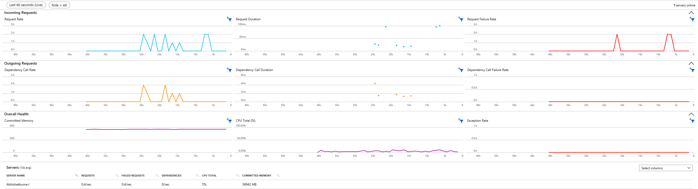

# Using Application Insights

## How to configure Application Insights

### Using DAB CLI
Feature work in Progress

### Manually editing the runtime config file

Add a new property under runtime section in the runtime config file.
```json
{
  "runtime": {
    //...
    "telemetry": {
      "application-insights": {
        "enabled": true,    // To enable/disable application insights telemetry
        "connection-string": "{APP_INSIGHTS_CONNECTION_STRING}" // Application Insights connection string to send telemetry
      }
    }
    //...
}
```

**NOTE:**
1. By default, application insights are turned off.
2. To enable, enabled flag should be made true and connection-string should be provided.
3. Application Insights connection string can be retrieved from the resource page in Azure portal.


## What telemetry data is sent to Application Insights
1. Currently, whatever logs that are generated by Data API builder in console, same logs are being sent to Application Insights.
2. These logs can be seen under the "Logs" tab in the left-hand menu in Application Insights resources using the below query.

```
traces
| order by timestamp
```
3. In traces table, Loglevel is mapped to Severity Level as follows:

| LogLevel | Severity Level | Severity Level Value |
|----------|----------------|----------------------|
| Trace    | Verbose        |       0              |
| Debug    | Verbose        |       0              |
| Information | Information |       1              |
| Warning  | Warning        |       2              |
| Error    | Error          |       3              |
| Critical | Critical       |       4              |

4. LogLevel can be set using --LogLevel option when using CLI. Otherwise, the host mode in the config file determines the minimum loglevel. If HostMode is set to `Production`, the minimum log level is `Error`, while it is `Debug` for `Development` mode.


## How to check different metrics in Application Insights Portal
1. Checking Live Metrics




2. Checking Application Logs/Traces


3. Checking Application Requests


4. Checking Application Exceptions


