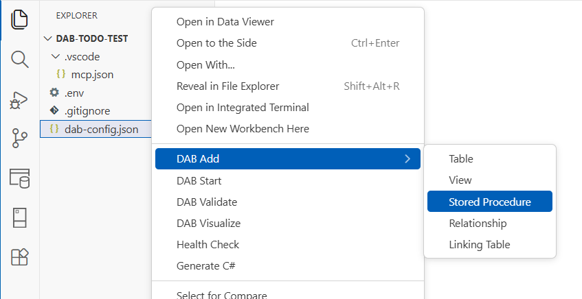

# DAB Add extension

Use the DAB Add extension to discover SQL objects and add them to an existing Data API builder configuration file.

    
> [!NOTE]
> Current support is focused on Microsoft SQL Server (`mssql`).

## Available actions

From the Explorer context menu on a supported configuration file, select **DAB Add** and choose one of these actions:

- **Table** (`dabExtension.addTable`)
- **View** (`dabExtension.addView`)
- **Stored Procedure** (`dabExtension.addProc`)
- **Relationship** (`dabExtension.addRelationship`)
- **Linking Table** (`dabExtension.addLinkingTable`)

## What the extension does

- Connects to your configured data source.
- Discovers schema objects and filters existing entries.
- Prompts for selections and required metadata (such as view key fields).
- Executes DAB CLI add/update operations to apply changes safely.

[!INCLUDE [Related content](includes/related-content.md)]
