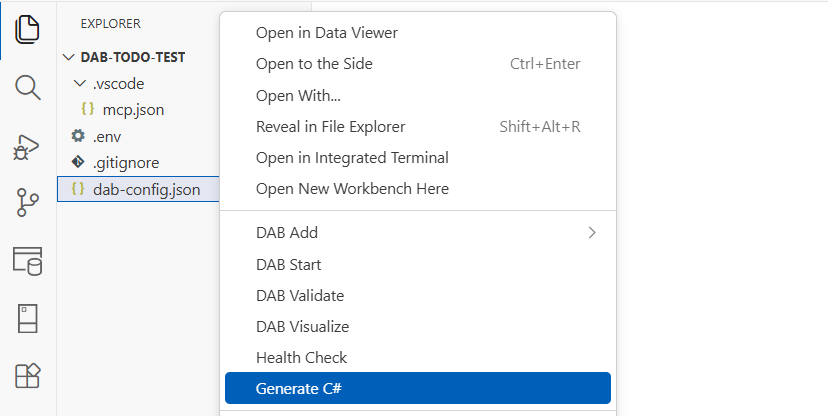

# DAB Code Gen extension

Use the DAB Code Gen extension to generate C# artifacts from selected entities in a DAB configuration.

> [!NOTE]
> Current support is focused on Microsoft SQL Server (`mssql`).

## Command

| Command | Command ID |
|---|---|
| Generate C# | `dabExtension.generateRestClient` |

## Generated outputs

The extension can create a `Gen/` solution with model types, repository helpers, and sample client assets derived from configuration and database metadata.

[!INCLUDE [Related content](includes/related-content.md)]
