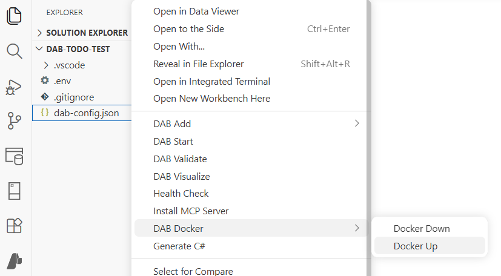

# DAB Docker extension

Use the DAB Docker extension to build Docker images and run Data API builder in containers directly from Visual Studio Code.

## Commands

| Command | Command ID |
|---|---|
| Create Image | `dabDocker.createImage` |
| Docker Up | `dabDocker.dockerUp` |

[!INCLUDE [Related content](includes/related-content.md)]
