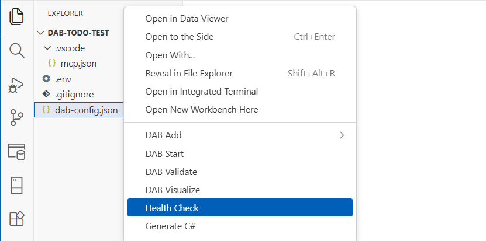

# DAB Health extension

Use the DAB Health extension to query the runtime `/health` endpoint and review status in an interactive report.

## Command

| Command | Command ID |
|---|---|
| Health Check | `healthDataApiBuilder.healthCheck` |

[!INCLUDE [Related content](includes/related-content.md)]
