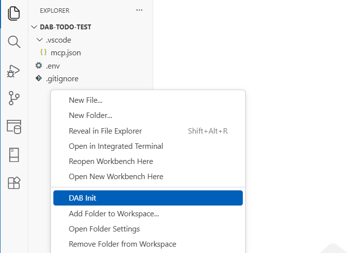

# DAB Init extension

Use the DAB Init extension to scaffold a new Data API builder configuration file with practical defaults for local development.

## Command

| Command | Command ID |
|---|---|
| DAB Init | `dabExtension.initDab` |

[!INCLUDE [Related content](includes/related-content.md)]
