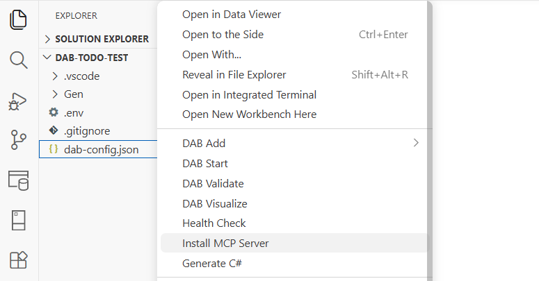

# DAB MCP extension

Use the DAB MCP extension to install Data API builder configurations as MCP (Model Context Protocol) servers with one-click setup.

## Command

| Command | Command ID |
|---|---|
| Install MCP Server | `dabMcp.installMcpServer` |

[!INCLUDE [Related content](includes/related-content.md)]
