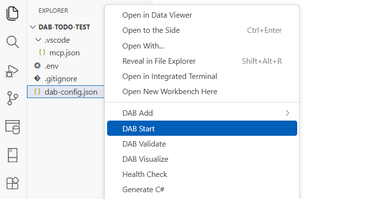

# DAB Start extension

Use the DAB Start extension to run `dab start` for a selected configuration file from the integrated terminal.

## Command

| Command | Command ID |
|---|---|
| DAB Start | `dabExtension.startDab` |

[!INCLUDE [Related content](includes/related-content.md)]
