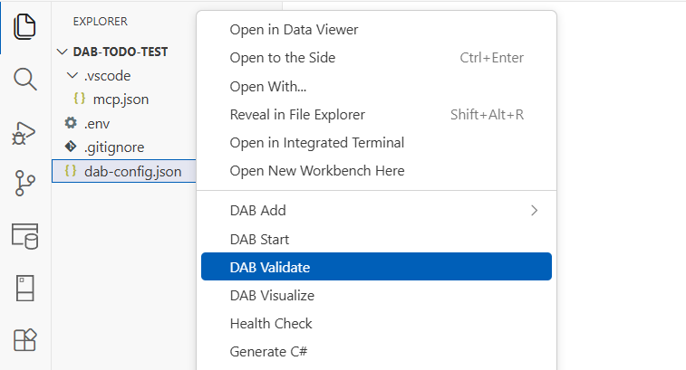

# DAB Validate extension

Use the DAB Validate extension to run configuration validation before runtime startup or deployment.

## Command

| Command | Command ID |
|---|---|
| DAB Validate | `dabExtension.validateDab` |

## Access

- Explorer: right-click a supported configuration file and select **DAB Validate**.

## Behavior

The extension runs `dab validate` in the configuration directory and streams messages to a dedicated output channel. Validation failures provide quick access to the output for troubleshooting.

[!INCLUDE [Related content](includes/related-content.md)]
