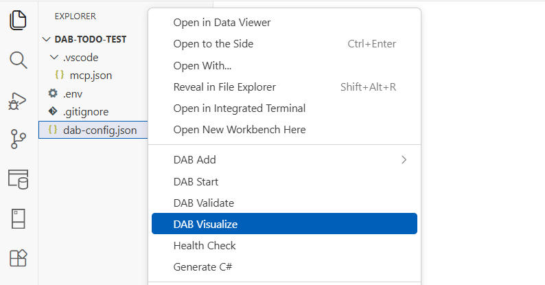

# DAB Visualize extension

Use the DAB Visualize extension to generate a Mermaid ER diagram from your configuration file.

## Command

| Command | Command ID |
|---|---|
| DAB Visualize | `dabExtension.visualizeDab` |

[!INCLUDE [Related content](includes/related-content.md)]
